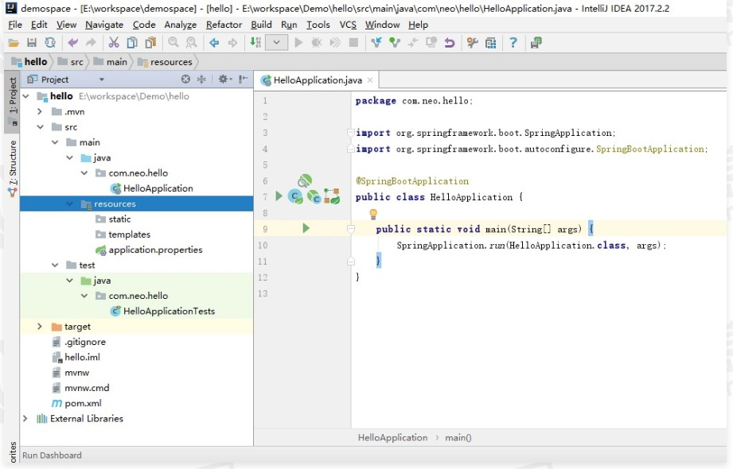

# SpringBoot环境依赖搭建和项目结构介绍

Java 领域最流行的 IDE 开发工具有 Eclipse 和IDEA。Eclipse 是 Java 的集成开发环境(IDE)，也是 Java 领域最流行的 IDE 开发工具之一，只是 Eclipse 这些年发展缓慢，慢慢的有些陈旧。IDEA(IntellJIDEA)是用干 Java 语言开发的集成环境，在业界被公认为是最好的 Java 开发工具之一，尤其在智能代码助手、代码自动提示、重构、J2EE 支持、创新的 GUI 设计等方面的功能可以说是超常的。因此强烈推荐大家使用 IntelliJ IDEA 开发 Spring Boot 项目。

接下来将介绍如何搭建基础环境以及 IntelliJ IDEA 的安装。

## 1、安装 JDK

下载安装，首先打开

[Oracle 官网 JDK 1.8]: https://www.oracle.com/java/technologies/downloads/#java8

页面，根据下图选择下载各系统对应的版本。 具体操作不做详解。

## 2、安装 Maven

安装 Maven 的前提是完成 Java 环境安装，Maven 依赖于 Java 环境。

下载安装 (具体操作不做详解)

settings.xml 设置

Maven 解压后目录下会有一个 settings.xml 文件，位置:${M2HOME}/conf/settingsxml，用来配置 Maven 的仓库和本地 Jar 包存储地址。Maven 仓库地址代表从哪里去下载项目中的依赖包（Jar 包）Maven 会将所有的Jar 包统一存储到一个地址下，方便各个项目复用。

localRepository 设詈本地存放 Jar 包地址，可以根据自己的情况改动:

```xml
<localRepository>D:\Common Files\maven\repository</localRepository>
```

mirrors为仓库列表配置的下载镜像列表：

```xml
<mirrors>
    <mirror>  
        <id>repo2</id>  
        <mirrorOf>central</mirrorOf>  
        <name>spring2.0 for this Mirror.</name>  
        <url>https://repo.spring.io/libs-milestone</url>  
    </mirror>
    ...
<mirrors>
```

## 3、IntelliJ IDEA 安装

IntelliJIDEA 2018 官方下载地址，IDEA 分为两种版本，即社区版和商业版，商业版是付费的，其功能多，社区版是免费的，功能相对较少。

## 4、构建项目

我们有两种方式来构建 Spring Boot 项目基础框架，第一种是使用 Spring 官方提供的构建页面；第二种是使用 IntelliJ IDEA 中的 Spring 插件来创建。

### 4.1、使用 Spring 官方提供页面构建

1. 访问 http://start.spring.io/ 网址；
2. 选择构建工具 Maven Project，编程语言选择 Java、Spring Boot 版本 2.0.5 以及一些工程基本信息；
3. 单击 Generate Project 下载项目压缩包；
4. 解压后，使用 IDEA 导入项目，选择 File|New|Model from Existing Source….|选择解压后的文件夹 | OK 命令，选择 Maven，一路单击 Next 按钮，OK done!；
5. 如果使用的是Eclipse，选择Import|Existinq Maven Projects|Next|选择解压后的文件夹|Finsh 按钮，OK done!

### 4.2、使用 IDEA 构建

1. 选择 File | New| Project.…. 命令，弹出新建项目的对话框；
2. 选择 Spring Initializr，Next 也会出现上述类似的配置界面，IDEA 帮我们做了集成；

3. 填写相关内容后，单击 Next 按钮，选择依赖的包再单击 Next 按钮，最后确定信息无误单击 Finish 按钮


对上面的配罟做如下解释：

- 第一个选择框选择创建以 Maven 构建项目，还是以 Gradle 构建项目，这是两种不同的构建方式，其中 Gradle 配置内容更简洁一些并且包含了 maven 的使用，但我们日常使用 maven 居多；
- 第二个选择框选择编程语言，现在支持 Java、Kotlin 和 Groovy；
- 第三个选择框选择 Spring Boot 版本，可以看出 Spring Boot 2.0 的最新版本是 2.0.5
  Dependencies，在这块添加我们项目所依赖的 Spring Boot 组件，可以多选，本次选择 Web、Devtools 两个模块。

## 5、项目结构介绍



如上图所示，Spring Boot 的基础结构共三个文件，具体如下:

- src/main/iava:程序开发以及主程序入口;
- src/main/resources:配置文件:
- src/test/iava:测试程序

另外，Spring Boot 建议的目录结构如下。

**com.example.myproject 目录下:**

```
myproject
 +-src
    +- main
         +- java
              +- com.example.myproject
                    +- comm
                    +- model
                    +- repository
                    +- service
                    +- web
                    +- Application.java
         +- resources
              +- static
              +- templates
              +- application.properties
    +- test
 +-pom.xml
```

**com.example.myproject 目录下:**

- Application.java，建议放到根目录下面，是项目的启动类，Spring Boot 项目只能有一个 main() 方法;
- comm 目录建议放置公共的类，如全局的配置文件、工具类等;
- ·model 目录主要用于实体(Entity)与数据访问层(Repository);
- repository 层主要是数据库访问层代码;
- service 层主要是业务类代码;
- web 层负责页面访问控制。

resources 目录下:

- static 目录存放 web 访问的静态资源，如 js、css、图片等;
- templates 目录存放页面模板;
- application.properties 存放项目的配置信息。

**test 目录**：存放单元测试的代码;

**pom.xml**：用于配置项目依赖包，以及其他配置。

采用默认配詈可以省去很多设署，也可以根据公司的规范进行修改，至此一个 Java 项目搭建好了.

## 6、Pom 包介绍

pom.xml 文件主要描述了项目包的依赖和项目构建时的配置，在默认的 pom.xml 包中分为五大块。

第一部分为项目的描述信息：

```xml
<groupId>com.neo</groupId>
<artifactId>hello</artifactId>
<version>2.0.5.RELEASE</version>
<packaging>jar</packaging>
 
<name>hello</name>
<description>Demo project for Spring Boot</description>
```

第二部分为项目的依赖配置信息：

```xml
<parent>
  <groupId>org.springframework.boot</groupId>
  <artifactId>spring-boot-starter-parent</artifactId>
  <version>2.0.5.RELEASE</version>
  <relativePath/> <!-- lookup parent from repository -->
</parent>
 
<dependencies>
  <dependency>
    <groupId>org.springframework.boot</groupId>
    <artifactId>spring-boot-starter-web</artifactId>
  </dependency>
  <dependency>
    <groupId>org.springframework.boot</groupId>
    <artifactId>spring-boot-devtools</artifactId>
    <scope>runtime</scope>
  </dependency>
  <dependency>
    <groupId>org.springframework.boot</groupId>
    <artifactId>spring-boot-starter-test</artifactId>
    <scope>test</scope>
  </dependency>
</dependencies>
```

- parent：标签内配置 Spring Boot 父级版本 spring-boot-starter-parent，Maven支持项目的父子结构，引入父级后会默认继承父级的配置;
- dependencies：标签内配置项目所需要的依赖包，Spring Boot 体系内的依赖组件不需要填写具体版本号，spring-boot-starter-parent维护了体系内所有依赖包的版本信息。

第三部分为构建时需要的公共变量:

```xml
<properties>
  <project.build.sourceEncoding>UTF-8</project.build.sourceEncoding>
  <project.reporting.outputEncoding>UTF-8</project.reporting.outputEncoding>
  <java.version>1.8</java.version>
</properties>
```

上面配置了项目构建时所使用的编码，输出所使用的编码，最后指定了项目使用的 JDK 版本。

第四部分为构建配置：

```xml
<build>
  <plugins>
    <plugin>
      <groupId>org.springframework.boot</groupId>
      <artifactId>spring-boot-maven-plugin</artifactId>
    </plugin>
  </plugins>
</build>
```

使用 Maven 构建 Spring Boot 项目必须依赖于 spring-boot-maven-plugin组件，spring-boot-maven-plugin 能够以 Maven 的方式为应用提供 Spring Boot 的支持，即为 SoringBoot 应用提供了执行 Maven操作的可能。

spring-boot-maven-oluain 能够将 Spring Boot 应用打包为口执行的 iar 或 war 文件，然后以简单的方式运行 Spring Boot 应用。

以上即为 pom.xml 文件基础内容，几乎所有的 Spring Boot 项目都会用到以上配置信息。

## 7、对比

简单做一下对比，使用 Spring Boot 之前和使用之后。

使用 Spring Boot 之前：

- 配置 web.xml，加载 Spring 和 Spring MVC;
- 配置数据库连接、配置 Spring 事务;
- 配置加载配置文件的读取，开启注解;
- 配置日志文件

- 配置完成之后部署 Tomcat 调试

现在非常流行微服务，如果项目只是简单发送邮件的需求，我们也需要这样操作一遍。

使用 Spring Boot 之后，仅仅三步即可快速搭建起一个 Web 项目：

- 页面配置导入到开发工具中
- 进行代码编写
- 
  运行

通过对比可以发现 Spring Boot 在开发阶段做了大量优化，非常容易快速构建一个项目。

## 8、总结

主要介绍了 Spring Boot 所依赖的基础环境，如何去搭建 JDK、Maven 环境，安装开发工具 IDEA；对 Spring Boot 项目结构进行了解读，介绍了 pom.xml 文件内容的含义。

通过本课的学习，我们发现构建 Spring Boot 项目更简单方便，相比传统项目，Spring Boot 项目配置更加灵活。

