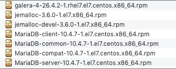

# CentOS7 安装 MariaDB 10.4.x

## 1、下载安装包



## 2、按顺序安装依赖环境包

```
yum install rsync nmap lsof perl-DBI nc

rpm -ivh jemalloc-3.6.0-1.el7.x86_64.rpm

rpm -ivh jemalloc-devel-3.6.0-1.el7.x86_64.rpm
```

## 3、卸载冲突的 mariadb-libs

- 先搜索

```
rpm -qa | grep mariadb-libs
```

- 后删除

```
rpm -ev --nodeps mariadb-libs-5.5.68-1.el7.x86_64
```

## 4、安装 boost-devel 依赖环境

```
yum install boost-devel.x86_64
```

## 5、导入 MariaDB 的 Key

```
rpm --import http://yum.mariadb.org/RPM-GPG-KEY-MariaDB
```

## 6、安装 `galera`  环境

```
rpm -ivh galera-4-26.4.2-1.rhel7.el7.centos.x86_64.rpm
```

## 7、安装 libaio (此步骤在安装10.4.8时需要)

```
wget http://mirror.centos.org/centos/6/os/x86_64/Packages/libaio-0.3.107-10.el6.x86_64.rpm
rpm -ivh libaio-0.3.107-10.el6.x86_64.rpm
```

## 8、安装 MariaDB 的 4个核心包

```
rpm -ivh 
MariaDB-common-10.4.7-1.el7.centos.x86_64.rpm 
MariaDB-compat-10.4.7-1.el7.centos.x86_64.rpm 
MariaDB-client-10.4.7-1.el7.centos.x86_64.rpm 
MariaDB-server-10.4.7-1.el7.centos.x86_64.rpm 

rpm -ivh MariaDB-common-10.4.8-1.el7.centos.x86_64.rpm MariaDB-compat-10.4.8-1.el7.centos.x86_64.rpm MariaDB-client-10.4.8-1.el7.centos.x86_64.rpm MariaDB-server-10.4.8-1.el7.centos.x86_64.rpm
```

安装完毕MariaDB后还没完，还需要配置数据库，在命令行中执行如下代码用以启动mysql服务(MariaDB就是mysql的分支，所以服务名是一样的，如果本地有 mysql可以无缝切换或安装):

```
service mysql start

systemctl start mariadb.service
```

启动成功后运行如下命令进行安全配置：

```
mysql_secure_installation
```

```
1.输入当前密码，初次安装后是没有密码的，直接回车
2.询问是否使用`unix_socket`进行身份验证：n
3.为root设置密码：y
4.输入root的新密码：root
5.确认输入root的新密码：root
6.是否移除匿名用户，这个随意，建议删除：y
7.拒绝用户远程登录，这个建议开启：n
8.删除test库，可以保留：n
9.重新加载权限表：y
```

当你看到 `Thanks for using MariaDB!` 这句话，表明配置成功!

但是还没完，这个时候我不能远程连接，要想远程连接还需要额外的配置，进入MariaDB的控制台。

-  输入密码

```
mysql -u root -p 
```

- 赋予 root 用户远程连接权限

```
# 赋予权限
grant all privileges on *.* to 'root'@'%' identified by 'root密码';
# 刷新权限
flush privileges;
```

权限配置后，就可以使用远程客户端连接数据库了。

------

参考文献：

```
https://www.cnblogs.com/leechenxiang/p/7095564.html
https://mariadb.org/
http://mirror.mariadb.org/yum/10.4/centos7-amd64/rpms/
https://mariadb.com/kb/en/mariadb-installation-version-10121-via-rpms-on-centos-7/
```

如果遇到libpcre2-8.so.0()(64bit) is needed by MariaDB-client-10.5.4-1.el7.centos.x86_64的问题，执行如下命令：

```
yum install pcre2
```