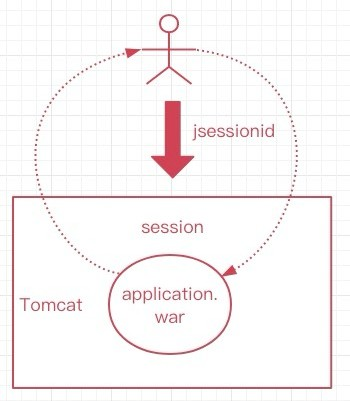
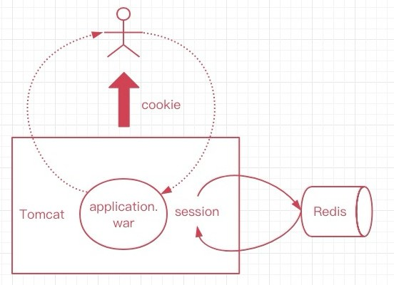
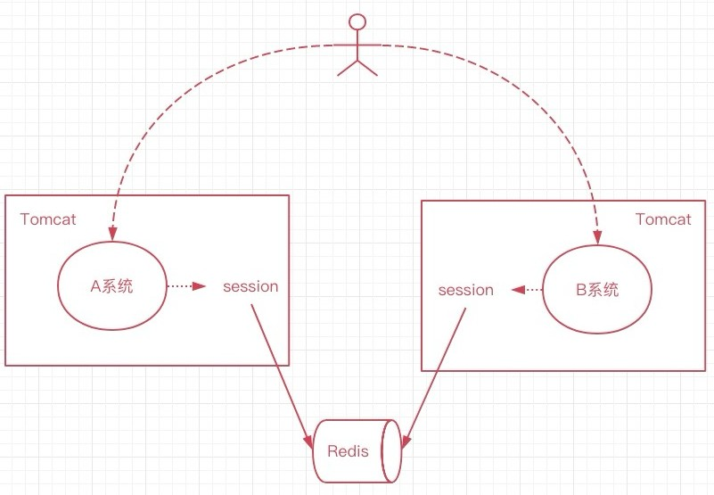

# 分布式会话

## 1、什么是会话

概念: 会话session代表客户端和服务器一次交互的过程，可以是连续的也可以是断断续续的;

工作原理： 用户端和服务端进行交互，服务器就会为用户创建一个sessionid， 根据这个id找到对应会话的session，拿到session就可以操纵会话了；会话存活期间，可以认为用户正处于一直使用网站的状态，当session超时过期，就可以认为用户离开网站了；用户的身份信息也是通过session来判断的；在session中可以保存不同用户的信息。

单体部分的session示例代码如下：

```
@GetMapping("/setSession")
public Object setSession(HttpServletRequest request) {
    HttpSession session = request.getSession();
    session.setAttribute("userInfo", "new user");
    session.setMaxInactiveInterval(3600);
    session.getAttribute("userInfo");
    // session.removeAttribute("userInfo");
    return "ok";
}
```

## 2、无状态会话

HTTP请求是无状态的,用户向服务端发起多个请求,服务端并不知道请求都来自同一用户，这就是无状态的，cookie的就是为了有状态的记录用户。

IOS和服务端交互, 安卓和服务的交互, 前后端分离, 小程序和服务端交互, 他们都是通过发起HTTP来调用接口数据的, 每次交互服务端都不会拿到客户端的状态;

虽然客户端向服务端发送HTTP请求,不会自带用户状态, 但是可以通过手段处理,比如请求携带用户id或者token来获取相应的用户信息数据。

## 3、有状态的会话

Tomcat中的会话，就是有状态的，一旦用户和服务端交互，就有会话，会话保存了用户的信息，这样用户就“有状态”了。

服务端会和每个客户端都保持着这样的一层关系，这个由容器来管理(也就是tomcat)，这个session会话是保存到内存空间里的，如此一来，当不同的用户访问服务端，那么就能通过会话知道谁是谁了。

tomcat会话的出现也是为了让http请求变的有状态。如果用户不再和服务端交与，那么会话超时则消失，结束了他的生命周期，如此一来每个用户其实都会有一个会话被维护，这就是有状态会话。

场景:在传统项目或者jsp项目中是使用的最多的session都是有状态的，session的存在就是为了弥补http的无状态。

> 注：tomcat会话可以通过手段实现多系统之间的状态同步，但是会损耗一定的时间，一旦发生同步那么用户请求就会等待，这种做法不可取。

## 4、单Tomcat会话

先来看一下单个tomcat会话，这个就是有状态的，用户首次访问服务端，这个时候会话产生，并且会设置isessionid放入cookie中，后续每次请求都会携带jsessionid以保持用户状态。



## 5、动静分离会话

用户请求服务端，由于动静分离，前端发起http请求，不会携带任何状态，当用户第一次请求以后，我们手动设置一个token，作为用户会话，放入redis中，如此作为redis-session，并且这个token设置后放入前端cookie中(app或小程序可以放入本地缓存)，如此后续交互过程中，前端只需要传递token给后端，后端就能识别这个用户请
求来自谁了。



## 6、集群分布式系统会话

集群或分布式系统本质都是多个系统，假设这个里有两个服务器节点，分别是AB系统，他们可以是集群，也可以是分布式系统；

一开始用户和A系统交互，那么这个时候的用户状态，我们可以保存到redis中，作为A系统的会话信息，随后用户的请求进入到了B系统，那么B系统中的会话我也同样和redis关联，如此AB系统的session就统一了；

当然cookie是会随着用户的访问携带过来的，那么这个其实就是分布式会话，通过redis来保存用户的状态。



## 7、类似关系（局部变量与全局变量）

Tomcat会话相当于一个类中其个方法的局部变量，只能在当前方法中使用；分布式会话相当于一个类中的公用全局变量，可以被类中诸多方法使用。如下代码

```
public class DistributedClusterTest {

    public String distributedSession = "global-1001";

    public void UserSystem() {
        String userSession = "user-2001";

        System.out.println(distributedSession);
        System.out.println(orderSession);
    }

    public void OrderSystem() {
        String orderSession = "order-3001";

        System.out.println(distributedSession);
        System.out.println(userSession);
    }
}
```

distributedSession 是这个类中的全局变量，可以在其他的方法中被使用到，而 userSession 和 orderSession 是在方法中的局部变量，局部变量只能在本方法中使用；全局变量可以在其他方法里都能使用。那么分布式会话和单个tomcat会话其实也是一样的道理。

