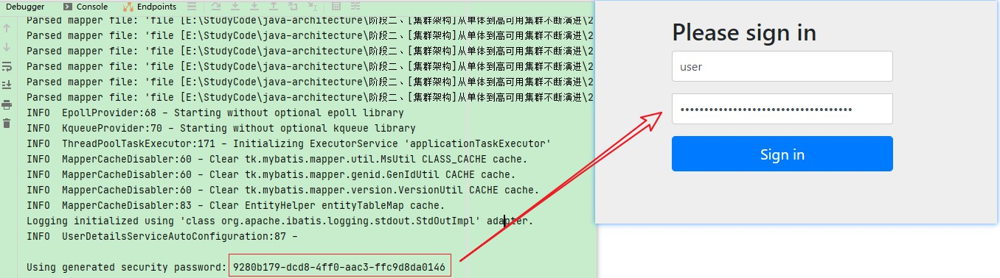
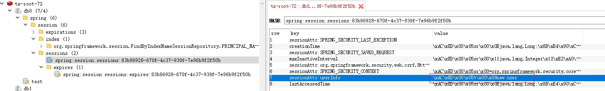

# SpringSession整合

## 1、引入SpringSession依赖

```
<dependency>
	<groupId>org.springframework.session</groupId>
	<artifactId>spring-session-data-redis</artifactId>
</dependency>

<dependency>
	<groupId>org.springframework.boot</groupId>
	<artifactId>spring-boot-starter-security</artifactId>
</dependency>
```

## 2、配置存储类型

```
spring:
  session:
    store-type: redis
```

## 3、配置类中添加注解

```
 // 开启使用redis作为spring session
@EnableRedisHttpSession 
```

## 4、测试

```
    @GetMapping("/setSession")
    public Object setSession(HttpServletRequest request) {
        HttpSession session = request.getSession();
        session.setAttribute("userInfo", "new user");
        session.setMaxInactiveInterval(3600);
        session.getAttribute("userInfo");
//        session.removeAttribute("userInfo");
        return "ok";
    }
```

登录 http://localhost:8088/login ，控制台输出密码：



访问：http://localhost:8088/setSession ，Redis中如下：



如果想取消Session登录，则修改配置文件，去除安全自动装配：

```
@SpringBootApplication(exclude = {SecurityAutoConfiguration.class})
```

