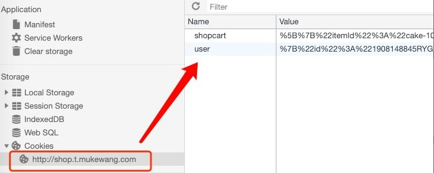
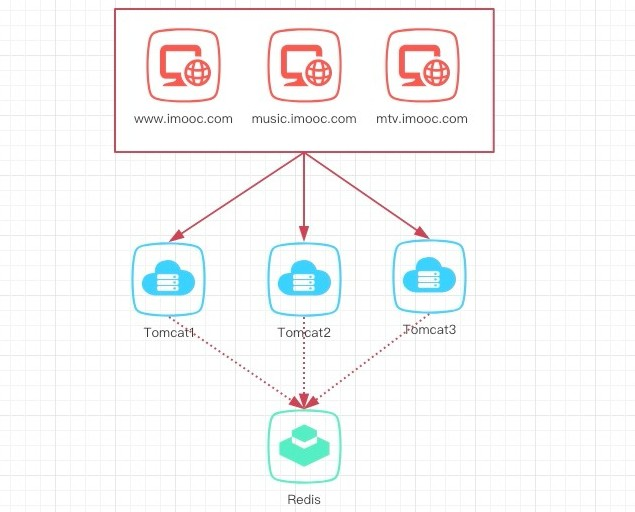

# 相同顶级域名的单点登录SSO

## 1、引子

单点登录，又称为Single Sign On，简称SSO；单点登录可以通过基于用户会话的共享，它分为两种，第一种：

**基于分布式会话实现；**

比如：现在有个 一级域名 为 www.imooc.com,是教育类网站,但是慕课网有其他的产品线， 可以通过构建二级域名提供服务给用户访问， 如:muisc.imooc.com,shop.imooc.com,blog.imooc.com等等；分别为慕课网音乐、慕课电商以及慕课博客等等， 用户只需要在其中一个站点登录,那么其他站点也会随之而登录。

也就是说，用户自始至终只在某一个网站下登录后，那么他所产生的会话，就共享给了其他的网站，实现了单点登录后，同时间接登录了其他的网站，那么这个其实就是单点登录，他们的会话是共享的，都是同一个用户会话。

## 2、 Cookie + Redis 实现 SSO

之前所实现的分布式会话后端是基于Redis的，如此会话可以流窜在后端的任意系统，都能获取到缓存中的用户数据信息；前端通过使用cookie，可以保证在同域名的一级二级下获取，那么这样一来，cookie中的信息 userid和token是可以在发送请求的时候携带上的，这样从前端请求后端后是可以获取拿到的；这样的话其实用户在某一端登录注册以后，其实cookie和redis中都会带有用户信息，只要用户不退出，那么就能在任意一个站点实现登录了。

- 原理主要也是cookie和网站的依赖关系，顶级域名 www.imooc.com  和 *.imooc.com 的cookie值是可以共享的,可以被携带至后端的；比如 设置为 .imooc.com、 .t.mukewang.com , 如此也是ok的

- 二级域名自己的独立cookie是不能共享的，不能被其他二级域名获取，比如 music.imooc.com的cookie是不能被 mtv.imooc.com共享,两者互不影响,要共享必须设置为 .imooc.com

## 3、Cookie 共享测试

找到前端项目  app.js  ,开启如下代码,设置你的对应域名,需要和SwitchHosts相互对应:

如下图,可以看到，不论是在shop 或是 center中, 两个站点都能够在用户登陆了后共享用户信息

这样cookie中的信息被携带至后端，而后端又实现了分布式会话，那么如此依赖，单点登录就实现了，用户无需再跨站点登录了；

上述过程我们通过下图来更加具象化的展示，只要前端网页都在同一个顶级域名下，就能实现cookie和session的共享:

那么目前我们的系统在经过分布式会话的完成以后，外加cookie设置的配合,就已经能够达到相同顶级域名下的单点登录了。