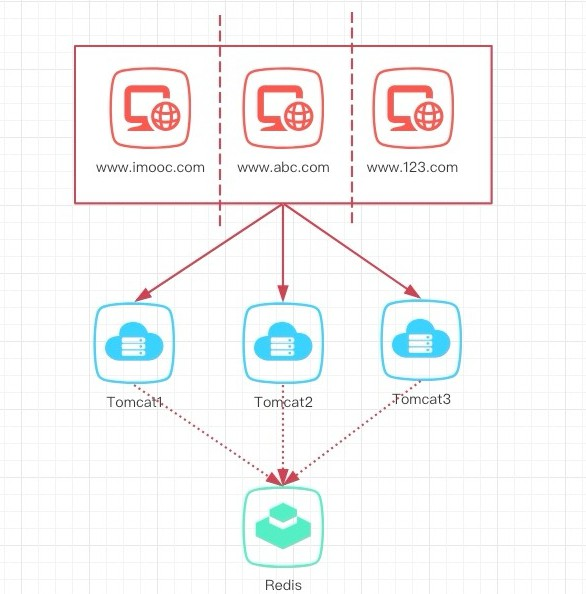
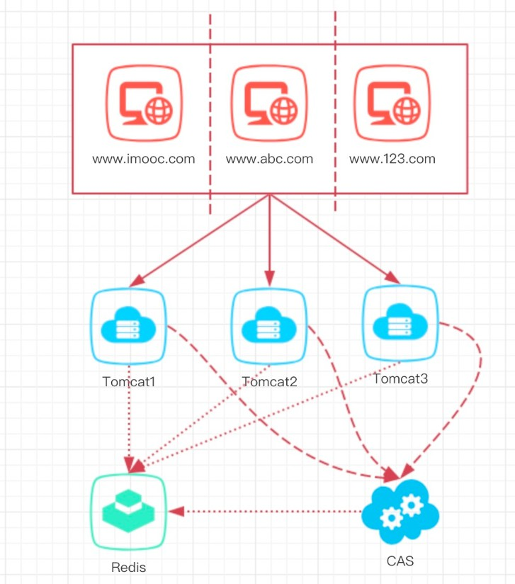

# 不同顶级域名的单点登录

## 1、顶级域名不同怎么办

顶级域名不同怎么办，例子: 如 www.imooc.com 和 www.mukewang.com 的会话实现共享，这个时候该怎么办？

由于顶级域名不同，就不能实现cookie跨域了；每个站点各自请求到服务端，cookie无法同步。如：www.imooc.com下的用户发起请求后会有cookie，但是他又访问了 www.abc.com,由于cookie无法携带，所以会要你二次登录。

那么遇到顶级域名不同，但又要实现单点登录的该如何实现呢，参考下图：

详细说明：多个系统之间的登录会通过一个独立的登录系统去做验证，他就相当于一个中介公司，整合了所有人，你要看房经过中介允许拿    钥匙就行，实现了统一的登录。那么这个就称之为 CAS系统 （Central Authentication Service）即中央认证服务。

## 2、CAS系统    

**名词解释**：即中央认证服务，是一个单点登录的解决方案，可以用于不用顶级域名之间的单点登录， 就是多个系统之间的登录会通过一个独立的登录系统去做验证，它就相当于是一个中介公司，整合了所有人，你要看房经过中介，允许拿钥匙就行，实现了统一的登录。

**架构实现**：在目前项目结构源码不需要去破坏，只需要构建两个静态站点来测试使用即可

在CAS中的具体的流程参考如下时序图：（上面首次登录系统[www.imooc.com]，下面为登录另一个不同的顶级域名[www.mukewang.com]）

 

