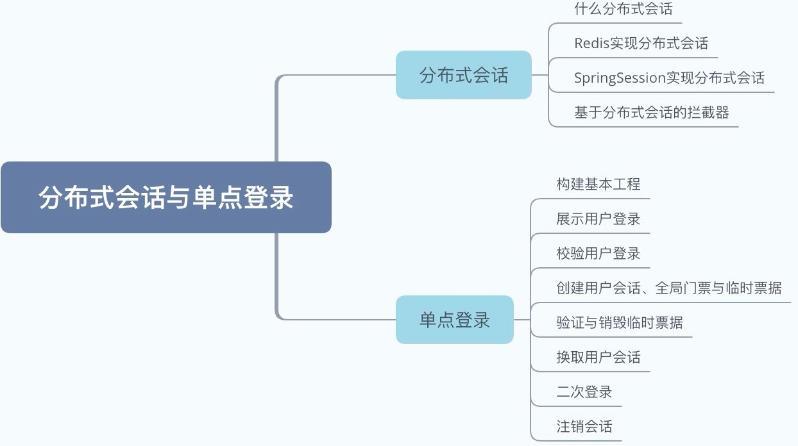
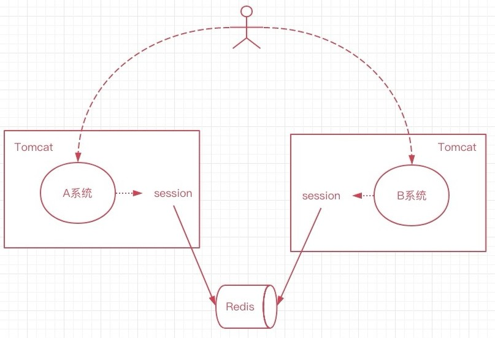

# 阶段复习

内容的思维导图如下：

1、首先我们接触了分布式会话，分布式会话基于cookie+redis实现，在相同顶级域名之下，cookie可以共享，由此当后端获得cookie中的用户数据时，也能相应的在系统中获得用户的会话。

回顾上图，多个系统共同组成的分布式系统，由于可以结合redis，所以共同的数据可以在不同的系统中获取，因为redis是介质，可以存储数据。正由于分布式会话，我们在编写拦截器的时候，往常单体系统中直接HttpSessin中获取，而如今从redis中获取，随后对用户身份进行校验和判断。

当然我们还能够通过SpringSession来实现用户的分布式会话，其中的原理其实也是基于的redis，不论SpringSession或是Redis+cookie都能够实现用户的分布式会话。

2、 单点登录，用户只需要输入一次用户名密码，既可以在多个系统登录，单点登录往往在相同顶级域名下会去实现，比如 www.imooc.com，mtv.imooc.com，music.imooc.com，在这些域名下，可以直接通过上述分布式会话来实现，本身就是基于cookie+redis可以做到的，如此一来只要在其中某个站点登录后，其他的站点就无需再次登录。

当然，顶级域名不同，www.music.com/www.mtv.com/www.imooc.com，其实也可以实现单点登录，这个通常称之为CAS，中央认证服务。用户是否登录的状态是保存在CAS这一站点的，这个站点也是验证校验的服务端。需要记录用户登录的状态，那么其他任何站点二次登录，都不会再让用户去输入用户名和密码，免去了这一步骤。

具体的流程可以参考如下时序图：

图中的每个步骤，我们都在foodie-sso中实现，同时还配有两个前端站点，虽然MTV和MUSIC都是静态页面，但是如果是从MTV或者MUSIC的后端发起请求，也是可以做到的。其中需要注意的一点是，CAS可以不需要结合Redis，因为他仅仅只是做了登录的步骤，其他的站点如果不用 Redis也都是没有任何问题的，所以Redis对于cas来讲并不是必须的，这一点需要注意喔~

那么对于SSO的整个处理流程来讲，其实我们实现起来并不是很难，主要是为的理解整个流程，因为在面试过程中有可能会被问到。有兴趣的同学可以去参考一下Apereo的CAS系统，是非常牛的，地址如下:

1. https://github.com/apereo/cas
2. https://www.apereo.org/projects/cas

