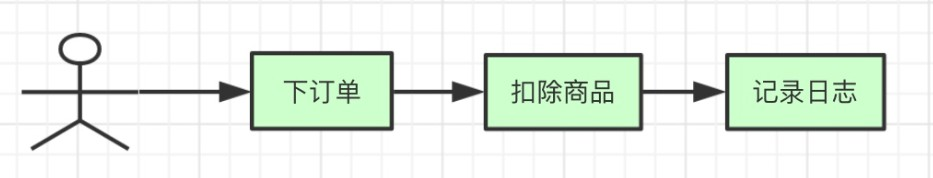
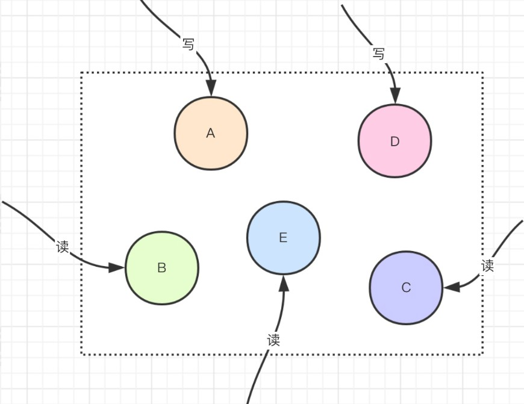
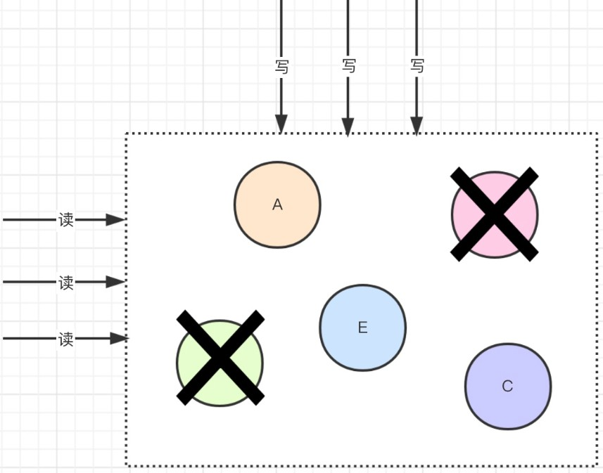
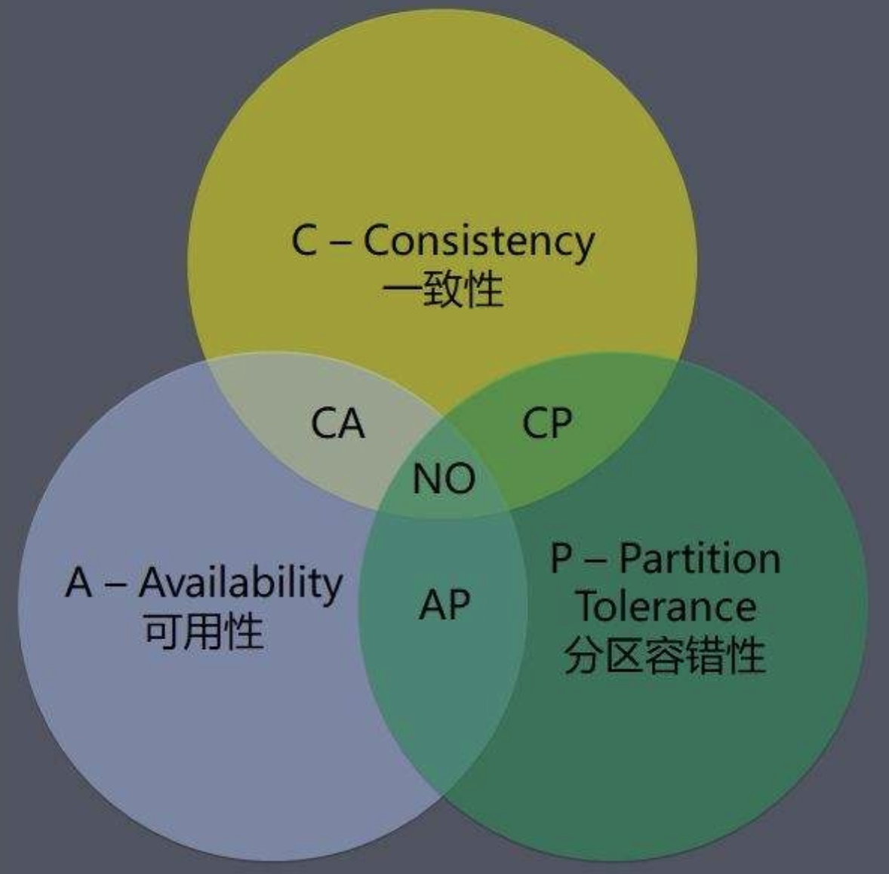
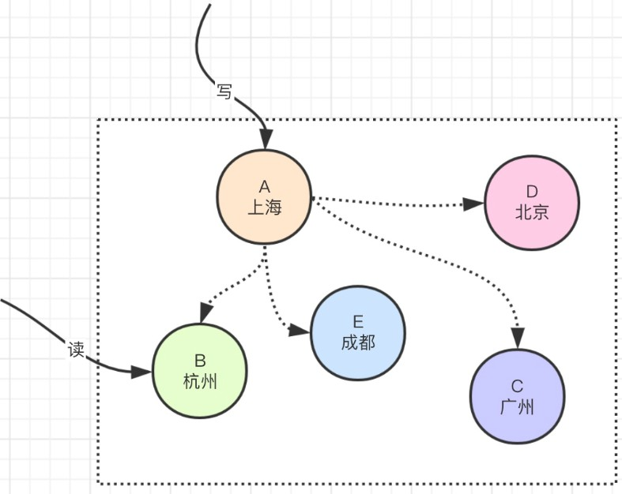

# 分布式系统中的CAP理论

## 1、分布式系统

分布式系统就是一个系统由多个组成部分共同构成，用户的一个请求可能会经过多个不同的计算机节点之后，通过运算才会把结果响应给用户，那么这个请求所经过的不同的几个系统就是分布式系统。

对于用户来讲，你是不是分布式系统，对他来讲是透明的。参考如下图:



图中就表示一个用户在经历下单过程会经过多个系统，他们是分布式的，共同组成一个整体。

## 2、CAP 概念

在分布式系统中，必定会遇到CAP，如下:

### 2.1、C (Consistency)：一致性

在分布式系统中，所有的计算机节点的数据在同一时刻都是相同的，数据都是一致的。不能因为分布式导致不同系统拿到的数据不一致。也就是说，用户在某一个节点写了数据，在其他节点获得该数据的值是最新的；如若是更新操作，那么所有用户看到的也是更新后的新的值，不论哪个节点，不论集群，不论主备，获得的数据都是相同的。

如下图：共有5个节点，往A节点去写，那么其他节点的数据在同一时间都是相同的，其他用户读取的时候也都是相同的，数据的一致性很强。



### 2.2、A (Availability)：可用性

保证你的系统可用，也就是说无论任何时候，系统都可以被用户访问到，用户可以获得正常的响应结果。比如做好集群啊，做好主备啊等等，这个就是高可用。

如下图所示：



集群是一个整体，不论是否有节点宕机，那么作为整体，他还是可以继续对外提供服务的，保证了系统的可用性。

### 2.3、P (Partition tolerance：分区容错性

在整个分布式系统中，我们都是部署在不同的节点上，或者是不同的机房甚至是不同的地域，部署的时候会有一些子网，某一些服务会部署在不同的子网，每个子网就是一个区，也就是网络分区，分区和分区之间的通信也有可能出现通信故障。某个节点或者网络或者地域(分区)出现问题，整体整个系统还是仍然能够提供一致性和可用性的服务，也就是说部分系统故障不会影响整体，为什么会这样，主要是因为有程序bug，计算机硬件问题，网络问题，网线被挖断了等等造成的综合因素。所以呢，我们的诉求就是即使小部分出问题，也要保全整体。并目对干任何分布式,系统来讲，都需要去考虑分区容错的问题。

下图以腾讯云为例，图中就有两处不同分区，第一个是在上海这个地域有不同的区域，不同区域通信走公网，可能有通信故障。其次就是私有网络，也就是子网络，他可以创建很多个，自己去定义不同的网段ip。


## 3、CAP 无法同时满足

如果从理论上来讲，以上三点C/A/P都应该满足吧，但是系统是人开发的，那肯定会或多或少有各种各样的问题，在分布式系统中同时满足这三点是不可能的。所以对于CAP来讲，只能满足其中两者，要么AP，要么CP，要么CA。如下图：



举例说明为何不能同时满足CAP：



上图中，ABCDE这5个节点都是分别部署在不同地域的机房的节点，假设现在我们的分区容错性P做的很好，保证不会出现网络方面的故障，这个时候我们来看一下一致性C和可用性A。

现在有一个请求把数据写入到了A节点，随后用户的下一个请求要访问B节点，那么由于他们之间在不同的地域，数据同步需要有时间延迟，可能几百毫秒可能1-2秒。那么读请求要请求到一致的数据，就会被阻塞，阻塞的时候当前这个系统就不可用了，因为数据同步需要时间，所以此时的可用性A就无法满足，只能满足CP；那么再来看，假设要满足系统可用性，那么请求读到的数据，在节点同步的过程中就会是一个老的数据，数据就不能达到一致性C，所以这个时候就是AP。OK不?

那么我们平时开发系统倒是在C和A之间取其一来搭配P的组合搭配那么CP.AP.CA，这三种，哪个好呢?

## 4、组合搭配

### 4.1、CP

满足一致性和分区容错的系统，性能不会很高，因为一致性是时时保持的。就比如说我提交一个订单，这个订单的数据要同步到各个系统，保证强一致性。那么这样用户请求大多都会被阻塞。需要耗时等待。redis，mongodb，hbase都是CP。(redis集群如果一个主节点挂了那么slave成为master，他会有一个时间段导致不可用，A不满足)

### 4.2、CA

满足一致性，满足可用性，一般来说都是以单体存在的集群架构，可扩展性不高。一般都是关系型数据库。

### 4.3、AP

满足可用性和分区容错，那么这样就不是一致性了，往往会采用弱一致性，或者最终一致性。这也是通常用的最多的。 我们平时开发的系统就是以AP来展开工作的。

对于我们平时开发的时候， **分区容错P** 是一定要满足的，因为我们在部署的时候往往都都是多节点集群部署，设置异地互备，比如北京机房和机房都提供服务，所以，一定要容错。
那么接下来我们要抉择 **一致性** 还是 **可用性** 呢?

一般来说，往往我们在搭建网站架构的时候，我们都会采用AP，主流的互联网公司也是如此，也就是数据的弱一致性，因为要保证系统的整体的高可用性以及容错性。

> 啥叫弱一致性，比如我们经常看头条，头条的点赞数评论数或者微博粉丝数，具体的数值每个人浏览的时候可能不一样，这个其实无所谓的，这就是弱一致性。而像Redis、MonqoDB这样的中间件，是CP，也就是要保证数据的一致性，因为毕竟要为网站提供数据服务的，一致性必须满足。

## 5、关于弱一致性

其实现在的互联网环境里，很多项目都不会采用强一致性，因为很难做，而往往采用弱一致性，因为用户可以接受，比如双11或者618的时候，订单蹭蹭蹭的海量增加，我们只需要关注订单下单成功就行，具体多少订单，具体多少金额，我们不会去实时的统计计算的，因为没必要，会在高峰期过后逐步去统计，慢慢的实现一致性。这个就是目前主流的做法。

但是一定要注意，数据层面的交互，关系型数据库，redis，mongodb等，他们肯定是强一致性，因为需要提供给你的网站数据服务。

其实我们在互联网环境里，往往会采用BASE理论：

> ```
> Base = Basically Available Soft-state Eventually-Consistent
> ```

也就是达到基本可用软状态的最终一致性。它是比较平衡了CAP后得到的结论，这也是绝大多数互联网系统实践后的一个结果，他主要的核心思想就是忽略强一致性，使用弱一致性来达到最终一致。