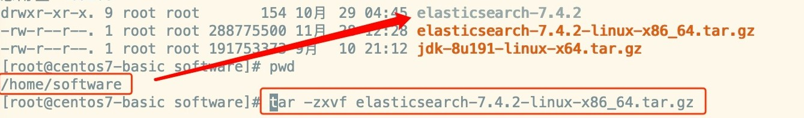
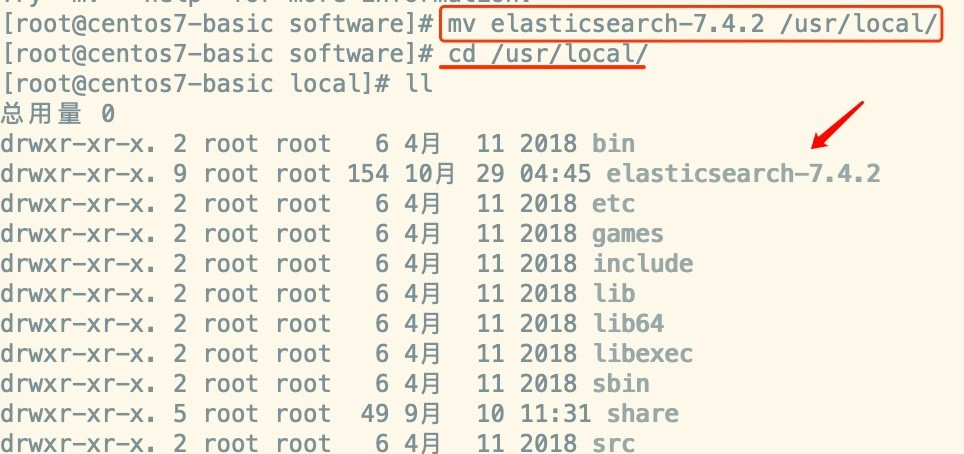
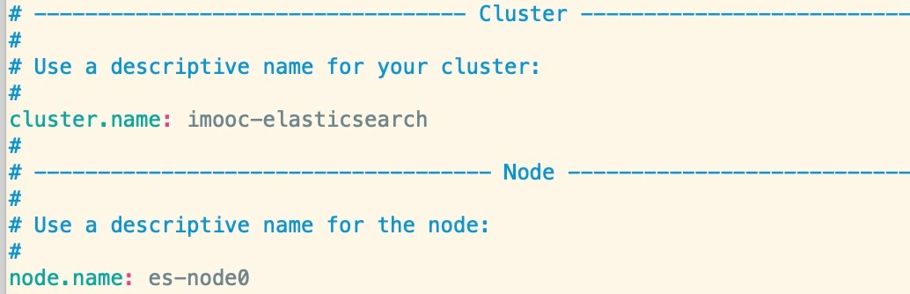
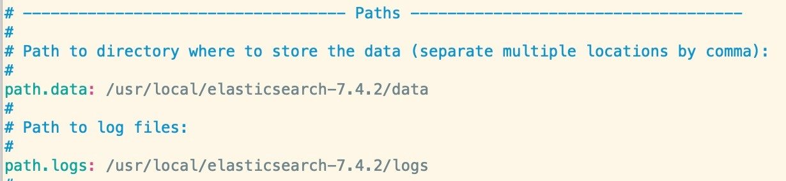
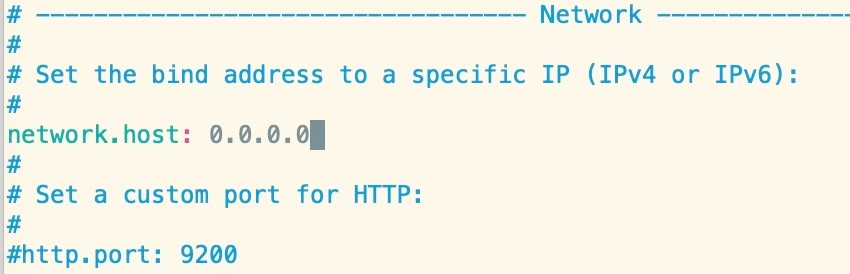
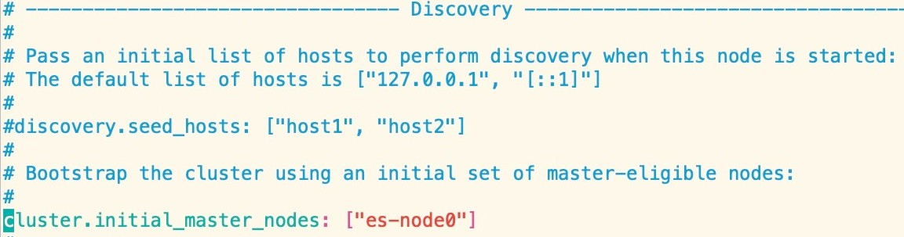
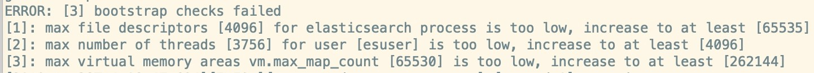
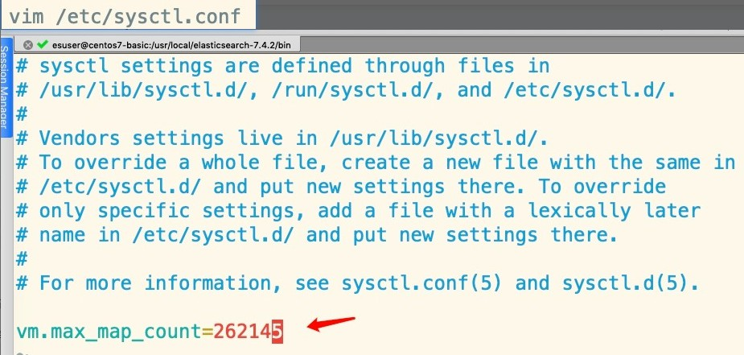
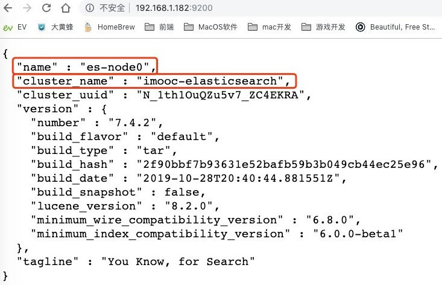
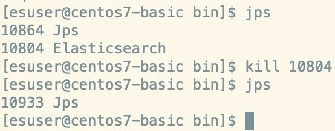

# 安装ElasticSearch

## 1、上传后解压

```
tar -zxvf elasticsearch-7.4.2-linux-x86_64.tar.gz
```



移动解压后的es文件夹

```
mv elasticsearch-7.4.2 /usr/local/

cd /usr/local/
```



## 2、ES 目录介绍

- bin：可执行文件在里面，运行es的命令就在这个里面，包含了一些脚本文件等

- config：配置文件目录

- JDK：java环境

- lib：依赖的jar，类库

- logs：日志文件

- modules：es相关的模块

- plugins：可以自己开发的插件

- data：这个目录没有，自己新建一下，后面要用 -> mkdir data，这个作为索引目录

```
 mkdir data
```

## 3、修改核心配置文件 elasticearch.yml

```
cd  config/

vim elasticsearch.yml
```

修改集群名称，默认是elasticsearch，虽然目前是单机，但是也会有默认的

为当前的es节点取个名称，名称随意，如果在集群环境中，都要有相应的名字

```
cluster.name: imooc-elasticsearch

node.name: es-node0
```



修改data数据保存地址

```
path.data: /usr/local/elasticsearch-7.4.2/data
```

修改日志数据保存地址

```
/usr/local/elasticsearch-7.4.2/logs
```



绑定es网络ip，原理同redis

```
network.host: 0.0.0.0
```

默认端口号，可以自定义修改



集群节点，名字可以先改成之前的那个节点名称

```
cluster.initial_master_nodes: ["es-node0"]
```



## 4、修改JVM参数

```
vim jvm.options
```


默认xms和xmx都是1g，虚拟机内存没这么大，修改一下即可

```
-Xms128m
-Xmx128m
```


## 5、添加用户

ES不允许使用root操作es，需要添加用户，操作如下：

```
useradd esuser
chown -R esuser:esuser /usr/local/elasticsearch-7.4.2
su esuser
whoami
```

## 6、启动ES

命令：

```
./elasticsearch
```

如果出现如下错误：



那么需要切换到root用户下去修改配置如下：

```
vim /etc/security/limits.conf
```

```
* soft nofile 65536
* hard nofile 131072
* soft nproc 2048
* hard nproc 4096
```



别忘记 sysctl -p 刷新一下

报错：future versions of Elasticsearch will require Java 11; your Java version from [/usr/local/java/jdk1.8.0_201/jre] does not meet this requirement

```
vim elasticsearch-env

#!/bin/bash
set -e -o pipefail
#使用es自带的jdk(开始）
export "/usr/local/elasticsearch-7.4.2/jdk"
CDPATH=""
SCRIPT="$0"
```

最后再次启动OK

## 7、测试

访问你的虚拟机ip+端口号9200，如下则表示OK



## 停止es

如果是前台启动，直接ctrl+c就可以停止

后台启动：

```
./elasticsearch -d
```

停止杀进程：



## 端口号意义

9200：Http协议，用于外部通讯

9300：Tcp协议，ES集群之间是通过9300通讯

## 附

如果有小伙伴使用centos6.x中安装es，那么和centos7有些不同，可以参考博文：

https://www.cnblogs.com/leechenxiang/p/10897562.html