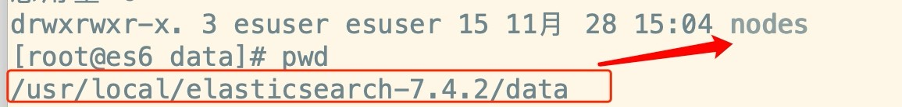

# 搭建 Elasticsearch 集群

## 1、Elasticsearch 集群的概念

一般我们可以把es搭建成集群，2台以上就能成为es集群了。集群不仅可以实现高用，也能实现海量数据存储的横向扩展。

##### 分片机制

每个索引可以被分片，就相当于吃披萨的时候被切了好几块，然后分给不同的人吃

- 索引my_doc只有一个主分片;
- 索引shop有3个主分片；
- 索引shop2有5个主分片；
- 每个主分片都包含索引的数据，由于目前是单机，所以副本分片是没有的，这个时候集群健康值显示为黄色；
- 副本分片是主分片的备份，主挂了，备份还是可以访问，这就需要用到集群了
- 同一个分片的主与副本是不会放在同一个服务器里的，因为一旦宕机，这个分片就没了

##### es集群搭建的准备工作

使用虚拟机克隆功能，把单个es的虚拟机克隆为3个，我们会搭建3节点的es集群。

## 2、搭建 Elasticsearch 集群

##### 前置操作

当克隆以后，es中的data目录，一定要清空，这里面包含了原先的索引库数据。



##### 配置集群

修改 elasticsearch.yml 这个配置文件如下：

```
# 配置集群名称，保证每个节点的名称相同，如此就能都处于一个集群之内了
cluster.name: imooc-es-cluster

# 每一个节点的名称，必须不一样
node.name: es-node1

# http端口（使用默认即可）
http.port: 9200

# 主节点，作用主要是用于来管理整个集群，负责创建或删除索引，管理其他非master节点（相当于企业老总）
node.master: true

# 数据节点，用于对文档数据的增删改查
node.data: true

# 集群列表
discovery.seed_hosts: ["192.168.1.184", "192.168.1.185", "192.168.1.186"]

# 启动的时候使用一个master节点
cluster.initial_master_nodes: ["es-node1"]
```

最后可以通过如下命令查看配置文件的内容：

```
more elasticsearch.yml | grep ^[^#]
```

##### 分别启动3台es

切换到esuser后在启动，访问集群各个节点，查看信息：

- http://192.168.1.184:9200/
- http://192.168.1.185:9200/
- http://192.168.1.186:9200/