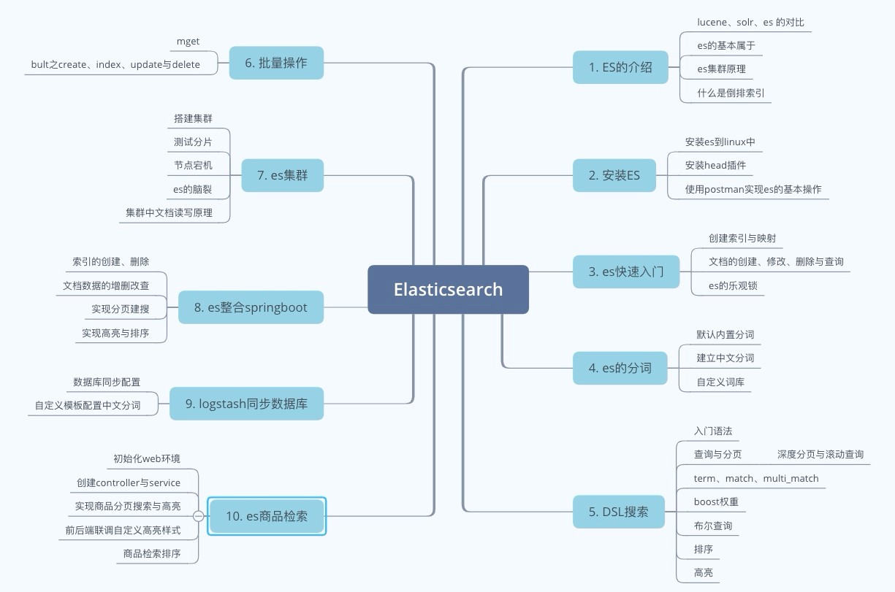

# 总结

思维导图如下：

1. 本阶段主要针对es的讲解，首先我们讲了什么是分布式搜索，以及lucene、solr与es的对比，他们都是全文检索，而且底层基于lucene，目前以es使用最为流行;随后我们又讲了什么是倒排索引，这是搜索引擎里的核心。此外呢我们也在最一开始就讲了集群原理，因为es的使用主要以集群为主，此外还包含了主分片与副本分片的概念；
2. 学习es必须要安装，首先我们在linux中安装了es7，另外呢，我们也安装了head插件，这个插件是基于es的可视化操作，使用起来非常方便当然我们也通过使用postman对es做了一些基本的操作；
3. 接下来我们对es做了一个快速入门，主要是创建索引与映射，文档的CRUD以及es乐观锁的讲解。
4. 在es中 默认的分词是基于英文的，比音是老外发明的 对中文支持的不好，所以我们要自己去安装中文分词器 如此就能对中文词语做分词了，安装好之后，还能对特定的词汇去设置自定义词库，比如 慕课网 不是词语，我们就能为他自定义；
5. DSL搜索是es中的复杂查询，而目也是使用的最多的，其中主要包含了term/match/multimatch/boost/bool/sort/hiahliaht等，这些搜索可以满足日常使用，如果语法忘记，百度上搜一下即可，json没必要手写，直接复制修改就能达到效果。另外我们也讲了分页，分页的话有一点需要注意，那就是深度分页，分页太深，会造成性能的影响。此外我们还讲了滚动搜索，这个相当于是快照分页功能，可以大批量的把数据查询出来；
6. 批量操作在redis中我们也提到过，在es中也有，因为批量操作可以提高性能与吞叶量，查询使用maet，增加删除修改使用bulk就能达到效果；
7. es集群是非常重要的，在企业里es往往以集群的形式存在，一般以3个节点居多，在老版本中，es集群有一个需要注意的就是脑裂问题，一定要设置半数master节点以上的投票，才能选举成为一个master，否则会出现脑裂现象，这个在老版本es中需要注意；
8. es提供了rest-api，所以我们可以使用es结合springboot来实现检索功能，主要是通过elasticsearchTemplate来进行相关检索，比如创建索引，文档的crud，分页，高亮，排序等；
9. 要查询商品数堀 那么我们必须要把数握同步到es中，这里我们使用了loastash 重要注音 版木要和es的安装版木-致，同步好以后就能检索相关数据了。自动同步以后，loastash会使用自定义的模板为我们创建mappinas映射，这样的话中文分词就不行了，我们可以手动创建或者使用自定义logstash模板来设詈field的中文分词就行了。
10. 最后我们把es整合到了项目中，实现了基于商品的全文检索，并且还有分页高亮以及排序。

