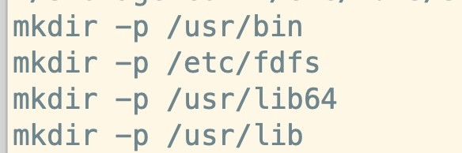
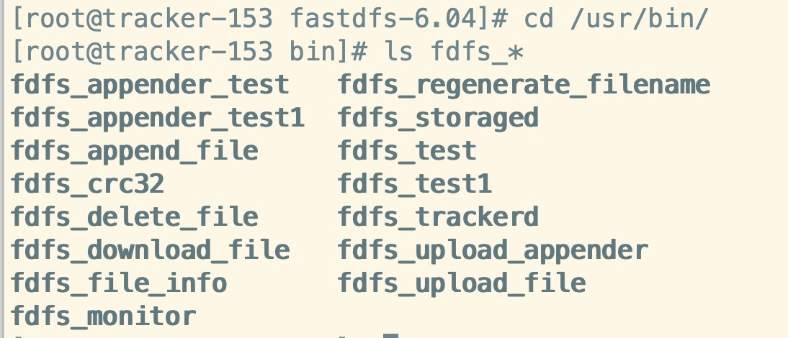
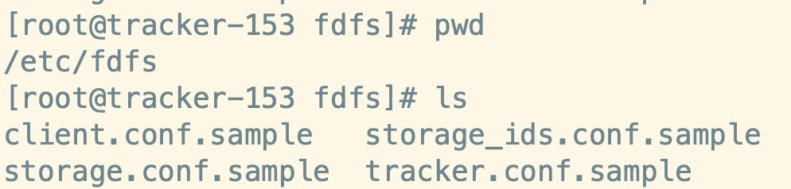
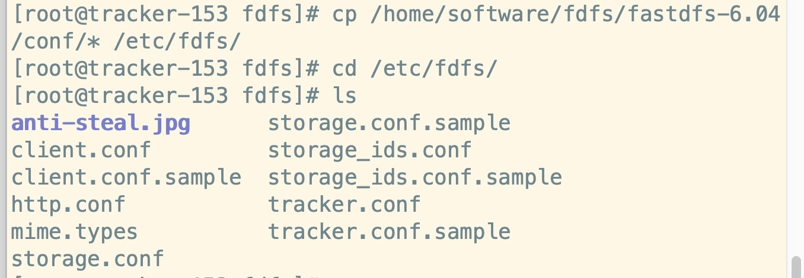

# 配置FastDFS环境准备工作

## 1、环境准备

Centos7.x两台，分别安装tracker与storage

下载安装包：

- libfatscommon:FastDFS分离出的一些公用函数包
- FastDES:FastDES本体
- fastdfs-nginx-module:FastDFS和nginx的关联模块
- nginx:发布访问服务

## 2、安装步骤 (tracker与storage都要执行)

-  安装基础环境

```
yum install -y gcc gcc-c++
yum -y install libevent
```

- 安装libfatscommon函数库

```
# 解压
tar -zxvf libfastcommon-1.0.42.tar.gz
```

- 进入libfatscommon文件夹，编译并安装

```
./make.sh
./make.sh install
```

- 安装 fastdfs 主程序文件

```
# 解压
tar -zxvf fastdfs-6.04.tar.gz
```

- 进入到 fastdfs 目录，查看 fastdfs 安装配置

```
cd fastdfs-6.04/
vim make.sh
```

```
TARGET_PREFIX=$DESTDIR/usr
TARGET_CONF_PATH=$DESTDIR/etc/fdfs
TARGET_INIT_PATH=$DESTDIR/etc/init.d
```

- 安装 fastdfs 

```
./make.sh
./make.sh install    
```



如上图：

/usr/bin ：中包含了可执行文件；

/etc/fdfs ：中包含了配置文件；





拷贝配置文件如下：

```
cp /home/software/FastDFS/fastdfs-6.04/conf/* /etc/fdfs/
```




Storage服务器操作同上