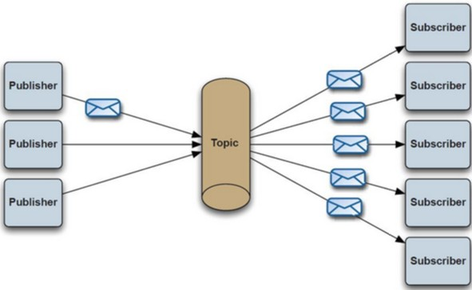
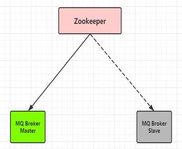

# ActiveMQ集群架构与原理解析

说起ActiveMQ，就必须先聊聊 JMS(Java Message Service)规范，也就是 Java消息服务，它定义了Java中访问消息中间件的接口的规范。在这里注意哦，JMS只是接口，并没有给予实现，实现 JMS接口的消息中间件称为“JMS Provider”。

目前知名的开源MOM(Message Oriented Middleware，也就是消息中间件)系统包括Apache的ActiveMQ，RocketMQ，Kafka，以及RabbitMO，可以说他们都“基本遵循”或“参考”JMS规范，都有自己的特点和优势。

## 1、专业术语

- JMS(Java Message Service)：实现JMS接口的消息中间件；
- Provider(MessageProvider)：消息的生产者；
- Consumer(MessageConsumer)：消息的消费者；
- PTP(Point to Point):即点对点的消息模型，这也是非常经典的模型；
- Pub/Sub(Publish/Subscribe：即发布/订阅的消息模型；
- Queue：队列目标，也就是我们常说的消息队列，一般都是会真正的进行物理存储；
- Topic：主题目标；
- ConnectionFactory：连接下厂，JMS 用它创建连接；
- Connection：JMS 客户端到 JMS Provider 的连接；
- Destination：消息的目的地；
- Session：会话，一个发送或接收消息的线程(这里Session可以类比Mybatis的Session；

JMS 消息格式定义：

- StreamMessage： 原始值的数据流；
- MapMessage： 一套名称/值对；
- TextMessage： 一个字符串对象；
- BytesMessage： 一个未解释字节的数据流；
- ObjectMessage：一个序列化的Java对象

## 2、了解ActiveMQ

ActiveMQ 是一个完全支持JMS1.1和J2EE 1.4规范的 JMS Provider实现，尽管JMS规范出台已经是很久的事情了，但是JMS在早些年的“J2EE应用”时期扮演着特殊的地位，可以说那个年代ActiveMQ在业界应用最广泛，当然如果现在想要有更强大的性能和海量数据处理能力，ActiveMQ还需要不断的升级版本，不断的提升性能和架构设计的重构。

就算现在，80%以上的业务使用ActiveMQ已经足够满足需求，其丰富的API，多种集群构建模式使得其成为业界老牌消息中间件，在中小型企业中应用广泛!

当然如果你想针对大规模、高并发应用服务做消息中间件技术选型，譬如淘宝、京东这种大型的电商网站，尤其是双11这种特殊时间，ActiveMQ可能就显得力不从心了。

## 3、消息投递模式

首先要了解JMS规范里最经典的两种消息投递模式，即“点对点”与“发布订阅”。

-  **点对点**：生产者向队列投递一条消息，只有一个消费者能够监听得到这条消息(PTP)，下图所示；


- **发布订阅**：生产者向队列投递一条消息，所有监听该队列的消费者都能够监听得到这条消息（P/S），下图所示：



## 4、ActiveMQ各项指标

衡量一个MOM，我们主要从三方面考虑即可，即服务性能、存储堆积能力、可扩展性。

- 服务性能：ActiveMQ的性能一般，在早期传统行业为王的时代还是比较流行的，但现如今面对高并发、大数据的业务场景，往往力不从心；
- 数据存储：默认采用kahadb存储(索引文件形式存储)，也可以使用高性能的 google leveldb(内存数据库存储)，或者可以使用MySql、Oracle进程消息存储(关系型数据库存储)；
- 集群架构：ActiveMQ 可以与zookeeper进行构建 主备集群模型，并且多套的主备模型直接可以采用Network的方式构建分布式集群。

## 5、ActiveMQ集群架构模式

ActiveMQ 最经典的两种集群架构模式，Master-Slave、Network集群模式

**Master-Slave**：顾名思义，就是主从方式，当然这里要理解为主备的方式，也就是双机热备机制；Master Slave 背后的想法是，消息被复制到slave broker，因此即使master broker遇到了像硬件故障之类的错误，你也可以立即切换到slave broker而不丢失任何消息。 Master Slave是目前ActiveMQ推荐的高可靠性和容错的解决方案。



架构思考：Master-Slave集群模型的关键点:

上图(Master-Slave)绿色的为主节点，灰色的则为备份节点，这两个节点都是运行状态的。

·zookeeper的作用就是为了当绿色的主节点宕机时，进行及时切换到备份的灰色节点上去，使其进行主从角色的互换，用于实现高可用性的方案。

Master-Slave集群模型的缺点也显而易见，就是不能做到分布式的tonic，queue，当消息量巨大时，我们的MO集群压力过大，没办法满足分布式的需求。

**Network**：


Network：这里可以理解为网络通信方式，也可以说叫Network of brokers。这种方式真正解决了分布式消息存储和故障转移、broker切换的问题。可以理解消息会进行均衡;从ActiveMQ1.1版本起，ActiveMQ支持networks of brokers。它支持分布式的queues和topics。

一个broker会相同对待所有的订阅(subscription)：不管他们是来自本地的客户连接，还是来自远程broker，它都会递送有关的消息拷贝到每个订阅。远程broker得到这个消息拷贝后，会依次把它递送到其内部的本地连接上。

架构思考：Network集群模型的关键点：

首先，这种方案需要两套或多套(Master-Slave)的集群模型才可以搞定，部署非常麻烦，需要两套或多套集群直接相互交叉配置，相互间能够感知到彼此的存在。

下面给出一段XML配置，简单来说就是在ActiveMQ的配置文件里要进行多套(Master-Slave)之间的networkConnector配置工作：

```
<broker brokerName="receiver" persistent="false" useJmx="false">
 	<transportConnectors>
 		<transportConnector uri="tcp://localhost:62002"/>
 	</transportConnectors>
 	<networkConnectors>
    	<networkConnector 
              uri="static:( tcp://localhost:61616,tcp://remotehost:61616)"/>
 	</networkConnectors>
</broker>
```

其次，Network虽然解决了分布式消息队列这个难题，但是还有很多潜在的问题，最典型的就是资源浪费问题，并且也可能达不到所预期的效果;通常采用Master-Slave模型是传统型互联网公司的首选，作为互联网公司往往会选择开箱即用的消息中间件，从运维，部署，使用各个方面都要优于ActiveMQ，当然AativeMQ毕竟是“老牌传统强Q"，Apache的顶级项目之一，目前正在进行新版本的重构(对于5.X版本)与落地，下一代“Artemis代理”，也可以理解为“6.X”。

有兴趣的小伙伴可以关注一下官网，传送门如下:https://activemq.apache.org