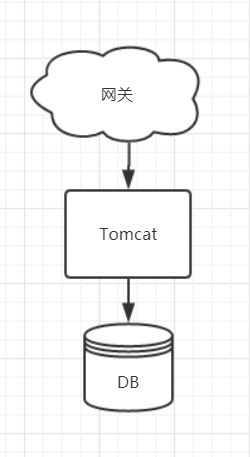
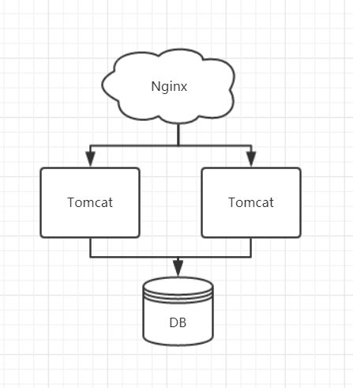
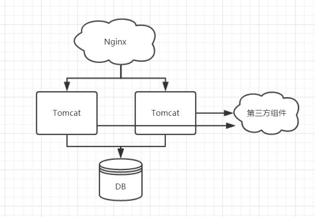

# Java单体应用锁与分布式锁

##### 1、互联网系统架构的演进

在互联网系统发展之初，系统比较简单，消耗资源小，用户访问量也比较少，我们只部署一个Tomcat应用就可以满足需求。系统架构图如下：

一个Tomcat 可以看作是一个 JVM 进程，当大量的请求并发到达系统时，所有的请求都落在这唯一的一个Tomcat上，如果某些请求方法是需要加锁的，比如秒杀扣减库存，是可以满足需求的，这和我们前面所讲的内容是一样的。但是随着访问量的增加，导致一个Tomcat难以支撑，这时我们就要集群部署 Tomcat，使用多个Tomcat共同支撑整个系统，系统架构图如下：

上图中，我们部署了两个Tomcat，共同支撑系统，当一个请求到达系统时，首先会经过Nginx，Nginx主要是做负载转发的，它会根据自己配置的负载均衡策略将请求转发到其中的一个Tomcat中。当大量的请求并发访问时，两个Tomcat共同承担所有的访问量，这时，我们同样在秒杀扣减库存的场景中，使用单体应用锁，还能够满足要求吗?

##### 2、单体应用锁的局限性

如上图所示，在整个系统架构中存在两个Tomcat，每个Tomcat是一个JVM，在进行秒杀业务的时候，由于大家都在抢购秒杀商品，大量的请求同时到达系统，通过Nginx分发到两个Tomcat上，我们通过一个极端的案例场景，可以更好地理解单体应用锁的局限性。

假如，秒杀商品的数量只有1个，这时这些大量的请求当中，只有一个请求可以成功的抢到这个商品，这就需要在扣减库存的方法上加锁，扣减库存的动作只能一个一个去执行，而不能同时去执行，如果同时执行，这1个商品可能同时披多人抢到，从而产生超卖现象。

加锁之后，扣减库存的动作一个一个去执行，凡是将库存扣减为负数的，都抛出异常，提示该用户没有抢到商品。通过加锁看似解决了秒杀的问题，但是事实上真的是这样吗?

我们看到系统中存在两个Tomcat，我们加的锁是JDK提供的锁，这种锁只能在一个JVM下起作用，也就是在一Tomcat内是没有问题的。当存在两个或两个以上的Tomcat时，大量的并发请求分散到不同的Tomcat上，在每一个Tomcat中都可以防止并发的产生，但是在多Tomcat之间，每个Tomcat中获得锁的这个请求，又产生了并发，从而产生超卖现象。这也就是单体应用锁的局限性：**它只能在一个JVM内加锁，而不能从这个应用层面去加锁。**

那么这个问题如何解决呢?

这就需要使用分布式锁了，在整个应用层面去加锁。

##### 3、什么是分布式锁

在说分布式锁之前，我们看一看单体应用锁的特点，单体应用锁是在一个JVM进程内有效，无法跨JVM、跨进程。那么分布式销的定义就出来了，分布式锁就是可以跨越多个JVM、跨越多个进程的锁，这种锁就叫做分布式锁。

##### 4、分布式锁的设计思路

在上图中，由于Tomcat 是由Java启动的，所以每个Tomcat可以看成一个JVM，JVM内部的锁是无法跨越多个进程的。所以我们要实现分布式锁，我们只能在这些JVM之外去寻找，通过其他的组件来实现分布式锁，系统架构图如下：

两个Tomcat通过第三方的组件实现跨JVM、跨进程的分布式锁，这就是分布式锁的解决思路，找到所有JVM可以共同访问的第三方组件，通过第三方组件实现分布式锁。

##### 5、目前存在的分布式的方案

分布式锁都是通过第三方组件来实现的，目前比较流行的分布式锁的解决方案有:

- **数据库**，通过数据库可以实现分布式锁，但是在高并发的情况下对数据库压力较大，所以很少使用；
- **Redis**，借助Redis也可以实现分布式锁，而且Redis的Java客户端种类很多，使用的方法也不尽相同；
- **Zookeeper**，Zookeeper也可以实现分布式锁，同样Zookeeper也存在多个Java客户端，使用方法也不相同。

