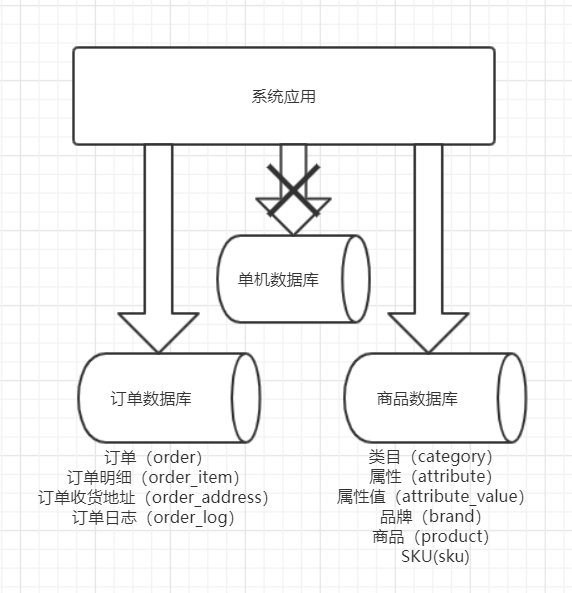
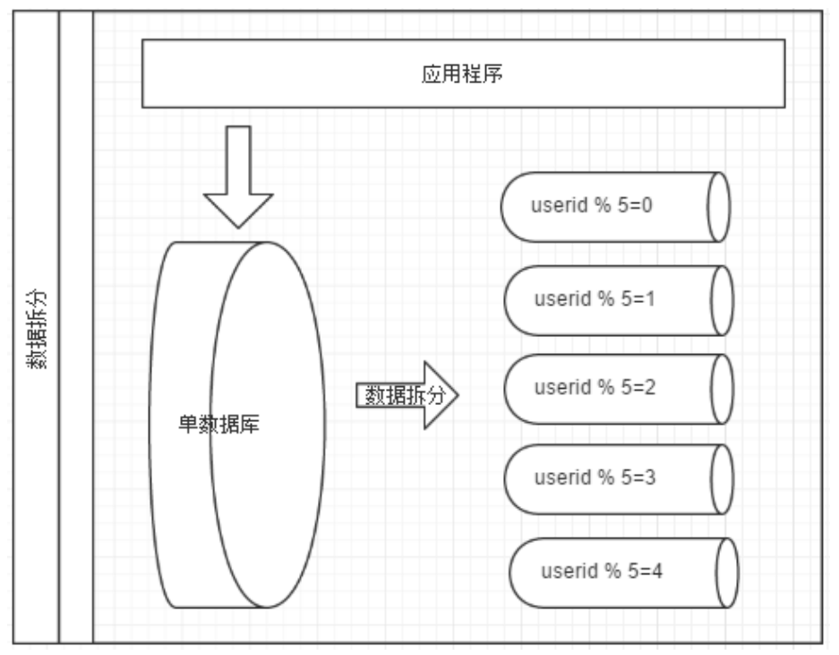

# 海量数据的存储与访问瓶颈解决方案-数据切分

## 1、背景

在当今这个时代，人们对互联网的依赖程度非常高，也因此产生了大量的数据，企业视这些数据为瑰宝，而这些被视为瑰宝的数据为我们的系统带来了很大的烦恼。这些海量数据的存储与访问成为了系统设计与使用的瓶颈，而这些数据往往存储在数据库中，传统的数据库存在着先天的不足，即单机(单库)，性能瓶颈，并目扩展起来非常困难，在当今的这个大数据时代，我们急需解决这个问题，如果单机数据苦易于扩展，数据可切分，就可以避免这些问题，但是当前的这些数据库广商，包括开源的教据库MYSQL在内，提供这些服务都是需要收费的，所以我们转向一些第三方的软件，使用这些软件做数据的切分，将原本在一台数据库上的数据，分散到多台数据库当中，降低每一个单体数据库的负载。那么我们如何做数据切分呢?

## 2、数据切分

数据切分，简单的说，就是通过某种条件，将我们之前存储在一台数据库上的数据，分散到多台数据库中，从而达到降低单台数据库负载的效果，数据切分，根据其切分的规则，大致分为两种类型，垂直切分和水平切分。

## 3、垂直切分

垂直切分就是按照不同的表或者Schema切分到不同的数据库中，在我们课程中，订单表(order) 和商品表 (product) 在同一数据库中，而我们现在要对其切分，使得订单表(order)和商品表(product)分别落到不同的物理机中的不同的数据库中，使其完全隔离，从而达到降低数据库负载的效果，如图所示：

垂直切分的特点：规则简单，易于实施，可以根据业务模块进行划分，各个业务之间耦合性低，相互影响也较小。

一个架构设计较好的应用系统，其总体功能肯定是有多个不同的功能模块组成的。每一个功能模块对应着数据库里的一系列表，例如在咱们的课程当中，商品功能模块对应的表包括：类目、属性、属性值、品牌、商品、SKU等表，而在订单模块中，对应的表包括：订单、订单明细、订单收货地址、订单日志等，如图所示：

在架构设计中，各个功能模块之间的交互越统一、越少越好。这样系统模块之间的耦合度会很低，各个系统模块的可扩展性、可维护性也会大大提高。这样的系统，实现数据的垂直切分就会很容易。

但是，在实际的系统架构设计中，有一些表很难做到完全的独立，往往存在跨库join的现象，还是上面的例子，比如我们接到了一个需求，要求查询某一个类目产生了多少订单，如果在单体数据库中，我们直接连表查询就可以了。但是现在垂直切分成了两个数据库，跨库连表查询是十分影响性能的，也不推荐这样用，只能通过接口去调取服务，这样系统的复杂度又升高了。

对于这种很难做到完全独立的表，作为系统架构设计人员，就要去做平衡，是数据库让步于业务，将这些表放在一个数据库当中？还是拆分成多个数据库，业务之间通过接口来调用呢? 

在系统初期，数据量比较小，资源也有限，往往会选择放在一个数据库当中。而随着业务的发展，数据量达到了一定的规模，就有必要去进行数据的垂直切分了。而如何进行切分，切分到什么程度，则是对架构师的一个艰难的考验。

下面我们来看看垂直切分的优缺点：

**优点：**

1. 拆分后业务清晰，拆分规则明确；
2. 系统之间容易扩展和整合；
3. 数据维护简单

**缺点：**

1. 部分业务表无法join，只能通过接口调用，提升了系统的复杂度；
2. 跨库事务难以处理；
3. 垂直切分后，某些业务数据过于庞大，仍然存在单体性能瓶颈

某一个业务模块的数据暴增时，仍然存在着单机性能缺陷。还是之前的例子，如果出现了一个爆款商品，订单量急剧上升，达到了单机性能瓶颈，那么你所有和订单相关的业务都要受到影响。这时我们就要用到水平切分。

## 4、水平切分

水平切分相比垂直切分更为复杂。它需要将一个表中的数据，根据某种规则拆分到不同的数据库中，例如：订单尾号为奇数的订单放在了订单数据库1中，而订单尾号为偶数的订单放在了订单数据库2中。这样原本存在一个数据库中的订单数据，被水平的切分成了两个数据库。

在查询订单数据时，我们还要根据订单的尾号，判断这个订单在数据库1中，还是在数据库2中，然后将这条SQL语句发送到正确的数据库中，查出订单，水平切分的架构图如下：

水平拆分数据，要先制定订单拆分的规则，找到你要按哪个维度去拆分，还是前面订单的例子，我们按照订单尾号的奇偶去拆分，那么这样拆分会有什么是影响呢? 

假如我是个用户，我下了两个订单，一个订单尾号为奇数，一个订单尾号为偶数，这时我去个人中心的订单列表页去查看我的订单，那么这个订单列表页要去怎么查，**要根据我的用户id分别取订单1库和订单2库去查询出订单，然后再合并成一个列表**，是不是很床烦须。

所以，咱们在拆分数据时一定要结合业务，选择出适合当前业务场景的拆分规则。那么按照用户id去拆分数据就合理吗? 也不一定，比如咱们的身份变了，不是买家了，而是卖家，我这个卖家有很多的订单，卖家的后台系统也有订单列表页，那这个订单列表页要怎么样去查? **是不是也要在所有的订单库中查一遍然后再聚合成一个订单列表呀**，那这样看是不是按照用户id去拆分订单又不合理了。所以在做数据水平拆分时，是对架构师的真正考验。

我们看看几种水平拆分的典型的分片规则：

1. 用户id求模；
2. 按照日期去拆分数据;
3. 按照其他字段求模，去拆分数据

下面是按照用户id去求模拆分的一个示意图：

水平拆分的优缺点：

优点：

1. 解决了单库大数据、高并发的性能瓶颈；
2. 拆分规则封装好，对应用端几乎透明，开发人员无需关心拆分细节；
3. 提高了系统的稳定性和负载能力;

缺点：

1. 拆分规则很难抽象；
2. 分片事务一致性难以解决；
3. 二次扩展时，数据迁移、维护难度大；比如开始我们按照用户id对2求模，但是随着业务的增长，2台数据库难以支撑，还是继续拆分成4个数据库，那么这时就需要做数据迁移了。

## 5、总结

世界上的万物没有完美的，有利就有弊，就像数据切分一样，无论是垂直切分，还是水平切分，它们解决了海量数据的存储和访问性能问题，但也随之而来的带来了很多新问题，它们的共同缺点有：

- 分布式的事务问题；
- 跨库join问题；
- 多数据源的管理问题

针对多数据源的管理问题，主要有两种思路：

1. 客户端模式，在每个应用模块内，配置自己需要的数据源，直接访问数据库，在各模块内完成数据的整合；
2. 中间代理模式，中间代理统一管理所有的数据源，数据库层对开发人员完全透明，开发人员无需关注拆分的细节。

基于这两种模式，目前都有成熟的第三方软件，这两种模式的代表作：

- 中间代理模式：MyCat
- 客户端模式：sharding-jdbc