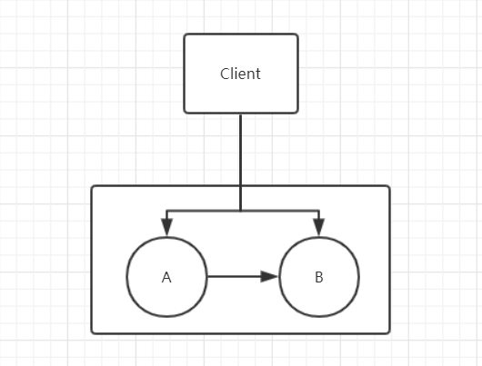

# 分布式系统中的CAP原理

## 一、简介

在分布式系统中，我们经常听到CAP原理这个词，这其实和C、A、P这3个字母有关，C、A、P分别是这3个词的首字母，下面我们就看一下这3个词分别是什么意思?

**C-Consistent：**一致性，具体是指，操作成功以后，所有的节点，在同一时间，看到的数据都是完全一致的。所以，一致性，说的就是数据致性；

**A-Availability：** 可用性。指服务一致可用，在规定的时间内完成响应；

**P-Partition tolerance：**分区容错性，指分布式系统在遇到某节点或网络分区故障的时候，仍然能够对外提供服务。

CAP原理指出，这3个指标不能同时满足，最多只能满足其中的两个。

## 2、详解

我们之所以使用分布式系统，就是为了在某个节点不可用的情况下，整个服务对外还是可用的，这正是满足P（分区容错性) ，如果我们的服务不满定P(分区容错性)那么我们的系统也就不是分布式系统了，所以，在分布式系统中，P(分区容错性）总是成立的。那么，A (可用性)和C(一致性)能不能同时满足呢?

我们看下面的图例：

A和B是两个数据节点，A向B同步数据，并且作为一个整体对外提供服务。由于我们的系统保证了P(分区容错性)，那么A和B的同步，我们允许出现故障。接下来我们再保证A(可用性)，也就是说A和B同步出现问题时，客户端还能够访问我们的系统，那么客户端既可能访问A也可能访问B，这时，A和B的数据是不一致的，所以C(一致性)不能满足。

如果我们满足C(一致性)，也就是说客户端无论访问A还是访问B，得到的结果都是一样的，那么现在A和B的数据不一致，需要等到A和B的数据一致以后，也就是同步恢复以后，才可对外提供服务。这样我们虽然满足了C(一致性) ，却不能满足A (可用性)。

所以，系统在满足P(分区容错性)的同时，只能在A(可用性)和C（一致性）当中选择一个，不能CAP同时满足，我们的分布式系统只能是AP或者CP。

## 三、ACID与BASE

在关系型数据库中，最大的特点就是事务处理，也就是ACID。

ACID是事务处理的4个特性：

- **A - Atomicity (原子性)：**事务中的操作要么都做，要么都不做；
- **C - Consistency (一致性) ：**系统必须始终处在强一致状态下；
-  **l - lsolation (隔离性)：**一个事务的执行不能被其他事务所工扰；
- **D - Durability (持久性)：**一个已提交的事务对数据库中数据的改变是永久性的。

ACID强调的是强一致性，要么全做，要么全不做，所有的用户看到的都是一致的数据。传统的数据库都有ACID特性，它们在CAP原理中，保证的是CA。但是在分布式系统大行其道的今天，满足CA特性的系统很难生存下去。

ACID也逐渐的向BASE转换。那么什么是BASE呢?

BASE是Basically Available (基本可用)，Sot-state (软状态)，Eventually consistent (最终一致)的缩写。

- **Basicaly Available**：基本可用是指分布式系统在出现故的时候，允许损失部分可用性，即保证核心可用。电商大促时，为了应对访问量激增，部分用户可能会被引导到降级页面，服务层也可能只提供降级服务。这就是损失部分可用性的体现。
- **软状态 (Soft State)：**指允许系统存在中间状态，而该中间状态不会影响系统整体可用性，分布式存储中一般一份数据至少会有两到三个副本，允许不同节点间副本同步的延时就是软状态的体现。mysgl replication的异步复制也是一种体现。
- **最终一致性 ( Eventual Consistency)：**指系统中的所有数据副本经过一定时间后，最终能够达到一致的状态，弱一致性和强一致性相反，最终一致性是弱一致性的一种特殊情况。

BASE型是传统ACID模型的反面，不同与ACID，BASE强调牺牲高一致性，从而获得可用性，**数据允许在一段时间内的不一致，只要保证最终一致就可以了。**

在分布式事务的解方案中，它们都是依赖了ACID或者BASE的模型而实现的。像基于XA协议的两阶段提交和实物补偿机制就是基于ACID实现的。而基于本地消息表和基于MQ的最终一致方案都是通过BASE原理实现的。