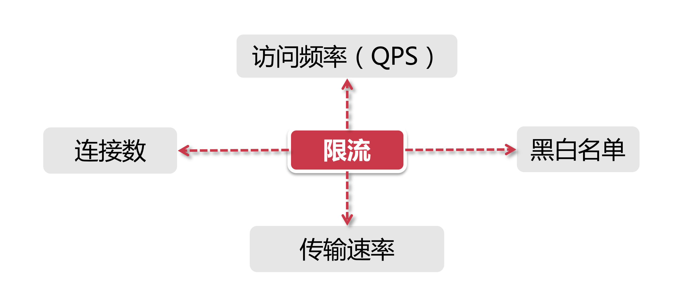

# 分布式限流介绍

说到“限流”这个词，我想同学们在实际生活中肯定经历过“被限流 的情况，只是大家浑然不觉，接下来就让我们回顾下那些深藏不漏的限流手段。

## 1、那些年被欺骗的感情

春运，一项全人类历史上最大规模的迁移活动，抢火车票一直是每年停年以后的热点话题，提起这个沉重的话题，我们不得不说起12306某个由5位数字组成的网站，大家每年都要通过这个网站购买火车票，这个系统在春运期间所承受的访问压力那是相当的大，毕竟不是所有人都会参加双11，但是大家过年总是要回老家的。

话说降低系统压力最有效的方式就是减少访问流量，说白了就是把用户拒之门外。比如说，可以给用户一句”服务正忙”的提示，将用户请求丢弃不管。但是这种事儿又不好光明正大的做，毕竟全国人民都知道我这网站花了好几个亿的成本，那怎么样才能做到不声不响把用户流量限制住呢?

答案在这里：

没错，就是坑死你没商量的验证码!

同学们肯定发现了这样一种情况，在春运抢票的时候，当你面对这么一堆验证码图片，不管你怎选，即使你用毕生所学选出了正确答案，提交后依然都会被告知你选错了，要么就是让你面对一堆鬼都看不出是什么东西的图片，不要怀疑自己的智商，其实，这就是网站的一种别样的限流措施，在拷问用户智商的同时，通过这种"故意"刁难的手段，光明正大地限制访问流量，从而大幅降低系统的访问压力，真不得不敬佩产品经理的智慧。

## 2、分布式限流的几种维度

通过前面的例子，再加上大家过往的经验，不难理解“限流”的含义，对一般的限流场景来说它具有两个维度的信息：

- **时间：** 限流基于某段时间范围或者某个时间点，也就是我们常说的“时间窗口”，比如对每分钟、每秒钟的时间窗口做限定；
- **资源：**基于可用咨源的限制，比如设定最大访问次数，或最高可用连接数。

上面两个维度结合起来看，限流就是在某个时间窗口对资源访问做限制，比如设定每秒最多100个访问请求，但在真正的场景里，我们不止设置一种限流规则，而是会设置多个限流规则共同作用，主要的几种限流规则如下：

### 2.1、QPS和连接数控制

针对上图中的连接数和QPS（quey per seond）限流来说，我们可以设定IP维度的限流，也可以设置基于单个服务的限流。在真实环境中通常会设置多个维度的限流规则，比如设定同一个IP每秒访问频率小于10，连接数小于5，再设定每台机器QPS最高1000，连接数最大保持20，更进一步，我们可以把某个服务器组或整个机房的服务器当做一个整体，设置更high-level的限流规则，这些所有限流规则都会共同作用于流量控制。

【在稍后的小节里，我们的实践Demo部分将主要围绕在QPS和连接数控制的限流规则】

## 2.2、传输速率

对于 “传输速率“ 大家都不会陌生，比如资源的下载速度，有的网站在这方面的限流逻辑做的更细致，比如普通注册用户下载度为100K/S，购买会员后是10M/S，这背后就是基于用户组或者用户标签的限流逻辑。

【在稍后的小节我们会给大家展示如何在Nginx中限制传输速度】

## 2.3、黑白名单

黑白名单是各个大型企业应用里很常见的限流和放行手段，而且黑白名单往往是动态变化的，举个例子，如果某个IP在一段时间的访问次数过于频繁，被系统识别为机器人用户或流量攻击，那么这个IP就会被加入到黑名单，从而限制其对系统资源的访问，这就是我们俗称的”封IP”。

我们平时见到的爬虫程房，比如说爬知乎上的美女图片，或者爬券商系统的股票分时信息，这类爬虫程序都从须实现更新 IP的功能，以方被加入黑名单。有时我们还会发现公司的网络无法访问12306这类大型公共网站，这也是因为某些公司的出网IP是同一个地址，因此在访问量过高的情况下，这个IP地外就被对方系统识别，进而被添加到了黑名单。使用家庭宽带的同学们应该知道，大部分网络运营商都会将用户分到到不同出网IP段，或者时不时动态更换用户的IP地址。

白名单就更好理解了，相当于御赐金牌在身，可以自由穿梭在各种限流规则里，畅行无阻。比如某些电商公司会将超大卖家的账号加入白名单，因为这类卖家往往有自己的一套运维系统，需要对接公司的IT系统做大量的商品发布、补货等等操作。

## 3、分布式环境

所谓的分布式限流，其实道理很简单，一句话就可以解释清楚。分布式区别于单机限流的场景，它把整个分布式环境中所有服务器当做一个整体来考量，比如说针对IP的限流，我们限制了1个IP每秒最多10个访问，不管来自这个IP的请求落在了哪台机器上，只要是访问了集群中的服务节点，那么都会受到限流规则的制约。

从上面的例子不准看出，我们必须将限流信息保存在一个"中心化”的组件上，这样它就可以获取到集群中所有机器的访问状态，目前有两个比较主流的限流方案：

- **网关层限流：** 将限流规则应用在所有流量的入口处；
- **中间件限流：** 将限流信息存储在分布式环境中某个中间件里(比如Redis缓存)，每个组件都可以从这里获取到当前时刻的流量统计，从而决定是拒绝服务还是放行流量。

我们将在接下来的章节里手把手搭建上面两种限流方案。