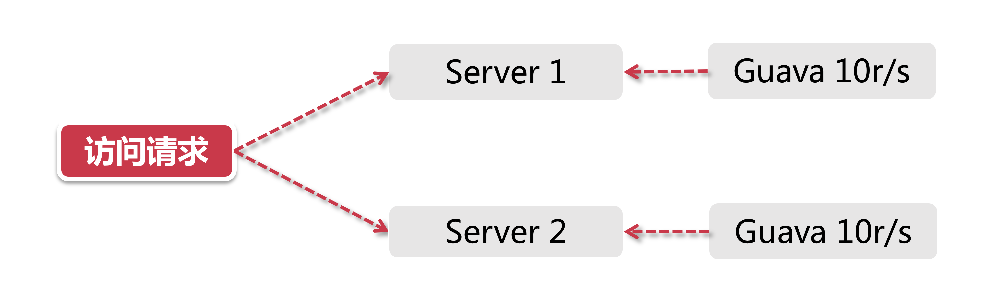
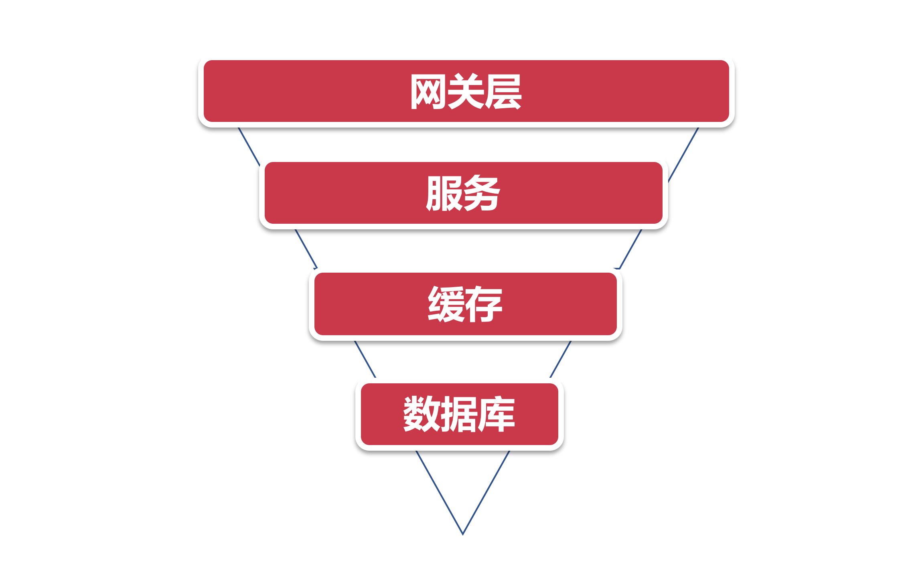

# 常见的分布式限流方案

前面我们了解了什么是分布式限流，这一节我们就挑选其中三个主流方案，同大家一起学习。

## 1、Guava

说起Guava大家一定不陌生，它是Google出品的一款工具包（com.google.guava) ，我们经常用它做一些集合操作比 `Lists.newArrayList()`，最源于2007年的"Google Collections Library 项目。Guava不甘于将自己平凡的一生都耗费在Collections 上面，于是子它开始了转型，慢慢扩展了自己在 Java 领域的影响力，从反射工具、函数式编程、安全验证、数学运算等等方面，都提供了响应的工具包。

在限流这个领域中，Guava也贡献了一份绵薄之力，在其多线程模块下提供了以RateLimter 为首的几个限流支持类，我们前面提到了，Guava是一个客户端组性，也就是说它的作用范围仅限于“当前”这台服务器，不能对集群以内的其他服务器施加流量控制。

打个比方，目前我有2台服务[ Senver 1，Server 2]，这两台服务器都部署了一个登陆服务，假如我希望对这两台机器的流量进行控制，比将两台机器的访问量总和按制在每秒20以内，如果用Guava来做，只能独立控制每台机器的访问量<=10。

尽管Guava不是面对分布式系统的解决方案，但是其作为一个简单轻量级的客户端限流组件，非常适合来讲解限流算法，稍后的章节我们将使用Guava做一个热身，让大家对限流的算法理论有了大致的了解以后，再学习其他的分布式限流方案。

## 2、网关层限流

在整个分布式系统中，如果有这么一个“一夫当关，万夫莫开”的角色，非网关层莫属。服务网关，作为整个分布式链路中的第一道关卡，承接了所有用户来访请求。

### 2.1、网关层限流的架构考量

漏斗是个好东西，不仅可以用来打香油，还可以应用在很多系统设计的领域，我们将系统流量的分布层次抽象成一个简单的漏斗模型来看：

上面是一个最普通的流量模型，从上到下的路径依次是：

1. 用户流量从网关层转发到后台服务
2. 后台服务承接流量，调用缓存获取数据
3. 缓存中无数据，则访问数据库

为什么说它是一个漏斗模型，因为流量自上而下是逐层递减的，在网关层聚集了最多最密集的用户访问请求，其次是后台服务。然后经过后台服务的验证逻辑之后，刷掉了一部分错误请求，剩下的请求落在缓存上，如果缓存中没有数据才会请求漏斗最下方的数据库，因此数据库层面请求数量最小(相比其他组件来说数据库往往是并发量能力最差的一环，阿里系的MySQL即便经过了大量改造，单机并发量也无法和Redis 、Kafka之类的组件相比)。

如果在上面这人漏斗模型中做流量限制，大家觉得在哪个环节最合适？

答案是：网关层，因为它是整个访问链路的源头，是所有流量途径的第一站，目前主流的网关层有以软件为代表的Nginx，还有Spring Cloud中的 Gateway和 Zuul 这类网关层组件，也有以硬件+软件为代表的F5(F5价钱贵到你怀疑人生)。

### 2.2、预告: Nginx限流

我们在这章将以Nginx为例，手把手教大家如何利用Nginx实现网关层限流，在后面的微服务章节我们将涉及到SorinCloud中的Gateway组件的网关层限流。

在稍后的章节中我们将个绍Nginx里的几种核心限流模式：

- 基于IP地址和基于服务器的访问请求限流；
- 并发量(连接数) 限流；
- 下行带宽速率限制

## 3、中间件限流

开发团队的年轻人们都是很有控制欲的，网关层限流对他们来说貌似有点不那么受控，毕竟不像改个程序代码那么简单，搞不好还要求爷爷告奶奶去让运维团队或者NetOpts团队去操作。

我们有没有一个解决方案，将限流下沉到业务层来，让开发团队可以自行控制? 我们来思考一下如何在分布式环境中引入服务层限流。

对于分布式环境来说，无非是需要一个类似中心节点的地方存储限流数据，打个比方，如果我希望控制接口的访问速率为每秒100个请求，那么我就需要将当前1s内已经接收到的请求的数量保存在某个地方，并且可以让集群环境中所有节点都访问。那我们可以用什么技术来存储这些临时数据呢？

这个场景天然适合我们的中间件大显神威，而目还得需要支持超高并发的中间件，Redis正好能填此重任。

> Redis简直就是为服务端限流量身打造的利器。利用Redis过期时间特性，我们可以轻松设置限流的时间跨度（比如每秒10个请求，或者每10秒10个请求) 。同时Redis还有一个特殊技能-脚本编程，我们可以将限流逻编写成一段脚本植入到Redis中，这样就将限流的重任从服务层完全剥离出来，同时Redis强大的并发量特性以及高可用集群架构也可以很好的支持庞大集群的限流访问。

## 4、限流组件

除了上面介绍的几种方式以外，目前也有一些开源组件提供了类似的功能，比如 Sentinel 就是一个不错的选择，Sentinel 是阿里出品的开源组件，并且包含在了Spring Cloud Alibaba组件库中，可以为Cloud服务在下一个“微服务架构设计与落地”的大章节中，我们将详细介绍Sentinel在分布式限流中的应用。

### 4.1、从架构维度考虑限流设计

在真实的大型项目里，不会只使用一种限流手段，往往是几种方式互相搭配使用，让限流策略有一种层次感，达到资源的最大使用率。

在这个过程中，限流策略的设计也可以参考前面提到的漏斗模型，上宽下紧，漏斗不同部位的限流方案设计要尽量关注当前组生的高可用。以我参与的实际项目为例，比如说我们研发了一个商品详情页的接口，通过手机淘宝导流，app端的访问请求首先会经过阿里的mtop网关，在网关层我们的限流会做的比较宽松，等到请求通过网关抵达后台的商品详情页服务之后，再利用一系列的中间件+限流组件，对服务进行更加细致的限流控制(这里面还会包含熔断降级等一系列复杂的异常处理，在微服务的章节中我们再深入学习)。

Mesaoe Queue行不行? 好像MQ的运作模式不大适合这个场景，而目并发室也就差强人意。

Kafka行不行，嗯，并发量机杠的，是个Option。那Redis呢? OMG，整说话就你了! 理由这就给足你!