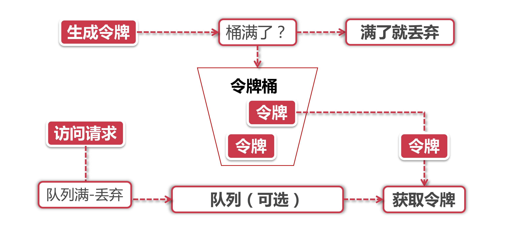
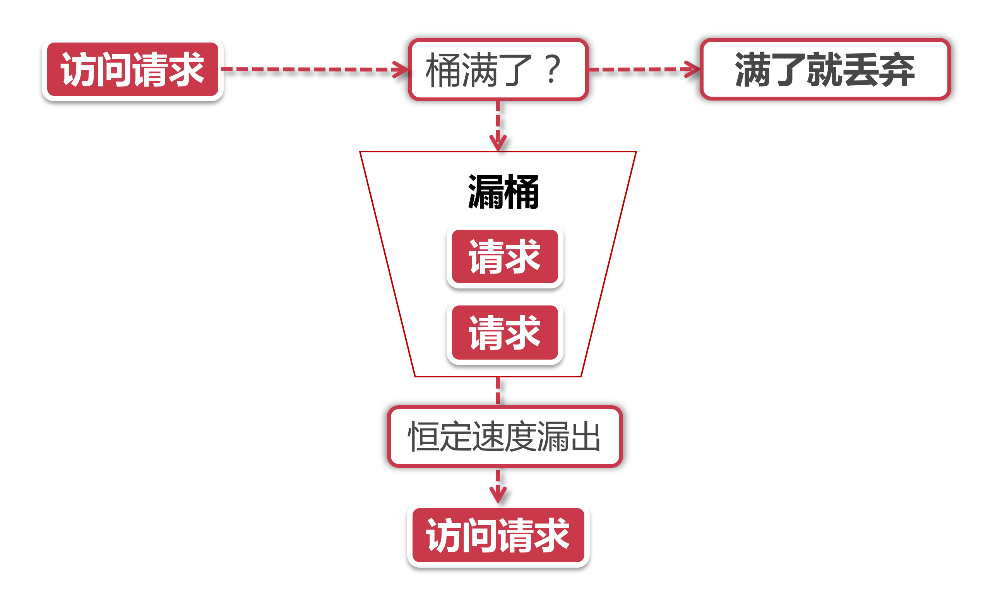
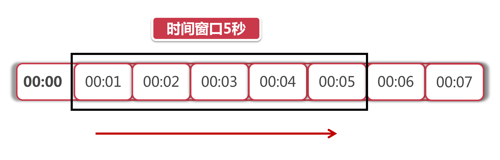

# 限流方案常用算法讲解

前面我们了解了分布式限流的几个常用方案，这一小节我们来透过现象看本质，一起学习下限流组件的底层算法。

正所谓天下武学殊途同归，不管是Nginx限流还是Redis限流，也不管招式要的再花哨，到了最后都是应用几种特定的限流算法，今天我们挑选令牌桶算法、漏桶算法、滑动窗口和计数器算法来讲一下。

## 1、令牌桶算法

Token Bucket令牌桶算法是目前应用最为广泛的限流算法，顾名思义，它有以下两个关键角色：

1. **令牌：** 获取到令牌的Request才会被处理，其他Requests要么排队要么被直接丢弃；
2. **桶：**用来装令牌的地方，所有Request都从这个桶里面获取令牌。

了解了这两个角色之后，让我们来看一下令牌桶算法的图示：

下面我们分别从**令牌生成**和**令牌获取**两个流程来解读令牌桶算法：

### 1.1、令牌生成

这个流程涉及到令牌生成器和令牌桶，前面我们提到过令牌桶是一个装令牌的地方，既然是个桶那么必然有一个容量，也就是说令牌所能容纳的令牌数量是一个固定的数值。

对于令牌生成器来说，它会根据一个预定的速率向桶中添加令牌，比如我们可以配置让它以每秒100个请求的速率发放令牌，或者每分钟50个。注意这里的发放速度是匀速，也就是说这50个令牌并非是在每个时间窗口刚开始的时候一次性发放，而是会在这个时间窗口内匀速发放。

在令牌发放器就是一个水龙头，假如在下面接水的桶子满了，那么自然这个水(今牌)就流到了外面。在令牌发放过程中也一样，令牌桶的容量是有限的，如果当前已经放满了额定容量的令牌，那么新来的令牌就会被丢弃掉。

**思考题：**大家知道为什么要速发放吗?同学们先自己思考一下，在最后一个小节里，我们再来探讨匀速限流和非约速限流的区别。

### 1.2、令牌获取

每个访问请求到来后，必须获取到一个令牌才能执行后面的逻辑，假如令牌的数量少，而访问请求较多的情况下，一部分请求自然无法获取到令牌，那么这个时候我们可以设置一个“缓冲队列”来暂存这些多余的令牌。

缓冲队列其实是一个可选的选项，并不是所有应用了今牌桶算法的程序都会实现队列。当有缓存队列存在的情况下，那些暂时没有获取到令牌的请求将被放到这个队列中排队，直到新的令牌产生后，再从队列头部拿出一个请求来匹配令牌。

当队列已满的情况下，这部分访问请求将被丢弃，在实际应用中我们还可以给这个队列加一系列的特效，比如设置队列中请求的存活时间，或者将队列改造为PriorintyQueue，根据某种优先级排序，而不是先进先出。算法是死的，人是活的，先进的生产力来自于不断的创造，在技术领域尤其如此。

## 2、漏桶算法

漏桶和令牌桶有什么不同呢?  我们来看图：

漏桶算法的前半段和令牌桶类似，但是操作的对象不同，今牌桶是将令牌放入桶里，而漏涌是将访问清求的数据包放到桶里。同样的是，如果桶满了，那么后面新来的数据包将被丢弃。

漏桶算法的后半程是有鲜明特色的，它永远只会以一个恒定的速率将数据包从桶内流出。打个比方，如果我设置了漏桶可以存放100个数据包，然后流出速度是1s一个，那么不管数据包以什么速率流入桶里，也不管桶里有多少数据包，漏桶能保证这些数据包永远以1s一个的恒定速度被处理。

### 2.1、漏桶 vs 今牌桶的区别

根它们各自的特点不难看出来，这两种算法都有一个"恒定 的速率和 “不定” 的速率，今牌桶是以恒定速率创建令牌，但是访问请求获取令牌的速率 “不定”，反正有多少令牌发多少，令牌没了就干等。而漏桶是以“恒定”的速率处理请求，但是这些请求流入桶的速率是“不定”的。

以这两个特点来说，漏桶的天然特性决定了它不会发生突发流量，就算每秒1000个请求到来，那么它对后台服务输出的访问速率永远恒定 。而令牌桶则不同，其特性可以预存”一定量的令牌，因此在应对突发流量的时候可以在短时间消耗所有令牌，其突发流量处理效率会比漏桶高，但是导向后台系统的压力也会相应增多。

## 3、滑动窗口

Rolling Window，如下图：

上图中黑色的大框就是时间窗口，我们设定窗口时间为5秒，它会随着时间准移向后动。我们将窗口内的时间划分为五个小格子，每个格子代表1秒钟，同时这个格子还包含一个计数器，用来计算在当前时间内访问的请求数量。那么这个时间窗口内的总访问量就是所有格子计数器累加后的数值。

比如说，我们在每一秒内有5个用户访问，第5秒内有10个用户访间，那么在0到5秒这个时间窗口内访问量就是15，如果我们的接口设置了时间窗口内访问上限是20，那么当时间到第六秒的时候，这个时间窗口内的计数总和就变成了10，因为1秒的格子已经退出了时间窗口，因此在第六秒内可以接收的访问量就是20-10=10个。

滑动窗口其实也是一种计算器算法，它有一个显著特点，当时间窗口的跨度越长时，限流效果就越平滑。打个比方，如果当前时间窗口只有两秒，而访问请求全部集中在第一秒的时候，当时间向后滑动一秒后，当前窗口的计数量将发生较大的变化，拉长时间窗口可以降低这种情况的发生概率。