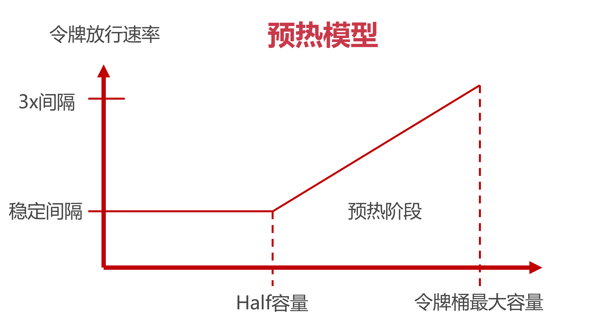

# Guava RateLimiter 预热模型

上一节我们了解了Guava组件是如何提供客户端限流功能的，这一节我们借Guava来进一个和限流有关的小技巧—— 【流量预热】

## 1、什么是流量预热

我们都知道在做运动之前先得来几组拉伸之类的动作，给身体做个热身，让我们的身体平滑过渡到后面的剧烈运动中。流量预热也是一样的道理，对限流组件来说，流量预热就类似于一种热身运动，它可以动态调整令牌发放速度，让流量变化更加平滑。

我们来举一个例子：某个接口设定了100个 Request 每秒的限流标准，同时使用令牌算法做限流。假如当前时间窗口内都没有 Request 过来，那么令牌桶中会装满100个令牌。如果在下一秒突然涌入100个请求，这些请求会迅速消耗令牌，对服务的瞬时冲击会比较大。因此我们需要一种类似热身运动 的缓冲机制，根据桶内的令牌数量动态控制令牌的发放速率，让忙时流量和闲时流量可以互相平滑过渡。

## 2、流量预热的做法

我们以Guava中的 RateLimiter 为例，看看流量预热在RateLimiter 中是如何运作的，我们用下面的状态转换图来展示整个过程：



横坐标是令牌桶的当前容量，纵坐标是令牌发放速率，我们先从横坐标来分析

### 2.1、横坐标

下面两种场景会导致横坐标的变化：

- **闲时流量：**流量较小或者压根没流量的时候，横坐标会逐渐向右移动，表示令牌桶中令牌数量增多；
- **忙时流量：**当访问流量增大的时候，横坐标向左移动，令牌桶中令牌数量变少

横轴有两个重要的坐标，一个是最右侧的 “令牌桶最大容量”，这个不难理解。还有一个是 Half 容量，它是一个关键节点，会影响令牌发放速率。

### 2.2、纵坐标

纵坐标表示令牌的发放速率，这里有3个标线，分别是稳定时间间隔，2倍间隔，3倍间隔。

这里间隔的意思就是隔多长时间发放一个令牌，而所谓稳定间隔就是一个基准时间间隔，假如我们设置了每秒10个令牌的限流规则，那么稳定间隔也就是1s /10 = 0.1秒，也就是说每隔0.1秒发一个令牌。相应的，3倍间隔的数值是用稳定间隔乘以系数3，比如上面这个例子中3倍间隔就是0.3秒。

### 2.3、运作模式

了解了横坐标和纵坐标的含义之后，让我们来试着理解预热模型的用例。继续沿用上面 10r/s的限流设置，稳定间隔=0.1s，3x间隔是0.3s。

我们先考虑闲时到忙时的流量转变，假定当前我们处于闲时流量阶段，没几个访问请求，这时令牌是满的。接着在下一秒突然涌入了10个请求，这些请求开始消耗令牌桶中的令牌，在初始阶段，令牌的放行速度比较慢，在第一个令牌被消耗以后，后面的请求要经过3x时间间隔也就是0.3s才会获取第二块令牌，随着令牌桶中令牌数量被逐渐消耗，当令牌存量下降到最大容量一半的时候(Half 位置)，令牌放行的速率也会提升，以稳定间隔0.1s发放令牌。

反过来也一样，在流量从忙时转变为闲时的过程中，令牌发放速率是由快到慢逐渐变化。起始阶段的令牌放行间隔是0.1s，随着令牌桶内令牌逐渐增多，当令牌的存量积累到最大容量的一半后，放行令牌的时间间隔进一步增大为0.3s。

RateLimiter 正是通过这种方式来控制令牌发放的时间间隔，从而使流量的变化更加平滑。

## 3、核心代码

理解了预热模型的运作流程之后，我们来看一下具体代码是如何实现的。

实现流量预热的类是SmoothWamingup，它是 SmoothRateLimter 的一个内部类，我们重点关注一个doSetRate方法，它是计算横纵坐标系关键节点的方法，先来看一下SmoothRateLimiter这个父类中定义的方法。

```java
// permitsPerSecond表示每秒可以发放的令牌数量
@Override
final void doSetRate(double permitsPerSecond, long nowMicros) {
  resync(nowMicros);
  
  // 计算稳定间隔，使用1s除以令牌桶容量
  double stableIntervalMicros = SECONDS.toMicros(1L) / permitsPerSecond;
  this.stableIntervalMicros = stableIntervalMicros;
  
  // 调用SmoothWarmingUp类中重载的doSetRate方法
  doSetRate(permitsPerSecond, stableIntervalMicros);
}
```

父类在这里的作用主要是计算出了稳定时间间隔(使用1s / 每秒放行数量的公式来计算得出) ，然后预热时间，三倍间隔等是在子类的doSetRate方法中实现的。

接下来我们看子类SmoothWarmingUp中的doSetRate做了什么：

```java
@Override
void doSetRate(double permitsPerSecond, double stableIntervalMicros) {
  	double oldMaxPermits = maxPermits;
  	
	// maxPermits表示令牌桶内最大容量，它由我们设置的预热时间除以稳定间隔获得
	// 打个比方，如果stableIntervalMicros=0.1s，而我们设置的预热时间是2s
	// 那么这时候maxPermits就是2除以0.1=20
  	maxPermits = warmupPeriodMicros / stableIntervalMicros;
  	
  	// 这句不用解释了吧，halfPermits是最大容量的一半
  	halfPermits = maxPermits / 2.0;
  
  	// coldIntervalMicros就是我们前面写到的3倍间隔，通过稳定间隔*3计算得出
  	// 稳定间隔是0.1，3倍间隔是0.2，那么平均间隔是0.2
  	double coldIntervalMicros = stableIntervalMicros * 3.0;
  	
  	// slope的意思是斜率，也就是前面我们图中预热阶段中画出的斜线（速率从稳定间隔向3x间隔变化的斜线）
  	// 它的计算过程就是一个简单的求斜率公式
  	slope = (coldIntervalMicros - stableIntervalMicros) / halfPermits;
  	
  	// 计算目前令牌桶的令牌个数
  	if (oldMaxPermits == Double.POSITIVE_INFINITY) {
  		// 如果令牌桶最大容量是无穷大，则设置当前可用令牌数为0
  		// 说实话这段逻辑没什么用
    	storedPermits = 0.0;
  	} else {
    	storedPermits = (oldMaxPermits == 0.0)
        	? maxPermits // 初始化的状态是3x间隔
        	: storedPermits * maxPermits / oldMaxPermits;
  }
}
```

通过上面的两个函数，RateLimter限流器就对maxPermits和slope（预热期斜率）两个变量做了初始化置。

我把关键步都注释在了代码里，大家理解了之后，可以尝试去阅读这个类的其他方法，弄清 maxPermits 和 slope是如何影响令牌发放速率的。