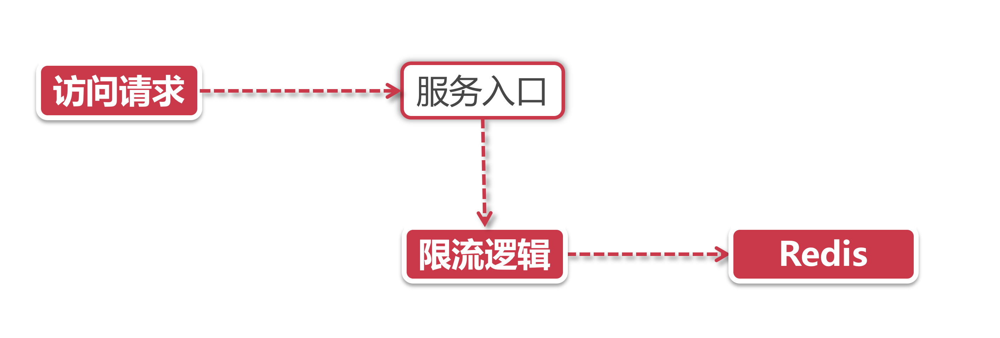

# 基于Redis+Lua的分布式限流

前面我们了解了如何利用Nginx做网关层限流，这一小节我们学习一个稍微复杂一点的分布式限流手段，利用Redis+Lua实现服务端限流。

## 1、架构思考: Why Redis

这么多中间件，为什么我们选择用Reds？

原因如下：

1. **性能：**Redis作为缓存组件，如果不采用持久化方案的话，Redis的大部分操作都是是纯内存操作，性能十分优秀；
2. **线程安全：**只用单线程承接网络请求(其他模块仍然多线程），天然具有线程安全的特性，而且对原子性操作的支持非常到位。

限流服务不仅需要承接超高QPS，还需要保证限流逻辑的执行层面具备线程安全的特性。利用Redis的这些天然特性做限流，既能保证线程安全，也能保持良好的性能。

## 2、基于Redis限流的架构模式

我们先来设想下Redis限流的工作模式，在一个限流场景中通常主要有三个角色：

- **限流请求：** 需要被限流的对象；
- **限流规则：** 定义一段程序或者脚本，当请求到来的时候执行；
- **存储介质：** 用来存储限流信息的地方，比如令牌个数或者是访问请求的计数。

思考题：在上面这个流程中， “限流逻辑”这块应该放到哪个地方。是放到服务入口里执行?还是放到Redis里执行?

我们假定这个服务入口就是我们的 Java程序，在 Java中执行一段限流逻辑并不会带来多大的性能压力，但是!我们有没有考过Reds的感受？

 在一个限流逻辑里，我们往往需要发起多个Redis查询和修改指令，比如获取令牌这一步，这里面就涉及到查询令牌、发放令牌等等步骤，这些步骤会发起多个Redis的请求指令，造成更多的网络开销。不光如此，我们还要保证这些操作是线程安全的，如此一来，在程序中就会涉及到资源锁定等复杂操作。

那我们有没有一个更好的方案来规避这些问题? 答案是肯定的，我们可以做这么一个假设，有这么一种脚本，它可以嵌入到Redis中去，那么对我们的系统来说就不用在一次限流控制中发送多次Redis访回命令，减少了大量不必要的网络开销。减轻了Redis的压力。

假设Redis在执行这个脚本逻辑的过程中，是当做一个原子操作来的的，也就是说，脚本开始到结束的时间段内Redis都只盯着这个脚本执行，不会插入其他的命令，那岂不是线程安全的问题也解决了? 

这样的存在就是——Lua脚本语言。

## 3、Lua脚本

Lua是一很小巧精致的语言，它的诞生(1993年) 甚至比JDK 1.0还要早，Lua是由标准的C语言编写的，它的源码部分不过2万多行C代码，甚至一个完整的Lua解释器也就200k的大小。

Lua往大了说是一个新的编程语言，往小了说就是一个脚本语言，对于有编程经验的同学，拿到一个Lua脚本大体上就能把业务逻辑理解的八九不离十了，我非常不建议同学们花大工夫去学习Lua的技术细节，Lua就像Shell脚本一样，尽管简单，但是细节之处还是相当繁琐的。

在分布式限流的章节中，我们以理解架构模式为主，大家只要明白为什么我们使用Lua和Redis，这样做有什么架构上的考量，这就足够了，在稍后的小节里，通过下面三个环节，带大家去理解Redis + Lua的分布式限流方案：

1. Lua的基本用法和个绍，有哪些优点；
2. Lua脚本如何嵌入Redis中执行；
3. 开发一个基于Redis + Lua的限流工具，在业务层通过自定义注解的形式为方法提供限流功能。

## 4、小结

这一节我们了解了Redis +Lua限流方案的大致背景，接下来我们循序渐进，先从Lua开始讲起，一步步实现整个限流方案。