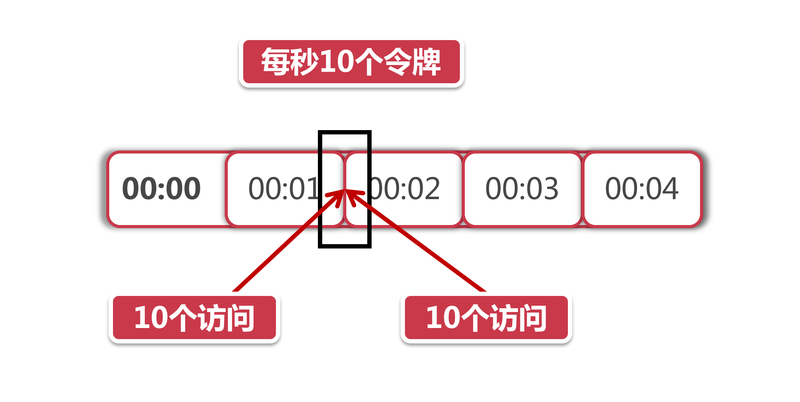
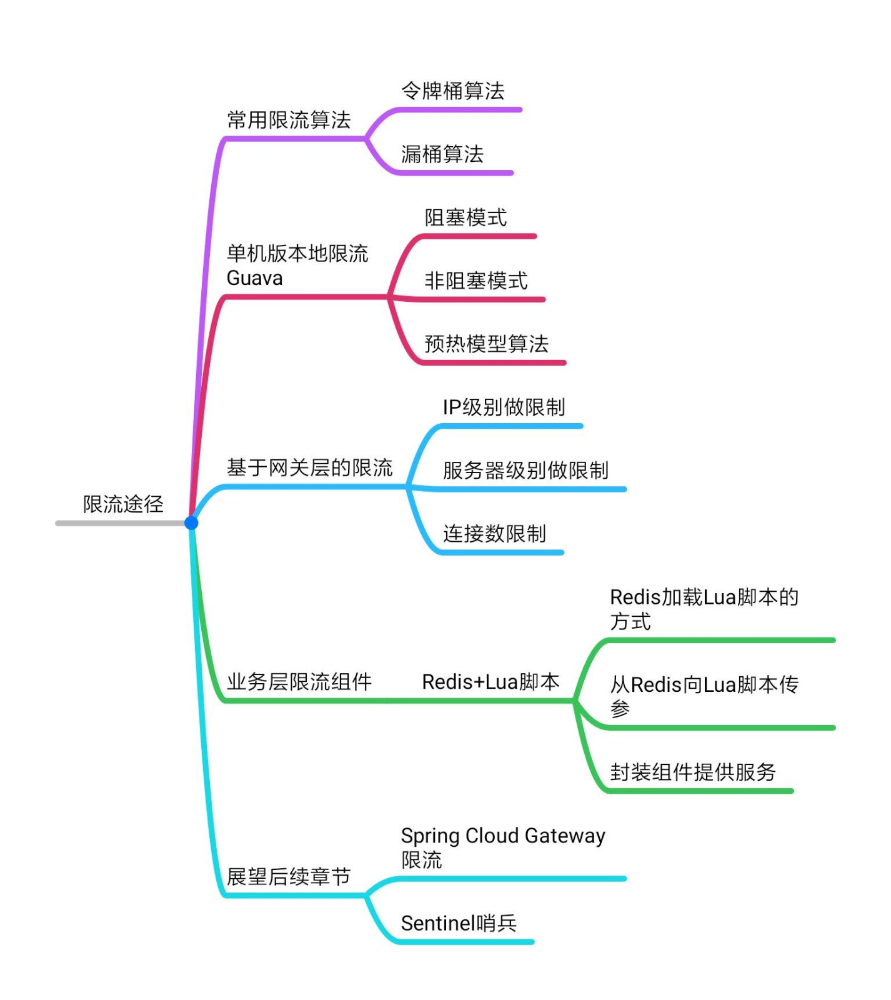

# 分布式限流要注意的问题

前面我们系统地学习了几种常用的分布式限流的方法，在这一章中，我们用几个“反模式”来探讨一下分布式限流中的几个注意点。

## 1、为什么需要匀速限流

同学们回想一下在Guava小节里留的一道思考题：为什么令牌需要速发放?

我们做这样一个场景假设，在某个限流策略中我们设置了10r/s（每秒十个请求）的限流速率，在令牌桶算法的实现中，令牌生成器每秒会产生10个新令牌放入令牌桶。Guava的RateLimter采用了一种“匀速” 的策略生成今牌，也就是说，这10令牌平均分到1秒钟的时间窗口中生成，每0.1秒产生一个令牌。如果在这一秒来了10个请求，这
些请求会在一秒钟以内匀速消化掉。

假如我们不采用匀速发放，而是采用一把梭的模式发令牌，在每一秒开始的时保把令牌一次性发放，这样会带来什么问题呢？我们可以用两个场景来说明这种模式的弊端。

一个最明显的问题就是令牌利用率降低，比如说我在前一秒还有9个令牌，在下一秒刚开始就直接生产10个令牌，这时候令牌桶明显装不下，因此会丢弃掉9个令牌。如里在这一秒突然涌现来了15个请求，由于这一秒的令牌都已经发放完毕，所以这种一把梭的发牌模式最多只能在当前时间窗口内处理10个请求，剩下的5个请求要延后到下一秒处理。

而如果我们采用匀速发牌的模式，这15个请求会在下一秒的一开始就处理掉10个，剩下的请求每隔0.1秒就会获取到一个新令牌，这样一来，15个请求在一秒内就可以处理完。

除此之外，还有一个可能导致服务雪崩的问题，我们来看下面的图：

以上面的图为例，在00:01秒和00:02秒各有10个令牌发放。

现在我化身为一个黑客，想方设法打出高额QPS(query per second) 击垮后台服务，我想了这么一个方法，我专挑当前这一秒和下一秒交汇的时间发起攻击，假如在00:01秒这10个令牌没有被消耗，那么我在这一秒快结束的时候能瞬间发起10个访问。

而在下一秒开始的时候由于又有10个新的令牌发放，我可以在下一秒刚到的极短时间里再发起10个访问。那么前后加起来，我可以瞬间向后台服务打出10+10=20的瞬时流量，当然20流量看起来并不大，我们如果把限流策略定为每秒1W个令牌，那么利用这种方式在理想情况下就可以打出2w的伤害，这就是一个比较可观的数字了。对于一些薄弱的后台服务，很有可能造成服务响应超时，如果发生在主链路，甚至会进一步引发服务雪崩。

基于上面这些情况，我们才需要将令牌按照一个 "匀速“ 的频率放进令牌桶。除此之外，也可以利用前面提到的”滑动窗口“算法，尽量使流量平滑输出，不过即便是滑动商口也并不能保证不会出现上面提到的人造流量峰值攻击，所以，使用匀速令牌桶才是理想的方案。

## 2、限流组件的失效

再牛的系统也不能保证100%的可用性，限流组件也不意外。尽管Redis和Nginx都是蛮靠谱的组件，但是明天和意外你永远不知道哪一个先来，珍惜当下的同时，对限流组件失效的情况，我们应该怎么办?

这是一个悖论论似的问题，继续提供服务就相当于给了外部攻击者利用流量洪峰击垮系统的机会，而拒绝服务就相当于系统关门打烊了。我们可以参考Spring CIoud和其他限流开源方案的做法，当限流组件失效的时候，默认不启用限流服务。比如 Spring Cloud的Gateway网关默认提供了Lua +Redis的限流功能，当Redis服务不可用的时候，Gateway就直接将所有访问请求做放行处理。

其实道理很简单，拒绝外部请求所造成的损失，远大于放行请求暴露出的潜在破绽，大家在设计自己的限流方案的同时，一定要记得考虑异常情况，如果是限流组件自身不可用的问题，那么就放弃限流，选择直接放行服务。

## 3、架构思考如何确定限流上界

对限流组件来说，如果能 ”卡在“ 系统处理能力的上限附近，那是再好不过的了。因此这个数值不能靠猜，而必须基于事实依据。那么事实从哪里来?压力测试!

在历次阿里集团双11的大运动中，其实早在双11前半年，很多业务部门已经开始在为双11做技术优化了。在双11之前的几个月，全面压测已经在集团的全链路压测平台上紧锣密鼓的开展了。当然，压测和容灾演练在平时空闲的时候也会开展，对于我们这更像是一个”常态化”的过程，就比如集团经常冷不了切断一个机房的设备，倒逼各个事业部将各自的应用以异地多活的方式部署。

压测不仅仅是无脑打高流量，拔到系统的极限，而是在基于一个合理的”预估”访问量级之下，对系统进行全方位的摸底。执行全维路压测，它不仅包含压力测试，还有故障演练，异地多活演练(突然切断一整个机房)，弹性伸缩（紧急上线新机器提高算力），服务降级（核心主链路降级演练，考察系统的最低可用性)等等复杂的流程。

因此，在确定限流上界之前，我们要根据当前业务规模预估一个合理的访问量级，再乘以一个系数（比次1.2)保证当前系统有一部分设计余量（预留少量弹性空间)，通过压测找到系统瓶颈加以巩固，先确保当前系统在这个量级下的可用性。

在此之上，向上打流量，反复进行多次测试后分析汇总性能指标(QPS和连接数)，将限流的上界设置在指标的【平均值】或者【中位数】附近。

## 4、本章小结

