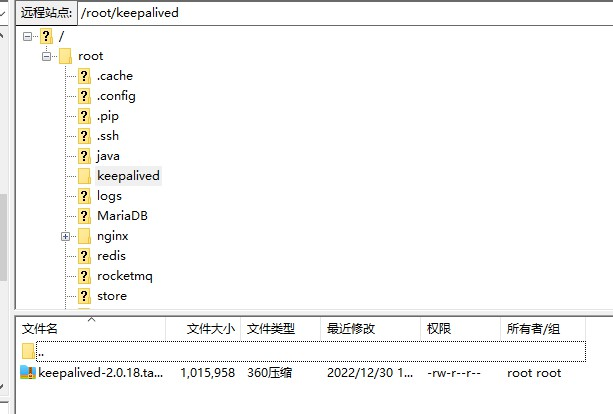
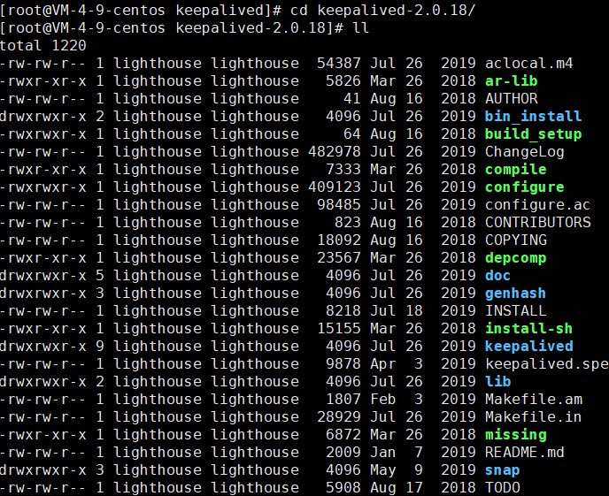
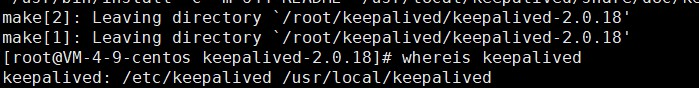

# Keeplived安装部署手册

## 1、下载

https://www.keepalived.org/download.html

## 2、上传服务器



### 3、解压

```
tar -zxvf keepalived-2.0.18.tar.gz
```

### 4、进入keepalived目录

```
cd /file/keepalived-2.2.4/
```



## 5、使用configure命令配置安装目录与核心配置文件所在位置

```
./configure --prefix=/usr/local/keepalived --sysconf=/etc
```

- prefix：keepalived安装的位置

- sysconf：keepalived核心配置文件所在位置，固定位置，改成其他位置则keepalived启动不了，/var/log/messages中会报错


### 5.1 配置过程中出现警告信息

```
*** WARNING - this build will not support IPVS with IPv6. Please install libnl/libnl-3 dev libraries to support IPv6 with IPVS.
```

### 5.2 安装 libnl/libnl-3依赖

老师给出的：

```
yum -y install libnl libnl-devel  
```

我的centos8

```
yum install -y libnl3.x86_64 libnl3-devel.x86_64
```

## 6、安装keepalived

```
make && make install
```

## 7、 进入到/etc/keepalived ,该目录下为keepalived核心配置文件

如果忘记目录，可以用命令找到：

```
whereis keepalived
```

