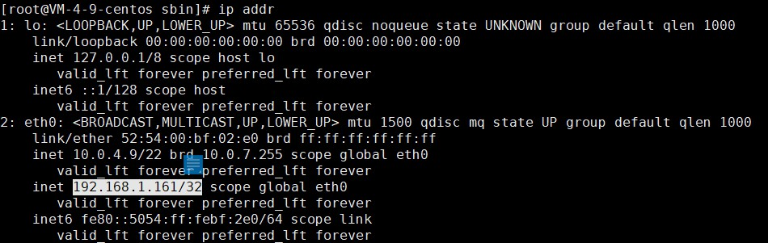

# 配置 Keepalived - 主

##### 1、通过命令 vim keepalived.conf 打开配置文件

```
cd /etc/keepalived
vim keepalived.conf
```

编辑配置文件

```
global_defs {
   # 路由id：当前安装keepalived的节点主机标识符，保证全局唯一
   router_id keep_171
}
# 计算机节点
vrrp_instance VI_1 {
    # 表示状态是MASTER主机还是备用机BACKUP
    state MASTER
    # 该实例绑定的网卡
    interface eth0
    # 保证主备节点一致即可
    virtual_router_id 51
    # 权重，master权重一般高于backup，如果有多个，那就是选举，谁的权重高，谁就当选
    priority 100
    # 主备之间同步检查时间间隔，单位秒
    advert_int 2
    # 认证权限密码，防止非法节点进入
    authentication {
        auth_type PASS
        auth_pass 1111
    }
    # 虚拟出来的ip，可以有多个（vip）
    virtual_ipaddress {
        192.168.1.161
    }
}
```

查看网卡内容：

```
ip addr
```


##### 2、启动Keepalived 

```
cd /usr/local/keepalived/sbin
```


##### 3、查看进程

```
ps -ef|grep keepalived
```


##### 4、查看vip

在网卡eth0下，多了一个192.168.1.161，这就是虚拟IP，查看网卡内容：

