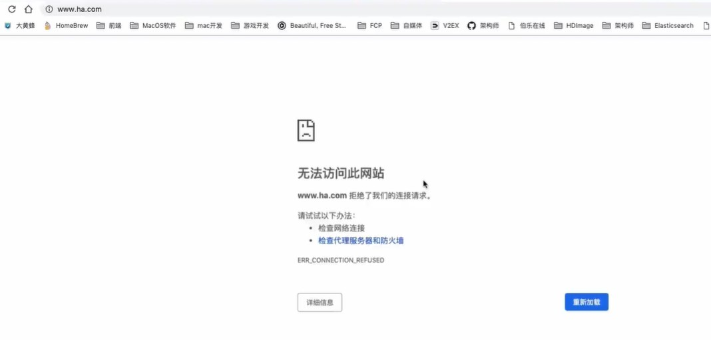
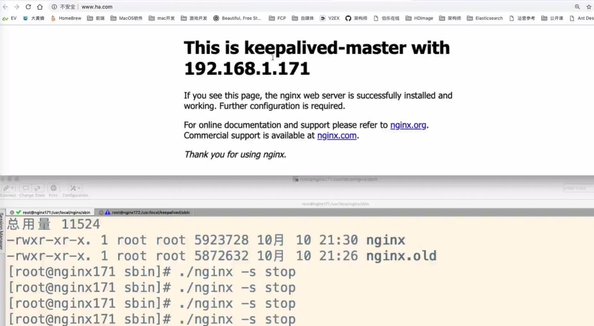

# Keepalived配置Nginx自动重启

如果Nginx服务挂了，则访问会报错：



##### 1、增加nginx重启脚本

```
vim /etc/keepalived/check_nginx_alive_or_not.sh
```

编辑脚本文件

```
#!/bin/bash

A=`ps -C nginx --no-header |wc -l`
# 判断nginx是否宕机，如果宕机了，尝试重启
if [ $A -eq 0 ];then
    /usr/local/nginx/sbin/nginx
    # 等待一小会再次检查nginx，如果没有启动成功，则停止keepalived，使其启动备用机
    sleep 3
    if [ `ps -C nginx --no-header |wc -l` -eq 0 ];then
        killall keepalived
    fi
fi
```

添加运行权限：

```
chmod +x  /etc/keepalived/check_nginx_alive_or_not.sh
```

运行脚本：

```
./check_nginx_alive_or_not.sh
```

##### 2、配置keepalived监听nginx脚本

在目录：

```
cd /etc/keepalived
```

修改配置文件 keepalived.conf，添加如下内容

```
# 添加Nginx监控配置
vrrp_script check_nginx_alive {
    script "/etc/keepalived/check_nginx_alive_or_not.sh"
    interval 2 # 每隔两秒运行上一行脚本
    weight 10 # 如果脚本运行成功，则升级权重+10
    # weight -10 # 如果脚本运行失败，则升级权重-10
}
```

##### 3、在vrr_instance中添加新增监控脚本

```
# 计算机节点
vrrp_instance VI_1 {
    # 表示状态是MASTER主机还是备用机BACKUP
    state MASTER
    # 该实例绑定的网卡
    interface eth0
    # 保证主备节点一致即可
    virtual_router_id 51
    # 权重，master权重一般高于backup，如果有多个，那就是选举，谁的权重高，谁就当选
    priority 100
    # 主备之间同步检查时间间隔，单位秒
    advert_int 2
    # 认证权限密码，防止非法节点进入
    authentication {
        auth_type PASS
        auth_pass 1111
    }     
    # 新增监控脚本
    track_script {
    check_nginx_alive   # 追踪 nginx 脚本
    }
    # 虚拟出来的ip，可以有多个（vip）
    virtual_ipaddress {
        192.168.1.161
    }   
}
```

##### 4、重启keepalived使配置生效

命令：

```
systemctl restart keepalived
```

##### 5、测试

停掉Nginx后发现还是能够正常访问Nginx，因为自动重启了Nginx

