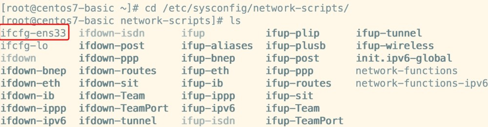
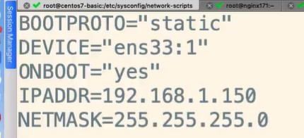
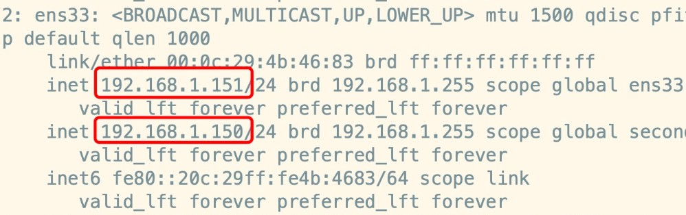
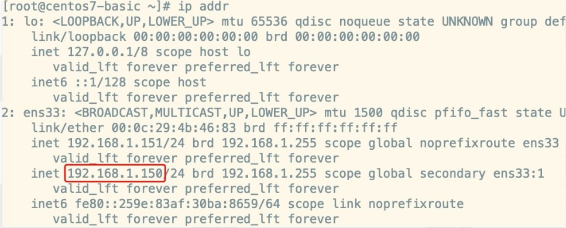
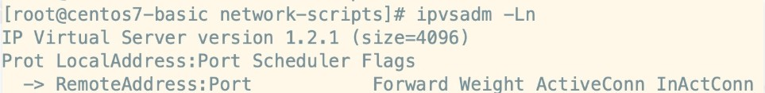

# 搭建LVS-DR-配置LVS节点与ipvsadm

## 一、前期准备

### 1.1）服务器与ip规划

LVS-1台

- VIP（虚拟ip）： 192.168.1.150

- DIP（转发者IP/内网IP）： 192.168.1.151


Nginx-2台（RealServer）

- RIP（真实IP/内网IP）：192.168.1.171

- RIP（真实IP/内网IP）：192.168.1.172

### 1.2）关闭网络配置管理器

所有计算机节点关闭网络配置管理器，因为有可能会和网络接口冲突：

```
systemctl stop NetworkManager 
systemctl disable NetworkManager
```

## 二、创建子接口

### 2.1）进入网卡配置目录

进入到网卡配置目录，找到ens33（ens0）；

```
cd /etc/sysconfig/network-scripts/
```



### 2.2）拷贝并且创建子接口

```
cp ifcfg-ens33 ifcfg-ens33:1

* 注：`数字1`为别名，可以任取其他数字都行
```

### 2.3）修改子接口配置

```
vim ifcfg-ens33:1
```

### 2.4）配置参考如下

```
DEVICE="ifcfg-ens33:1"
ONBOOT="yes"
IPADDR=192.168.1.150
NETMASK=255.255.255.0
BOOTPROTO=static
```



注：配置中的 192.168.1.150 就是咱们的vip，是提供给外网用户访问的ip地址，道理和nginx+keepalived那时讲的vip是一样的。

### 2.5）重启网络服务或者重启linux

```
service network restart
```

### 2.6）查看地址

重启成功后，ip addr查看一下，就好发现多了一个ip，也就是虚拟ip（vip）



## 三、创建子接口方式2（不推荐使用）

### 3.1）创建网络接口并绑定虚拟ip

```
ifconfig ens33:1 192.168.1.150/24
```

### 3.2）配置规则

配置规则如下：

```
总览

ifconfig 【接口】

ifconfig 接口 【aftype】 options | address ...

描述

ifconfig 用于配置常驻内核的网络接口。它用于在引导成功时设定网络接口。

地址族

如果跟在接口名称后的第一个参数是它支持地址的名称。

选项

接口 接口名称。通常是一个跟单元号的驱动设备名，例如第一个以太接口 eth0 。
```

配置成功后，查看ip会发现新增一个192.168.1.150：



通过此方式创建的虚拟ip在重启后会自动消失

## 四、安装ipvsadm

现如今的centos都是集成了LVS，所以ipvs是自带的，相当于苹果手机自带ios，我们只需要安装ipvsadm即可（ipvsadm是管理集群的工具，通过ipvs可以管理集群，查看集群等操作），命令如下：

```
yum install ipvsadm
```

检测是否安装成功：

```
ipvsadm -Ln
```



图中显示目前版本为1.2.1，此外是一个空列表，啥都没。

> 注：关于虚拟ip在云上的事儿
>
> 阿里云不支持虚拟IP，需要购买他的负载均衡服务
>
> 腾讯云支持虚拟IP，但是需要额外购买，一台节点最大支持10个虚拟ip