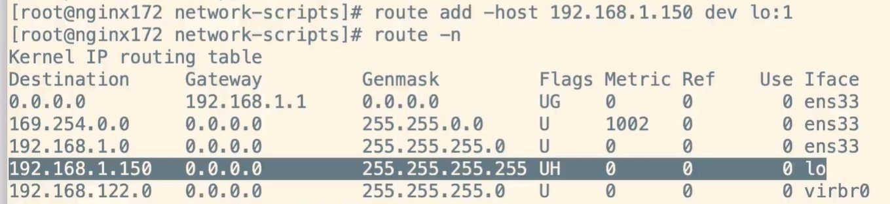
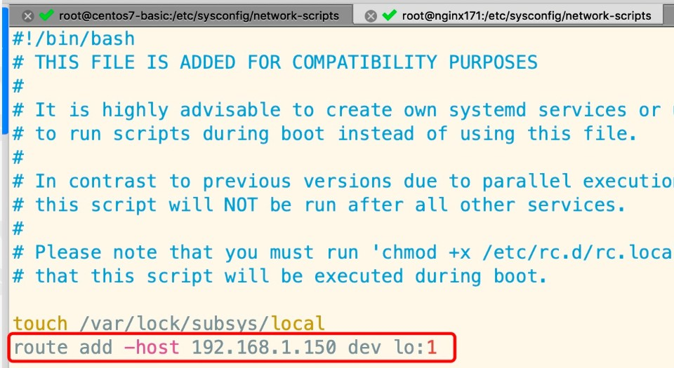

# 搭建LVS-DR模式- 为两台RS配置arp

## 一、ARP响应级别与通告行为 的概念

1.arp-ignore:ARP响应级别(处理请求)

- 0:只要本机配置了ip，就能响应请求
- 1:请求的目标地址到达对应的网络接口，才会响应请求

2.arp-announce:ARP通告行为(返回响应)

- 0:本机上任何网络接口都向外通告，所有的网卡都能接受到通告

- 1:尽可能避免本网卡与不匹配的目标进行通告

- 2:只在本网卡通告

  ------

  **补充说明：**

> ARP（Address Resolution Protocol）地址解析协议。IP数据包经常通过以太网进行发送，以32位的IP地址作为源/目的地址。但是以太网设备不能识别IP地址，他们是以48位的以太网地址传输以太网数据包的。ARP就是用来实现这种地址转换的协议。     
>
> arp_ignore作用：控制系统在收到arp广播请求报文时，是否返回arp响应报文
>
> 　　常见取值解释：
>
> 　　0、主机上任意一个网卡接口有arp广播请求报文中的IP地址，就进行回应
>
> 　　1、只响应目的IP地址为接收网卡上的本地地址的arp请求
>
> 　　2、只响应目的IP地址为接收网卡上的本地地址的arp请求，并且arp请求的源IP必须和接收网卡同网段
>
> 　　取值为0，举例解释：
>
> 　　例如：一台Linux主机，有2块网卡，接口1的IP地址为：1.1.1.1，接口2的IP地址为2.2.2.2;这时该主机收到一个arp广播请求，请求问到”谁拥有1.1.1.1的IP地址，请将你的MAC地址发给我“，不管接口1还是接口2收到这个arp广播请求，都会进行回应，即使2.2.2.2这个接口收到这个广播解析请求，这个接口没配置这个IP地址，但这个接口依然可以探测到其他接口配有这个IP地址，依然会进行回应;
>
> 　　上面的阐述涉及到的核心要点：IP地址是逻辑地址，是属于我们的Linux主机的，是由位于内核的TCP/IP协议栈处理的，不属于网卡本身，一定理解这点，重要重要!!!
>
> 　　取值为1，举例解释：
>
> 　　例如：一台Linux主机，有2块网卡，接口1的IP地址为：1.1.1.1，接口2的IP地址为2.2.2.2;这时该主机收到一个arp广播请求，请求问到”谁拥有1.1.1.1的IP地址，请将你的MAC地址发给我“，假如2.2.2.2的接口收到这个arp广播请求，那么不会对其做出回应，因为arp_ignore配置为1了，也就是说：收到arp广播请求的网卡接口，只查看自身有没有配置这个IP地址，如果没有配置，即使别的接口上配置了，也不会做出相应;但如果1.1.1.1的接口收到了这个arp广播请求，由于自身就配置了这个IP地址，那么会回送arp响应报文
>
> 　　取值为2，举例解释：
>
> 　　不仅要满足取值为1的要求，而且还会对arp请求包的源IP地址做校验，一个网段内的才会做相应，相较于1，更加严格
>
> 　　例如：一台Linux主机，有2块网卡，接口1的IP地址为：1.1.1.1，接口2的IP地址为2.2.2.2;这时该主机收到一个arp广播请求，请求问到”谁拥有1.1.1.1的IP地址，请将你的MAC地址发给我“?假如1.1.1.1的接口收到了这个arp广播请求报文，但会检查请求报文中的源IP地址是否和1.1.1.1在同一网段内，如果在同一网段内，则回送arp相应报文;相反不在同一网段内，则依然不会回送响应报文
>
> 　　总结：从上面解释可以看出，arp_ignore从0--1--2，是越来越严格;
>
> 　　取值为0，不管那个网卡收到，只要任一网卡有配置这个IP地址，就会响应
>
> 　　取值为1，收到arp请求报文的网卡接口，刚好该接口配置的IP地址又正好是请求的IP地址，才回应
>
> 　　取值为2，不仅要满足取值为1的条件，还要对arp请求报文的源地址做判断，只有同一网段内，才会回应
>
> 　　我们知道，调度器和所有的Real Server都配置了VIP地址，LVS的VIP配置在物理网卡接口上，而Real Server都是配置在了本地接口lo上
>
> 　　为了保证客户端的ARP广播请求可以只被调度器所响应，因此必须限制所有Real Server的arp响应级别，所以才设置arp_ignore为1，这样对于Real Server来说，因为arp请求一定来自别的主机，所以接收的网卡只能是物理接口，而Real Server又将VIP配置到了lo接口上，因此刚好不会回应，从而保证了请求只会到达调度器;
>
> 　　理解了上面的内容，也就理解了为什么我们要把调度器的VIP配置到物理接口上，而把Real Server的VIP配置到本地接口lo上

## 二、配置ARP

### 1.1）编辑配置文件

打开sysctl.conf，命令如下：

```
vim /etc/sysctl.conf
```

### 1.2）修改内容

配置所有网卡、默认网卡以及虚拟网卡的arp响应级别和通告行为，分别对应：all，default，lo：

```
# configration for lvs
net.ipv4.conf.all.arp_ignore = 1
net.ipv4.conf.default.arp_ignore = 1
net.ipv4.conf.lo.arp_ignore = 1

net.ipv4.conf.all.arp_announce = 2
net.ipv4.conf.default.arp_announce = 2
net.ipv4.conf.lo.arp_announce = 2
```

### 1.3）刷新配置文件

命令如下：

```
sysctl -p
```

### 1.4）新增网关

增加一个网关，用于接受数据报文，当有请求到本机后，会交给lo去处理：

```
route add -host 192.168.1.150 dev lo:1
```



### 1.5）设置开机自启

防止重启失效，做如下处理，用于开机自启动：

```
echo "route add -host 192.168.1.150 dev lo:1" >> /etc/rc.local
```

