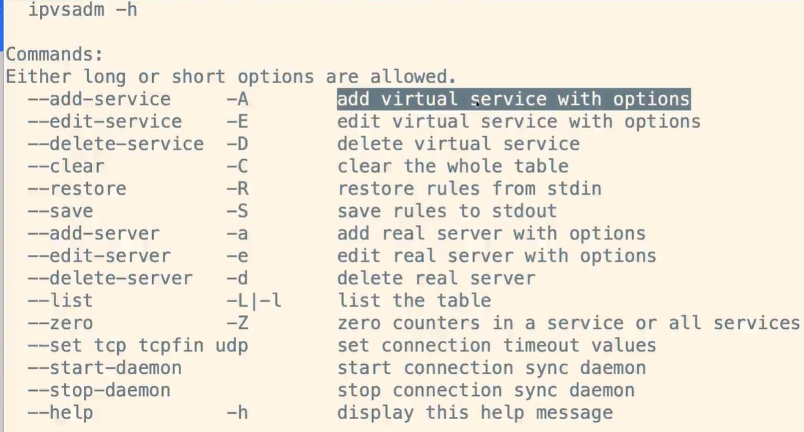

# 搭建LVS-DR-使用ipvsadm配置集群规则

## 1、创建LVS节点

创建LVS节点，用户访问集群调度者

```
ipvsadm -A -t 192.168.1.150:80 -s rr -p 5
```

参数说明：

> - -A：添加集群
> - -t：tcp协议
>
> - ip地址：设定集群的访问ip，也及时LVS的虚拟ip
>
> - -s：设置负载均衡的算法，rr表示轮询算法
> - -p：设置连接持久化时间

## 2、创建2台RS真实服务器

```
ipvsadm -a -t 192.168.1.150:80 -r 192.168.1.171:80 -g
ipvsadm -a -t 192.168.1.150:80 -r 192.168.1.172:80 -g
```

参数说明：

> - -a：添加真实服务器
> - -t：tcp协议
>
> - -r：真实服务器ip地址
> - -g：设定DR模式

## 3、保存到规则库

保存到规则库，否则重启失效

```
ipvsadm -S
```

## 4、检查集群

查看集群列表

```
ipvsadm -Ln
```

查看集群状态

```
ipvsadm -Ln --stats
```

## 5、其他命令

```
    # 重启ipvsadm，重启后需要重新配置
    service ipvsadm restart
    # 查看持久化连接
    ipvsadm -Ln --persistent-conn
    # 查看连接请求过期时间以及请求源ip和目标ip
    ipvsadm -Lnc
    
    # 设置tcp tcpfin udp 的过期时间（一般保持默认）
    ipvsadm --set 1 1 1
    # 查看过期时间
    ipvsadm -Ln --timeout
```

## 6、更详细的帮组文档

```
ipvsadm -h
man ipvsadm
```

