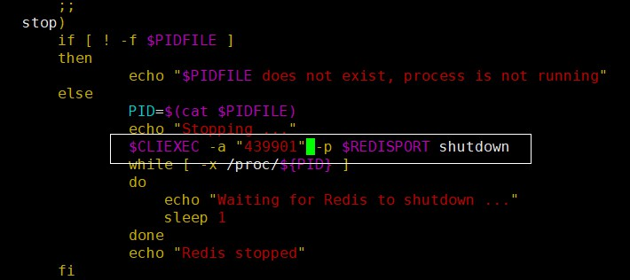
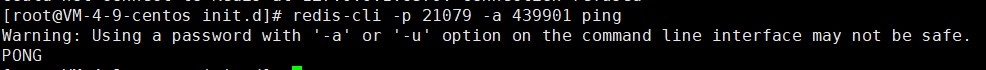

# Redis的客户端命令

●    关闭redis

     redis-cli -a password shutdown

●    关闭redis

添加密码后要修改脚本

     ./redis_init_script stop

●    进入到redis客户端

     redis-cli -p 21079

●    输入密码

     auth pwd

●    设置缓存

     set key value

●    获得缓存

     get key

●    删除缓存

     del key

●    查看是否存活

     redis-cli -a password ping

