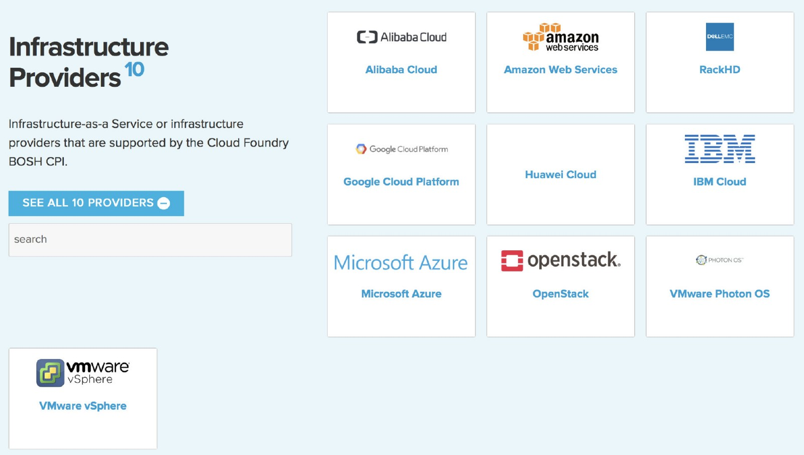
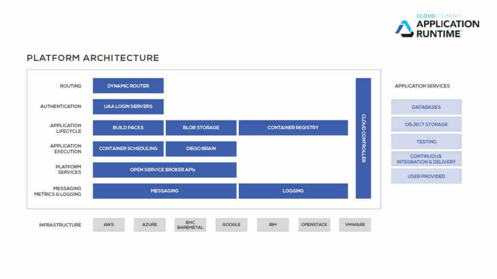
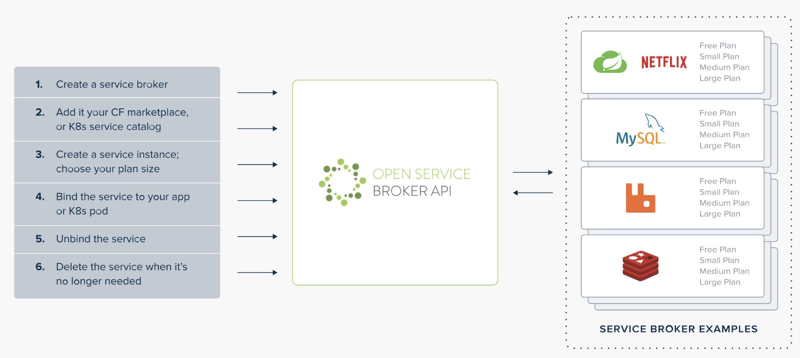

# Cloud Foundry 的功能和特点

## 1、Cloud Foundry 是什么?

说到容器，大家第一反应就是Docker，但其实还有很多容器技术被普遍应用。基于Docker的runc容器运行时环境，就有另一个著名分支：CIoud Foundry，可以看到CIoud Foundry生态圈也拥有大量的合作伙伴，提供插件和集成对接的支持。比如在基础架构对接方面，CIoud Foundry可以直接对接所有主流的云平台：

Cloud Foundry类似与Docker，也存在两大分支：

**1.开源的Cloud Foundry：**主要由Cloud Foundry基金会开发并支持，基金会包括Pivotal、 Del EMC、IBM、VMWare、Google、Microsot、SAP、SUSE以及其它许多公司。

**2.商业版本的Cloud Foundry：**如IBM Bluemx和Pivotal Cloud Foundry (简称PCF)，是基于开源Cloud Foundry 项目开发的企业版解决案。

用户可以根据企业的业务要求有选择地挑选开源方案或者商业版本的支持，整体来说，Cloud Foundry是基于容器技术的一套开源云应用平台，它适用于私有云、公有云和混合云部署，它提供了一整套云环境，开发框架和配套的应用支持服务，方便用户快速、便利地进行应用的开发、测试、部署和扩容。新版本的Cloud Foundry在原有生态匿的基础上，也可以融合Kubenetes和Docker，实现跨平台的协作和整合。

## 2、Cloud Foundry 技术特点?

1. **快速发布：**整个Cloud Foundry最核心的一条命令就是CF push，可谓一招鲜，吃遍天。但在简单部署的背后，Cloud Foundry平台实现了从运行时环境buildpack的准备、应用镜像droplet的打包、软件包的二进制存储、准发布环境staging测试、应用软件部署、日志和监控保护、服务弹性和伸缩等核心功能。
2. **多语言支持：**几乎所有常见的语言都有默认的运行时环境(runtime buildpack)支持，包含Java、Nodejs、Go、Python、PHP、Ruby、.NET等。
3. **网络和路由绑定：**对于Docker环境里最复杂的模块非网络模块莫属，要实现容器间和跨服务器的数据通信，有多种网络解决方案供选择，每种都有自身的限制和缺陷。而对于Cloud Foundry，通过路由(Routing)和应用执行层（Application Execution）的配合，可以很方便地实现内部、外部路由解析和数据通信。
4. **用户和认证：**用户和认证是PaaS平台的主要功能之一，但是在容器平台(如Docker) 和容器编排平台(如Kubenetes)并没有给予很强的管理和集成。这也是Cloud Foundry作为开源云应用平台的优势所在。
5. **日志和监控：** Cloud Foundry通过消息(Messaging)和日志(Logging)模块实现基本的日志管理，它可以通过在平台里添加砖块(Tile)的方式，很自然地对接主流的监控平台 (Splunk、LogStash、NewRelic、Datadog、Dynatrace等)。
6. **第三方支持：**当前有近200个主流商业或开源产品对Cloud Foundry平台提供了第三方服务集成支持，从前端web服务到后端数据库服务，从平台功能到大数据，不一而足，对接过程类似于apple store和google play的市场化模块管理，用户可以从本地市场中选择需要的服务集成到各自的应用中。

