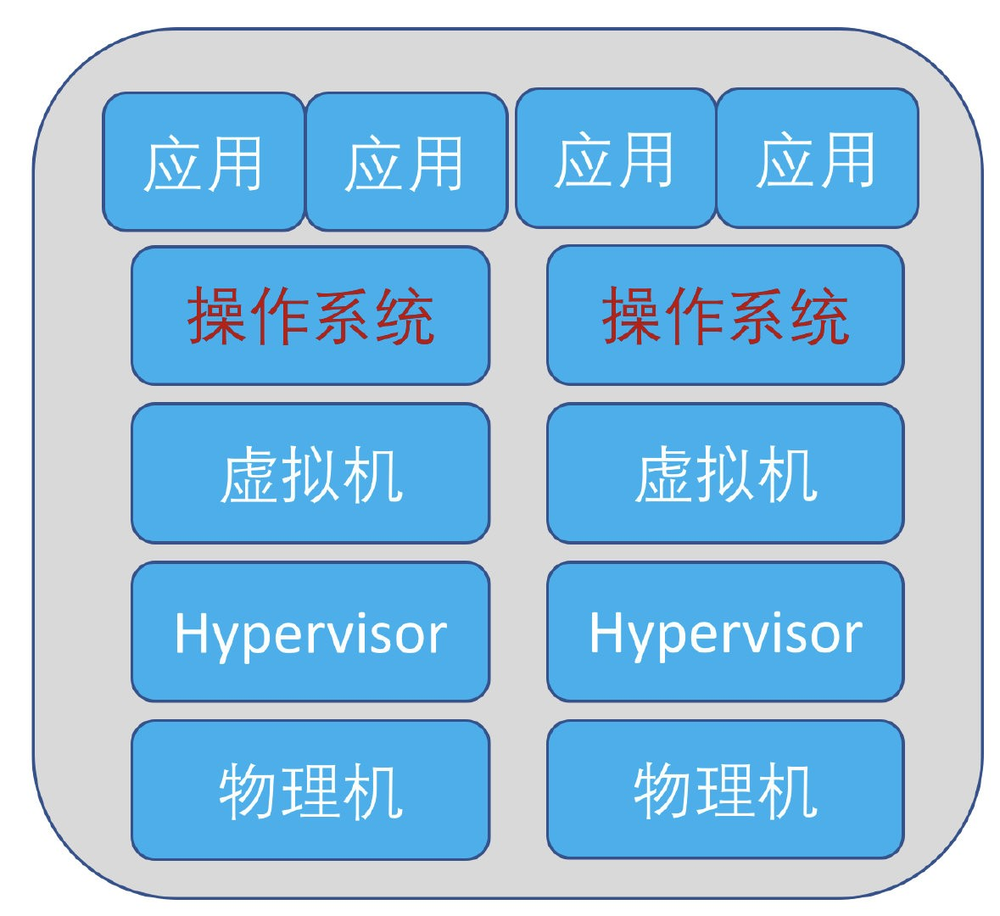
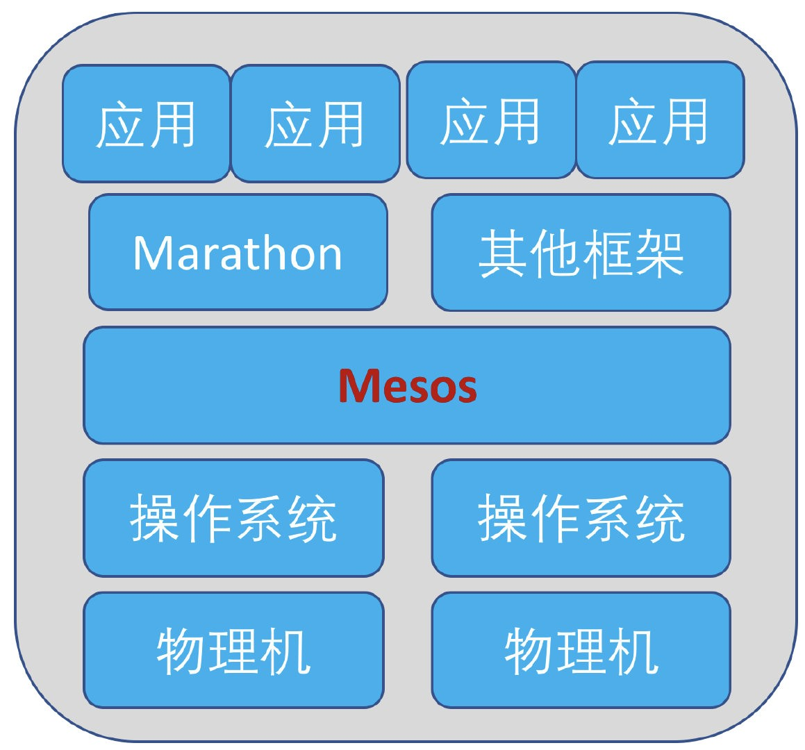

# Mesos Marathon概述

## 1、Mesos能做什么?

想知道Mesos能做什么先来看一段短剧吧。

狄仁杰：我新买了一台电脑，想在上面装各种应用软件。元芳，此事你怎么看?

元芳：大人，那就装一个windows或者linux、MacOS操作系统吧。操作系统装好后，应用软件随便装。

狄仁杰：那如果我去买一个数据中心呢?一堆的物理服务器，想在上面跑各种应用系统，又该如何选择呢?

元芳：以我多年的虚拟化经验来看，我们可以在上面装一套hyperviser，比如VMware。上面可以装更多的操作系统，更多的应用软件，还可以让应用在物理机间飘来飘去。

狄仁杰：此事基得我意。但我最近听闻有一种新技术，可以把整个数据中心当作一台电脑使用，不用再关心操作系统和虚拟化软件的事情了。元芳，你怎么看?

元芳：这种技术叫做Mesos，确实非常神奇，不管您之前在数据中心里装的什么操作系统(Windows、 linux、MacOS)，也不管您想安装部署什么软件（Spark大数据、jenkins自动部署、marathon应用长跑)，只要Mesos神功一发力，就全部自动解决了。它还有个个高大上的名字，叫做分布式操作系统内核。有了这套武功，数据中心的所有资源就可以统一管理了，各套应用想怎么分配就怎么分配，想隔离就隔离，想共享就共享。

Apache Mesos是一个集群管理器，可跨分布式应用程序或框架提供有效的资源隔离和共享，作为分布式操作系统内核，让用户可以像用一台电脑(一个资源池)一样使用整个数据中心。

Mesos是以与Linux内核同样的原则而创建的，不同点仅仅是在于抽象的层面。Mesos内核运行在每一个机器上，同时通过API为各种应用提供跨数据中心和云的资源管理调度能力。这些应用包括Hadoop、Spark、Kafka、Elastic Search。还可配合框架 Marathon 来管理大规模的Docker等容器化应用。

## 2、Marathon又是做什么的呢?

Marathon就是应用部署领域的马拉松。本质上，Marathon是一个mesos框架，能够支持运行长服务(比Web应用等)。如果将Mesos类比为操作系统的内核，负责资源调度；则Marathon可以类比为服务管理系统，比如init、systemd或upstart等系统，用来管理应用的状态信息。

Marathon将应用程序部署为长时间运行的Mesos任务，并调用Mesos管理的资源实现应用的业务需求。

## 3、Mesos和Marathon的发展

2010年，一个旨在解决扩容问题的项且在美国加州大学伯克利分校诞生，这个就是Apache Mesos的前生。它在在一定程度上对CPU、内存、磁盘资源进行了抽象，从而允许整个数据中心作为一体进行运转和管理。

在之后的一年中，Mesos得到了Twitter的大力支持，并部署到了其实际的运营环境中。

Mesos从一开始就是专门面向大客户的，之后陆续在Apple、 Verizon、Yelp和Netfilx都有应用，并且在数千台服务器上运行了数十万个容器。

而Marathon作为Mesos应用调度框架中最知名的一款软件，由Mesosphere公司开发后，经常在各类技术大会上和Mesos配对出现，作为实现DCOS（数据中心操作系统）这个完整的全自动数据中心解决方案的核心环节。

Mesos和Marathon这一对兄弟，有着大量的成功案例，不管是在国外的互联网企业还是国内的电信运营商中都大量被使用和验证，是一款可以和当前做火热的Kuberetes相PK的开源容器编排和应用部署解决方案。