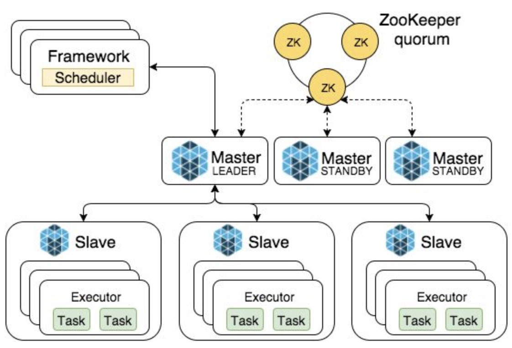
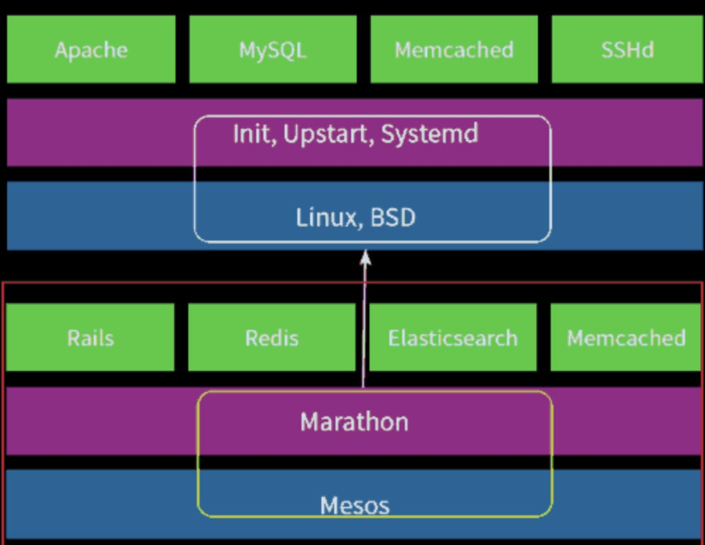

# Mesos功能和特点

## 1、Mesos功能和特点

Mesos是如何实现整个数据中心统一管理的呢?

核心的概念就是资源两级供给和作业两级调度，先说说从下而上的资源两级供给吧：

1.在Mesos集群中，资源的供应方都来自Mesos Slave所在的物理节点。资源可以包括CPU、内存、存储空间、IO吞吐能力等；这些资源通过供给的方式，从Mesos Slave提供给了Mesos Master的Leade是第一级的资源供给。

2.Mesos maste进一步将资源整合后，作为可选项提供给了各种framework框架，这些框架中最主流的就是Marathon长服务框架，但也可能是其他 Jenkins CI/CD框架、Spark大数据框架、Kafka中间件框架、Chrons任务管理框架、Aurora应用管理框架等，各种框架可以有选择地对Mesos Master整合后的数据中心资源提出要求。

而Mesos和各种框架对于资源的要求处理过程，正是从上而下的两级调度机制的核心：

1.首先，各个框架都有自己的调度器Scheduler，它会根据用户需求启动特定的工作任务。调度器在上层第一级确定工作任务需要的资源情况，是否需要接受Mesos提供的CPU、内存和存储资源来运行特定的工作负载。

2.同时Mesos对于上层框架的需求也不是予取予求，他会采用默认的DRF优势资源公平法（Dominant Resource Faireness）来决定各种框架任务的资源分配情况，从而使整个数据中心利益最大化。比如上层框架中的Marathon调度器需要启动Nginx任务，而同时Spark框架需要启动streaming任务，Mesos的DRF算法会根据框架提出的资源请求，将尽量多的内存和CPU分配给Nginx用于进行反向代理服务，同时将尽可能多的IO吞吐性能提供给Spark进行流处理。

Mesos的主要特点包括:

**1.轻量级的master：**仅保留了framework和slave的一些状态，易于重构，因此采用zookeeper很容易解决HA问题；

**2.配合container技术的slave：**利用Linux-Container和Docker技术可以实现很方便地实现任务间的CPU与内存资源隔离；

**3.资源分配调度比较简单：**默认的DRF算法可以轻松实现资源的最大化利用，不需要复杂的人工干预和配置。

## 2、Marathon功能和特点?

一个操作系统有了优秀的内核只是完成了一半工作，强大易用的服务管理（如init、systemd系统等）才是操作系统得以生存发展的另一半工作，相同的道理，有了Mesos这个分布式操作系统内核，还得有一个可以支持分布式的长服务运行调度框架，这就是Marathon。

Marathon的主要特点有：

**1.高可用性：**Marathon作为主动/被动群集运行，领导者选举可以实现100%的高可用运行时间。

**2.资源分布可控：**可以允许每个机架/节点等仅放置应用程序的一个实例，从而缓解单点故障的影响。

**3.服务发现和负载平衡：**可以通过HA Proxy和DNS等方式自动实现负载均衡。

**4.健康检查：**可以使用HTTP或TCP检查评估应用程序的运行状况。

**5.活动订阅：** 提供HTTP端点以接收通知。例如，与外部负载均衡器集成。

**6.UI：** 美丽而强大的UI。

**7.API：**完整的REST API，易于集成和编写脚本。

**8.安全：**Basic Auth和SSL。

**9.监控：**以JSON格式在/metrics查询它们或将它们推送到诸如graphite，statsd和Datadog之类的系统。

## 3、使用场景

如果想运行长生命周期的应用服务（而不是短时作业等），想将数据中心的多种形式的任务结合管理（如CI/CD连续集成连续部署、大数据、消息中间件、搜索引擎但应用之间不需要太强的集群耦合（如Oracle数据库心跳、Keepalive节点心跳等），Mesos+Marathon这一对数据中心操作系统决方案，可以成为您的首选。