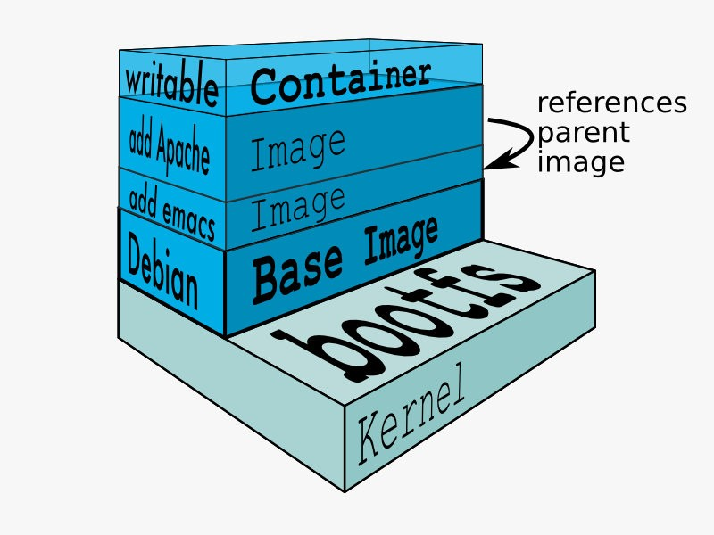

# Docker镜像制作和管理

## 1、Docker镜像结构

进了Docker的世界，就像进了少林的藏经阁，武功秘籍是应用尽有。前辈武借给我们准备了各种基本功法(基础镜像baseimage)。我们来看一下少林的十大武功秘籍吧：


Linux操作系统由内核空间和用户空间组成，内核空间的核心就是内核和bootfs启动时加载系统。用户空间的核心就是rootfs文件系统。通常不同的Linux发行版，即使基于不同的Ubuntu/Debian和CentOS/Fedora，也可以互相在内核层兼容。

下图就是在CentOS内核上运行Debian rootfs的例子：


上例中，底层操作系统是CentOS，用户通过 `docker pull debian` 下载了包含`Debian rootfs`的Docker镜像，这个镜像可以在运行 `docker run -it debian` 加载运行时充分利用CentOS底层的内核空间，将roofs用户空间运行起来。用户通过 `uname -a `仍然可以查询到内核仍然是底层CentOS的版本，但是整个文件系统(/dev、/prod、/bin、/etc、/usr、/tmp等）却采用了Debian的结构。

```
[root@training1 ~]# uname -a
Linux training1 3.10.0-514.26.2.el7.x86_64 #1 SMP Tue Jul 4 15:04:05 UTC 2017 x86_64 x86_64 x86_64 GNU/Linux
[root@training1 ~]# cat /etc/redhat-release
CentOS Linux release 7.2.1511 (Core)

[root@training1 ~]# docker run -it debian

root@3e666078fe81:/# uname -a
Linux 3e666078fe81 3.10.0-514.26.2.el7.x86_64 #1 SMP Tue Jul 4 15:04:05 UTC 2017 x86_64 GNU/Linux
root@3e666078fe81:/# cat /etc/issue
Debian GNU/Linux 10 
 l
```

## 2、Docker镜像构建

用户修改Dokcerfile：

```
[root@training1 ~]# cat Dockerfile
FROM debian
ADD emacs /
ADD apache /
```

之后运行 `docker build`：

```
[root@training1 ~]# docker build -t debian-emacs-apache .
Sending build context to Docker daemon  54.78kB
Step 1/3 : FROM debian
 ---> 85c4fd36a543
Step 2/3 : ADD emacs /
 ---> 147bb4cfa4b0
Step 3/3 : ADD apache /
 ---> 908246963b33
Successfully built 908246963b33
Successfully tagged debian-emacs-apache:latest
```

通过`docker images` 命今可以看到新的image产生了，通过` docker history `命令可以查看到 image层层堆叠的效果，我们的少林拳法从铁头功(Debian)、升级到了铁布衫(Add emacs dir)、升级到了金钟罩 (Add apache dir) 

```
[root@training1 ~]# docker images
REPOSITORY            TAG                 IMAGE ID            CREATED              SIZE
debian-emacs-apache   latest              908246963b33        About a minute ago   114MB
debian                latest              85c4fd36a543        4 days ago           114MB
[root@training1 ~]# docker history debian-emacs-apache
IMAGE               CREATED              CREATED BY                                      SIZE                COMMENT
908246963b33        About a minute ago   /bin/sh -c #(nop) ADD dir:35c3010dfae5d26232…   0B
147bb4cfa4b0        About a minute ago   /bin/sh -c #(nop) ADD dir:08133be9c242532cbb…   0B
85c4fd36a543        4 days ago           /bin/sh -c #(nop)  CMD ["bash"]                 0B
<missing>           4 days ago           /bin/sh -c #(nop) ADD file:99bf629976cd3d79c…   114MB
```

运行 `docker run -it debian-emacs-apache`启动并进入容器，检查一下是否可用：

```
[root@training1 ~]# docker run -it debian-emacs-apache
root@c6eedfad2845:/# ls -ld apache emacs
-rw-r--r-- 1 root root 0 Aug 18 13:55 apache
-rw-r--r-- 1 root root 0 Aug 18 13:55 emacs
```

可以看到apache和emac目录已经成功地部署在容器中运行的应用上，我们可以尽情地在apache和emacs目录里增删改查，所有效果只会在最上层的容器层生效，并不会影响下面的镜像层。尝试打破镜像层：

```
root@553461c68488:/# rm -rf apache emacs
root@553461c68488:/# ls
bin   dev  home  lib64	mnt  proc  run	 srv  tmp  var
boot  etc  lib	 media	opt  root  sbin  sys  usr
```

`exit`退出容器后，让我们再重新基于 debian-emacs-apache 运行容器：

```
[root@training1 ~]# docker run -it debian-emacs-apache
root@e2f50248b065:/# ls
apache	boot  emacs  home  lib64  mnt  proc  run   srv	tmp  var
bin	dev   etc    lib   media  opt  root  sbin  sys	usr
```

可以看到铁布衫(emacs)和金钟置(apache) 保持依旧，并没有因为容器层的修改而变化。

具体架构图参见：



## 3、Dockerfile常用指令

FROM

> 所谓定制镜像，那么就一定是以一个镜像为基础，在其上进行修改定制。而FROM就是指定基础镜像，因此在DockerFile中，FROM是必备指定，并且必需是第一条指令!

COPY

> COPY指令将从上下文目录中的指定路径下的文件或文件夹复制到新的一层的镜像内的指定路径之下，格式为：COPY<源路径>...<目标路径>

ADD

> ADD指令和COPY的格式和性质基本一致，只不过是在COPY的基础上增加了一些功能，如: 源路径可以是一个远程URL，Docker引擎会自动帮我们将远程URL的文件下载下来到目标路径下；如果源路径是本地的一个tar压缩文件时，ADD指定在复制到目录路径下会自动将其进行解压。

VOLUME

> VOLUME指令用于构建镜像时定义匿名卷，将在后续数据持久化中讨论

EXPOSE

> EXPOSE指令是声明运行时容器服务端口，将在后续网络通信中讨论

WORKDIR

> 使用WORKDIR指令来制定工作目录

ENV

> ENV指令用于设置环境变量

RUN

> RUN指令是用来执行命令行命令的，由于命令行的强大功能，RUN指令是定制镜像时最常用的指令之一，将在Dockerfile实战中详细讨论

CMD

> 在启动容器的时候，指定运行的程序及参数，将在Dockerfile实战中详细讨论

ENTRYPOINT

> ENTRYPOINT指令和CMD指令目的一样，都是指定容器运行程序及参数，将在Dockerfile实战中详细讨论