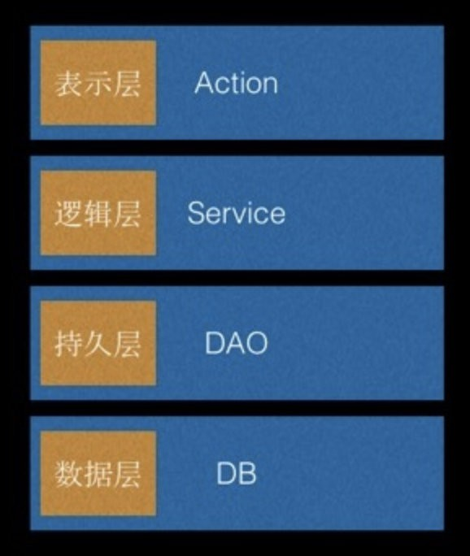
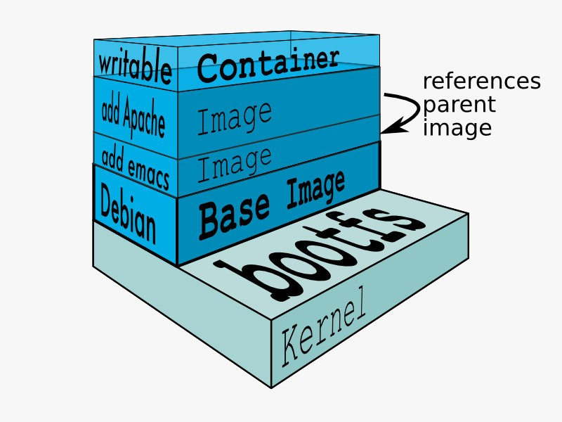
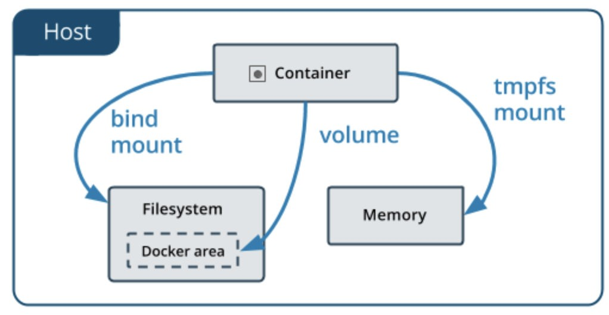
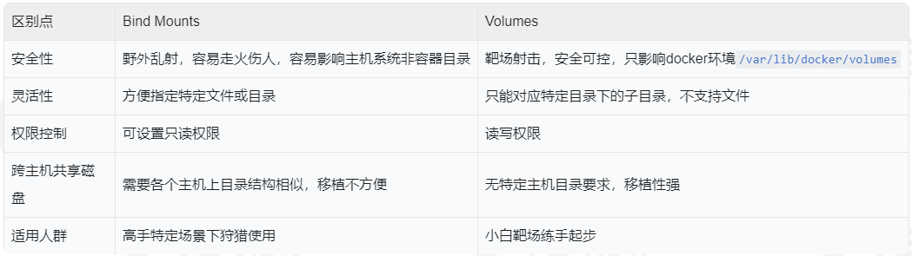

# Docker数据持久化管理

## 1、Docker数据持久化

Web应用服务的核心是业务逻辑处理，不管是采用了微服务的贫血模型(Get/Set) ，还是实现数据增删改查的DAO层，操作的关键都是后台的应用数据。同时如果想运行带持久化功能的缓存模块，如Redis、数据库集群服务MySQL、微服务配置中心Consul等容器，都需要对后台数据卷进行读写功能，换言之，数据持久化撑起来容器服务的半边天。



## 2、系统卷

之前在Docker镜像一节，大家已经看到了容器文件系统的分层加载模型。Docker 在启动的时候采用了默认的storage driver，包含AUFS、Device Mapper、VFS、Overlay、FS、Btrfs等。不同操作系统会选择不同的默认存储驱动。以CentOS 7为例：

```
[root@training1 ~]# docker info
Client:
 Debug Mode: false

Server:
 Containers: 5
  Running: 1
  Paused: 0
  Stopped: 4
 Images: 5
 Server Version: 19.03.1
 Storage Driver: overlay2
  Backing Filesystem: extfs
  Supports d_type: true
  Native Overlay Diff: false
  ...
  Docker Root Dir: /var/lib/docker
  ...
```

可以看到，默认的存储驱动是overlay2，采用的文件系统是extfs，系统卷的默认目录是主机的 `/var/lib/docker `目录。

在启动内的所有数据增删改查操作只会对当前容器有效，容器销毁后，在主机和镜像内不会有其相关的数据残留。Writable的部分只限制于当前容器内：



这个技术适合作为容器系统的系统卷使用。

## 2、数据卷

是不是摆放数据的持久化卷也是通过类似方式准备起来的呢?

 答案是NO，数据卷有两类常见的使用方法：Bind Mount和Volume (tmpfs mount很少使用)。



**1.Bind Mounts：**我把这种模式称为狩猎模式，当你手提猎枪站在森林里狩猎的时候，最大的感觉就是畅快，可指哪打哪。在Bind Mount模式也一样，你想把主机中什么文件或者目录mount到容器的什么位置都可以。

还是以之前的redis为例，对这个缓存模块进行增强，提供数据持久化功能：

```
[root@training1 ~]# pwd
/root
[root@training1 ~]# ls
apache  Dockerfile  emacs  get-docker.sh


[root@training1 ~]# docker run -v $PWD/data:/data -d redis:3.2 redis-server
aa964b1b61fd2a8c503bb3cd63ee87235f85bead022b504f48f20eff575e5b05
[root@training1 ~]# ls
apache  data  Dockerfile  emacs  get-docker.sh

[root@training1 ~]# docker ps
CONTAINER ID        IMAGE                 COMMAND                  CREATED              STATUS              PORTS               NAMES
aa964b1b61fd        redis:3.2             "docker-entrypoint.s…"   About a minute ago   Up About a minute   6379/tcp            tender_franklin
[root@training1 ~]# docker exec -it aa964b1b61fd /bin/bash

root@aa964b1b61fd:/data# touch update
root@aa964b1b61fd:/data# exit
exit

[root@training1 ~]# ls data/
update
```

从上面的演示可以看出，Bind Mount模式的关键命今在于` -v <host_path>:<ontainer_path>` 这几个字符。通过指定当前目录下的data子目录为加载的源头，容器内的`/data` 为mount点，进行目录的加载。之后在容器内的数据操作会保留到主机的相关文件和目录中，持久化存储下来。

**2.Volumes：**我把这种模式称为靶场模式。当一个新兵开始训练的时候，通常狩猎场都不是最好的选择，相对的，靶场的封闭的场馆和方便的弹药更换环境，才更受欢迎。在Volumes模式中，用户可以创建卷名，并把它加载到指定的容器，但是在主机平台，这些卷却被统一存放在为Docker指定的靶场环境 `/var/lib/docker/volume`中。

两种主流volume创建方式：

隐式创建卷：`docker run .... -v /data`；

显式创建卷：`docker volume create  --name **`

先隐式地创建Redis缓存所需的持久化卷：

```
[root@training1 volumes]# docker run -v /data2 -d redis:3.2 redis-server
8fb55dcc8a5e6b0294044a99190c89e829f152782f7eb10b45f2331223f27509
[root@training1 volumes]# docker inspect 8fb55dcc8a5e6b0294044a99190c89e829f152782f7eb10b45f2331223f27509
...
        "Mounts": [
            {
                "Type": "volume",
                "Name": "f0815cce95ff0ec913f8c0a72fd04a0da72be0cccf685d9b1ecd57c14965c35a",
                "Source": "/var/lib/docker/volumes/f0815cce95ff0ec913f8c0a72fd04a0da72be0cccf685d9b1ecd57c14965c35a/_data",
                "Destination": "/data",
                "Driver": "local",
                "Mode": "",
                "RW": true,
                "Propagation": ""
            }
        ],
...
[root@training1 volumes]# ls /var/lib/docker/volumes/f0815cce95ff0ec913f8c0a72fd04a0da72be0cccf685d9b1ecd57c14965c35a
_data
```

大家可以看到，Volumes模式和Bind Mounts模式最大的区别就是  `-v` 后面没有`:`符号，这也就意味着我们只制定了容器内的目标mount点，而所需要从host上加载的卷由系统在` /var/lib/docker/volumes` 目录下随机指定，并mount到容器的 `/data2` 目录。

现在我们再来显式地创建Volume，并加载到容器内：

```
[root@training1 ~]# docker volume create data3
data3
[root@training1 ~]# docker inspect data3
[
    {
        "CreatedAt": "2019-08-21T00:16:47+08:00",
        "Driver": "local",
        "Labels": {},
        "Mountpoint": "/var/lib/docker/volumes/data3/_data",
        "Name": "data3",
        "Options": {},
        "Scope": "local"
    }
]
[root@training1 ~]# ls -d /var/lib/docker/volumes/data3
/var/lib/docker/volumes/data3

[root@training1 ~]# docker run -v data3:/data3 -d redis:3.2 redis-server
833da638bfdc220e7f9d9e49821ac247d6abdc6b3868a9be51803097d8de649f
[root@training1 ~]# docker exec -it 833da638bfdc220e7f9d9e49821ac247d6abdc6b3868a9be51803097d8de649f /bin/bash
root@833da638bfdc:/data# ls -ld /data3
drwxr-xr-x 2 root root 4096 Aug 20 16:16 /data3
```

显式地创建volume会使得其在主机上的卷名比较容易记忆，但整个加载效果其实和隐式创建类似。Volume会确保保存在 `/var/lib/docker/volumes` 目录下。

## 4、区别比较

