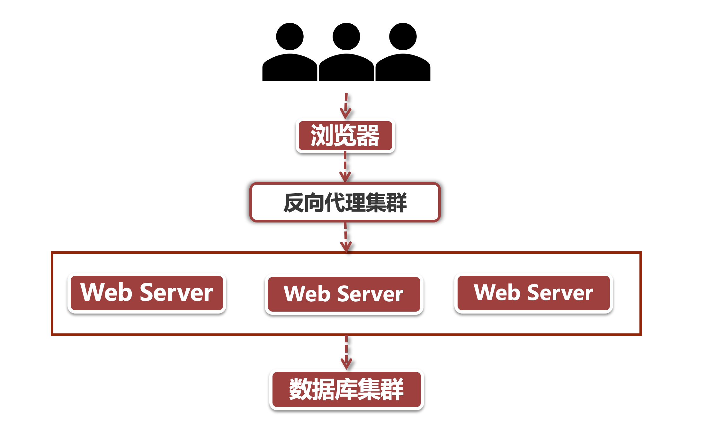
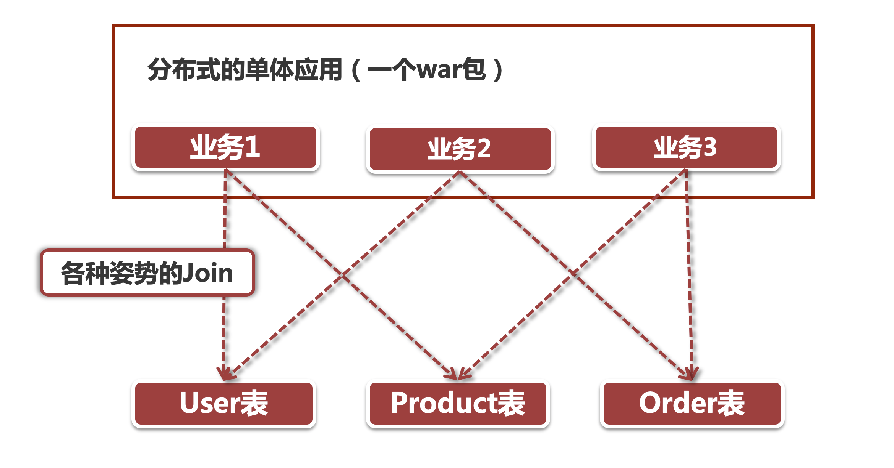

# 为什么要将应用微服务化

## 1、上古时期的高可用架构

其实在十多年前，"架构师“ 并不是一个需求很大的职业，一来那时还没有“全民App”级别的应用，除了三大门户网站以外，其他的网上应用业务压力并不大；二来也没有现如今这么丰富的技术选型，几乎清一色的PHP。因此对所谓“架构师”的需求并不是很大，那些年的高可用架构大体上就是这个样子的：

在上面的反向代理集群之下，是众多Web服务器构成的高可用集群，不过这些服务器中部署的应用却是千篇一律，什么意思呢？ 大家看过火影忍者吧，里面主人公经常用的一招叫"多重影分身之术“，将一个自己的本尊复制为成千上万个本尊。这里的服务器集群是一个道理，将一个巨无霸的单体应用复制成N个单体应用，组成一个分布式的服务集群。

## 2、传统架构之殇

随着互联网行业的飞速发展，个人的衣食住行几乎全依赖各种APP来满足。每天早上起来刷刷淘宝，地铁上用视频app看个短句，一天微信不离手，睡前刷个抖音一不小心就刷到了后半夜，这些现象级全民应用层出不穷，所承接的用户访问量远非上古时期的门户网站所能比拟的。在这种用户量级下还要能够满足不断变化的用户请求，就
像给飞行中的飞机换引擎，传统的架构模式已经完全不能满足业务发展的节奏。

我们来举几个”单体应用” 中经常被人诟病的几个问题：

### 2.1、数据访问杂乱

同一个war包内，在数据访问层面没有划分领域模型，比如说我们有User、Product和Order三张表，对于不同的Service来说，都通过直接访问数据库的方式来获取数据。

#### 2.1.1）数据模型变更

拿Order表来说，如果某一天我的Data Model发生了重大变更，比如说引入了“子订单”的概念，原先的数据模型不能再很好地支持业务，必须重构Order订单表，与此同时，还要兼容老的订单结构。这种情况下你贸然改动数据模型吗? 恐怕不行，原因就是这个Order表被这个系统中的各个服务引用到了，你的改动可能会破坏其他服务的功能。

再举个例子，Product表以前存放的是单个的商品记录，数据模型非常简单，后面引入了SKU的概念，这就要对数据模型做重大改动，同时还可能影响到 库存模块（以往库存落在Product级别，现在要落地到SKU级别）。

以上都是我做电商业务中遇到的实际场景，对于传统的应用结构来说，一丁点数据结构的改变都会引起很大的影响。如果数据模型的变动是必须的，那我们如何解决这种情况呢？

很简单，通过微服务架构在各个服务之间做好隔离，将Data Model的影响带来的业务复杂度隔离在当前微服务中，划分好领域模型，上下游服务只要对接微服务的接口就可以，领域模型驱动不用依赖底层数据结构的变更。

#### 2.1.2）底层组件变更

假如现在我要对 Product 表的数据访问规则做一个变更，比如引入 MyCat 分库分表，或者对热点数据的访问加上缓存读写的步骤。那么意味着上下游所有访问 Product 表的业务，都需要连带着做同样的改动。

再说个更极端的例子，以前我们使用的是Oracle，太贵了，领导层想要换成MySQL，即便我们没有存储过程的牵绊，那么这个变更也是极其巨大的，可调牵一发动全身。

理论上来说，我们应该尽可能对业务层屏蔽底层组件的变更，在传统的分布式应用中非常难以办到，但是在微服务架构下却没有那么困难，因为微服务间的访问依赖 API接口+业务模型，我们只要在当前微服务中把这种底层组件的变更处理好，对上下游其他服务来讲这个变更其实是无感知的，因为在微服务接口暴露出的业务模型并不会有什么变化。

## 3、代码复用带来的维护成本

整个应用的代码掺杂在一块，少不了各种“借鉴”，咱来细数下这里面的坑：

### 3.1、码农的傲娇-rewrite code

作为一个骄傲的码农，看人写的代码都跟屎一样，只有自己出品的才是最好的。路见不平重构一，重构不了的干脆重新写个功能上一模一样但是代码结构上更“优雅“的接口出来，随着时间的推移，这深藏于码农血液里的 “rewrite code” 基因，终究会把一个代码库编程一座山。

### 3.2、小改动没什么大不了

“我就改了个if条件啊，谁知道你们也用了这个方法，这方法我当初就写给自己用的啊!”

码农之间的撕逼没有那么轰轰烈烈，反正最后归根结底就是-改出bug来了。上面那个情景在传统架构的系统里很常见，当你的业务需要添加一个新功能，瞄了几眼发现，咦?我去年写的这方法改一下正好能用，随手改了个条件，谁管料想，隔壁组的程序媛妹子没打招呼也用了这个方法，被你这么一改，把别人的服务搞挂了，又不好意思跟人妹子撕逼，只好自己背了个生产事故的锅。

## 4、糙快猛才是生产力

不知道大伙有没有经历过互联网公司的业务节奏，拥抱变化不是白叫的，研发团队沉漫在996的福报中不能自拔。就像前面说的，为了支持不断变化的新业务，开发团队对系统的改造就像给飞行中飞机换引擎，既要让飞机飞，又要保证完成任务，还得要快，因此我们提出了“糙快猛”的开发模式，它是继瀑布模型、敏捷模型等等软件工程理论之后的具有中国特色的互联网研发模式。

面对一个屎山一般的单War包应用，产品的发布节奏往往是以月甚至年来计，一个变更从评估到上线，拖个一年半载是很常见的事情，这种节奏对于互联网公司来说，倒闭100次都够了。

### 4.1、小步快跑

互联网产品的迭代依靠小步快跑，尽快上线，尽快验证业务模式，有问题立即调整，一切都是"快字当头“。对于传统应用来说，发布节奏只能划归到一个千年等一回的发布窗口，再小的变更都得耗上很长的时间，可能每次发布都要经历很耗时的全链路回归测试。对微服务架构来说完全不存在这个问题，每个微服务模块由于职责边界足够清晰，规模可控便于快速变更和测试，完全可以让团队自己制定发布窗口，即便是上线前的回归测试也只局限在当前服务模块。

### 4.2、回滚

回滚对于传统的单war包分布式系统来说是个噩梦，好不容易等到了发布窗口，各个团队牟足了劲把所有变更都发布了出去，结果因为其中某个小改动引发的问题，导致全部回滚，又要苦苦等待下一个发布窗口。

在微服务架构中，回滚只局限在某个微服务的范围内，只要把出问题的应用回滚就好了，不会影响上下游其他应用的发布节奏。