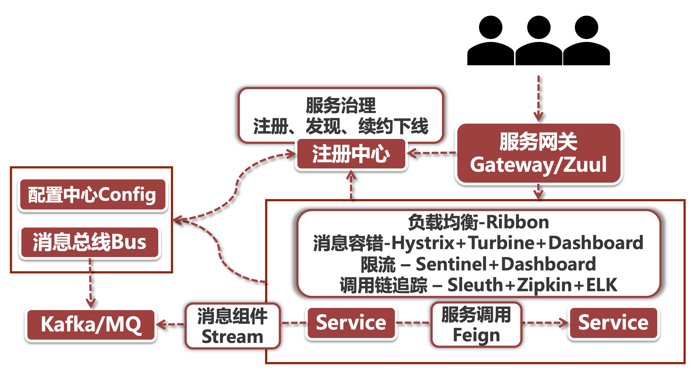

# Spring Cloud整体架构

我们前面说过，Spring Cloud是一款微服务架构的一站式解决方案，你在微服务化过程中碰到的任何问题，都可以从Spring 全家桶里找到现成的解央方案，而目方案还不止一种。

我们先来看一幅Spring Cloud的全景图，再来详细解释其中的每个组件的功能：

## 1、服务治理

Spring Cloud 提供了三款服务治理的组件，分别是Eureka,Consul 和 Nacus，从这三足鼎立的态势里我们就能猜到，在服务治理领域的背后一定有那么一段恩怨情仇。没错，这三个组件其实是由三个不同的公司或组织来研发的。

在 Spring Cloud 的架构中，服务治理是其中不可或缺的核心环节，它包含了服务从注册到销毁的整个生命周期的管理。用一句话来说，服务治理确保了调用方可以准确的向**可用的**服务节点发起调用。

## 2、负载均衡

Ribbon 是 Spring Cloud 中负责负载均衡的组件，Ribbon的一大优势是它能够和各个 Spring Cloud 组件无缝集成，而且十分灵巧轻便又具备高可扩展性。

负载均衡框架是起到分散服务器压力的作用，可以这么说，没有负载均衡技术的服务器集群就不能叫做集群，只有借助负载均衡技术，集群才能够借助服务节点的规模效应发挥出优势。

## 3、消息间调用

对于原生态的HTTP调用来说，从Java代码里发起调用并且构造消息体和Header是一件非常麻烦的事情，考虑到 Spring Cloud 的服务治理组件也是基于HTTP的，因此特别需要一款简化服务调用的组件。Feign的出现就是为了解决这个问题，我们可以借助Feign的代理机制，像调用一个接口方法一样发超远程HTTP调用。

## 4、服务容错

Hystrix 是目前Spring Cloud中应用最广的服务容错组件，服务容错从观上来解释，就是尽可能降低服务异常所带来的影响。我们经常听到两个词叫做”降级 和“熔断”，降级很好理解，现在大家都会打趣的说“消费降级”，就是说降低咱自己的消费水平，在服务容错这里其实是一个道理，降级就是退而求其次，在异常发生之后选一种备选方案继续提供服务。而熔断则是指在异常达到某个临界值以后，直接切断服务通路，将用户请求统统导向降级逻辑中。

## 5、分布式配置中心和消息推送组件

Spring Cloud 借助 Config组件 来集中管理集群中所有服务节点的配置，它是一个中心化的配置管理中心，可以采用包括Github、Database等多种持久化方案来保存配置信息，将你的微服务从繁重的配置工作中解脱出来。利用Config组件我们可以轻松玩转环境隔离、配置推送和配置项动态刷新。

提到配置属性的刷新，就不得不说Spring Cloud中的另一个组生BuS，它承担了批量通知和推送配置变更的工作，而目我们可以通过扩展 Bus 的事件，实现 "消息广播“ 的应用场景。

## 6、服务网关

服务网关是微服务的第一道关卡，目前 Nginx 是应用最广泛的反向代理技术，在各个大厂的核心业务系统中都有大量应用，不过Nginx 可不是使用 Java 来配置的，使用和配置 Nginx 需要掌握它的语法树，Spring Cloud 则为广大的 Java 技术人员提供了更加""编程友好”的方式来构建网关层，那就是Gateway和Zuul网关层组件。我们可以通过Java 代码或者是yml 配置文件的方式编写自己的路由规则，并通过内置过滤器或自定义过滤器来实现复杂的业务需求（比如在网关层做令牌验证）。Gateway本身也集成了强大的限流功能，结合使用Redis+SpEL表达式，可以对业务系统进行精准限流。

## 7、调用链路追踪

微服务的一大特点就是完成一个业务场景所需要调用的上下游链路非常长，比如说一个下单操作，后台就要调用商品、订单、营销优惠、履约、消息推送、支付等等一大家子微服务，任何一个环节出可能都会导致下单失败。

那同学们如何在一个调用链路中定位到出问题的环节？生产环境可不是我们的开发机器，不能为所欲为的做线上debug，那我们只能依靠日志线索。

SIeuth 是 Spring Cloud 提供的调用链路追踪组件，它进行线上问题排查必不可少的关键坏节，单就SIeuth 来说，它就是在一整条调用链路中打上某个标记，将一个api请求所调用的所有上下游链路串联起来。如果从宏观的角度来说，调用链追踪还涉及到日志打标、调用链分析、日志收集、构建搜索lndex等等流程，我们在本章中将通过SIeuth+Zipkin+ELK (Elasticsearch，Logstash，Kibana) 这五种技术结合使用，玩转调用链路追踪。

## 8、消息驱动

Kafka和 RabbitMQ 是目前应用最广泛的消息中间件，很多异步调用场景底层部依赖于消息组件，比如说电商场景中的商品批量发布，或者下单功后的邮件通知系统等等。Stream是Spring Cloud 为我们提供的消息驱动组件，它代理了业务层和底层的物理中间件的交互，至于底层中间件是 Kafka 还是 RabbitMQ，对业务层几乎是无感知的。借助Stream我们不仅可以轻松实现组播（组内单播）和广播场景，同时Stream还提供了对异常处理的丰富支持。

## 9、防流量卫兵

Sentinel是阿里巴巴开源的一款主打 “流量控制” 的组件，它秉承了阿里系组件十八班武艺样样精通的风格，与Spring Cloud 、Dubbo 甚至 GRPC 都可以很好的集成，在分布式流量控制（包括秒杀场景的突发流量场景），熔断、消息驱动下的削峰填谷等各个场景下都有稳定发挥，要知道它可是在背后默默支挥双十一流控业务的顶梁。