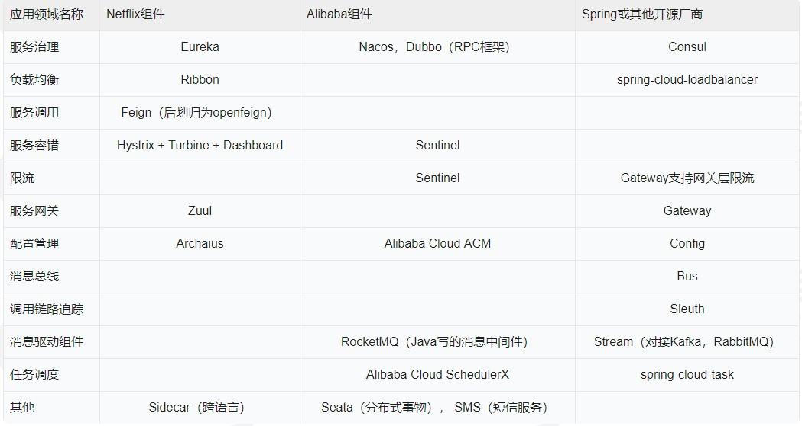

# Spring Cloud核心组件介绍

## 1、Netflix

是先有Spring Cloud还是先有Netflix? 这是一个好问题，Netflix是一家大名鼎鼎的互联网传媒公司，为什么它在开源软件领域有这么大的名声呢?这就不得不说起它和 Spring Cloud 的渊源了。

Netflix公司，拿自身的业务动手，开启了一段微服务的改造之旅。在这段漫长的过程中，沉定出了一系列优秀的微服务组件，比如大名鼎鼎的Eureka，Hystrix，Zuul 等等，这些组件经过Pivotal 的一系列封装以后就构成了初代的Spring Cloud。

目前 Spring Cloud Netflix 组件库是Spring Cloud中最受欢迎的项目，并且还拥有最广泛的群众基础，这么说吧，10个用 Spring Cloud 的公司，有八个都会选用Netflix 组件库全家桶来构建自己的技术栈。

## 2、阿里巴巴

阿里近些年开源的步子迈的很大，都说步子迈得大容易扯着挡，不过凭借阿里996+鸡血文化的加特，用互联网行业特有的糙快猛的精神，近几年在开源软件上不断开疆扩土，发展速度和规模都是是可圈可点。

目前开源领域一大热门当属Spring Cloud，尽管前面有 Netflix 组件库占尽天时地利，可是不妨碍阿里巴巴后来居上。这不，Spring Cloud大家族中又添新丁，那就是 Spring Cloud Alibaba组件库。

从目前的势头来看，Alibaba组件库还是呈现一路高歌猛进的态势，其中多款组件已经站上擂台和Netflix 组件展开直接竞争，从我个人使用这两个组件的感受来说，Netflix 组性相对来说比较 “纯粹”，Alibaba组件透出一股“KPI导向”的味道(恨不信把能想到的功能全塞进去)。

本章课程我们将以Netflix 组件为主，同时也会重点介绍几个Alibaba组件库的组件。

## 3、Spring Open Source

最后一股势力就是Spring 自个了，由Spring 自己独家挂牌的开源组性，可以说是“原配”组件了，都说原配的才是最好的，不过在上面两个重量级组性库面前还真不好说，同学们经常会看到这样一个情况，在某个领域中这一家的组件会扎堆出现。以如服务治理，这三家各自都有一个独立组件。

## 4、势力范围

那接下来我们就看一看上面那三股势力都在哪些领域部署了兵力：

从上面的表格中可以看出，在大多数的领域当中，我们都有多于一种的解决方案，而且各个组织在不同领域发力程度也不一样，我们在实际的研发当中不会只盯着一个组件库用，而是结合使用来自不同组织开发的组件，这样才能发挥Spring Cloud的最强功力。

