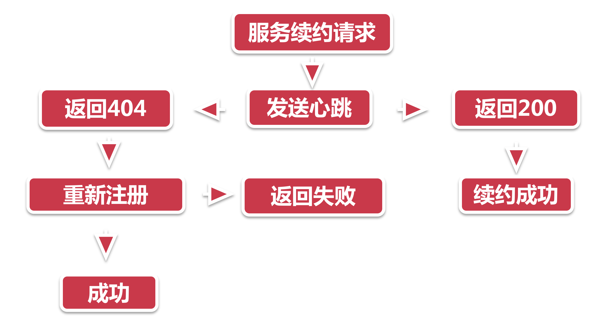
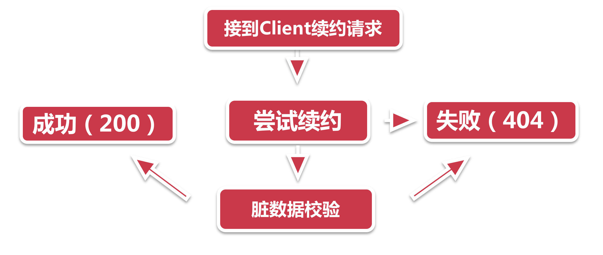

# 服务续约

## 1、三角关系

我们先来理一理心跳、续约和剔除之间的爱恨纠葛。这三弟兄都紧紧围绕在注册中心里的服务同步时间周围，意图霸占。

我们先来说说续约和心跳的关系，服务续约分为两步：

- 第一步 是将服务节点的状态同步到注册中心，意思是通知注册中心我还可以继续工作，这一步需要借助客户端的心跳功能来主动发送；
- 第二步 当心跳包到达注册中心的时候，那就要看注册中心有没有心动的感觉了，他有一套判别机制，来判定当前的续约心跳是是否合理。并根据判断结果修改当前 instance 在注册中心记录的同步时间。

接下来，服务剔除并不会和心跳以及续约直接打交道，而是通过查验服务节点在注册中心记录的同步时间，来决定是否剔除这个节点。

所以说心跳，续约和剔除是一套相互拮抗，共同作用的一套机制。

## 2、发送 Renew 请求

接着就是服务节点向注册中心发送续约请求了，如下图：

1. **服务续约请求：** 在前面的章节里我们讲到过，客户端有一个 DiscoverClient 类，它是所有操作的门面入口。所以续约服务就从这个类的renew方法开始；
2. **发送心跳：** 服务续约借助心跳来实现，因此发给注册中心的参教和上一小节的心跳部分写到的一样，两个重要参数分别是服务的状态（UP）和 lastDirtyTimeStamp：

> - 如果续约成功，注册中心则会返回200的HTTP code；
> - 如果续约不成功，注册中心返回404，这里的404并不是说没有找到注册中心的地址，而是注册中心认为当前服务节点并不存在。这个时候再怎么续约也不灵验了，客户端需要触发一次重新注册操作。

3. 在重新注册之前，客户端会做下面两个小操作，然后再主动调用服务册流程：

> - 设置`lastDirtyTimeStamp` ，由于重新注册意味着服务节点和注册中心的信息不同步，因此需要将当前系统时间更新到`lastDirtyTimeStamp` 
> - 标记自己为脏节点

4. 当注册成功的时候，清除脏节点标记，但是`lastDirtyTimeStamp`会清除，因为这个属性将会在后面的服务续约中作为参数发给注册中心，以便服务中心判断节点的同步状态。

## 3、注册中心续约校验

考验注册中心灵验不灵验的时候到了，注册中心开放了一系列的HTTP接口，来接受四面八方的各种请求，他们都放在 `com.netflix.eureka.resources` 这个包下。只要客户端路径找对了，注册中心什么都能帮你办到。

1. **接受请求：** `InstanceResource`下的`renewLease`方法接到了服务节点的续约请求；
2. **尝试续约：**服务节点说：“万能的注册中心，请赐予我永生”。注册中心："想得美，从现在算到下一次心跳间隔时间，如果你没来renew，就当你死了”。注册中心此时会做几样简单的例行检查，如果没有通过，则通通返回404，不接受申辩。

> - 小样你以前来注册过吗？没有？续约失败！带齐资料工作日前来办理注册！
> - 小样你是Unknown状态? 回去回去，重新注册！

3. **脏数据校验：** 如果续约校验没问题，接下来就要进行脏数据检查，到了服务续约最难的地方了，脏数据校验逻辑之复杂，如同这皇冠上的明珠。说往细了说，就是当客户端发来的 `lastDirtyTimeStamp` ，晚于注册中心保存的`lastDirtyTimeStamp` 时（每个节点在中心都有一个脏教据时间），说明在从服务节点上次注册到这次续约之间，发生了注册中心不知道的事儿（数据不同步）。这可不行，这搞得我注册中心的工作不好有序开展，回去重新注册吧。续约不通过，返回404。

> 服务节点：脏数据校验就这么简单？说好的皇冠上的明珠呢？
> 注册中心：我说复杂就复杂，哪个不服？是你不，刚404那个？你瞅啥？！再瞅我削你！

## 4、小结

本节带大家学习了关于服务续约的知识：

1. 心跳、服务续约和服务剔除之间不得不说的关系；
2. 客户端服务续约流程；
3. 服务端续约请求处理。