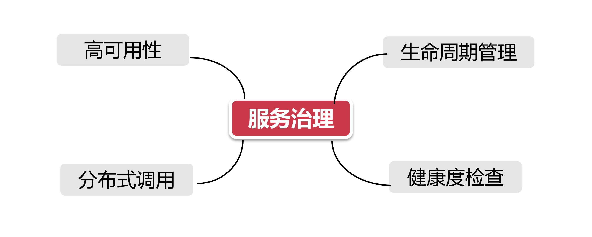

# 服务治理概述

## 1、服务治理的目标

目标如下图示：

- **高可用性：**换成通俗易懂的说法就是”当一只打不死的小强"”，在服务治理麾下的所有微服务节点，不论是被闪电击中还是被挖掘机铲断了电源，即使战至最后一个存活节点，服务治理框架也要保证服务的可用性。
- **分布式调用：** 微服务的节点通常散落在不同的网络环境中，大型互联网公司甚至会使用两地三机房或跨洲际机房做异地容灾。这就要求服务治理框架具备在复杂网络环境下准确获知服务节点网络地址（IP，端口以及服务名称）的能力。作为服务消费者，就可以借助服务治理框架的精准制导能力，向服务节点发起请求。一只穿云箭，千军万马来相见。
- **生命周期管理：**万物都在轮回之中，在Spring的世界更是如此，微服务也把自己平凡而充实的一生，交给了服务治理框架，从服务上线、持续运行直到临终关怀，服务治理始终贯穿整个微服务生命周期。
- **健康度检查：** 微服务的节点都是任劳任怨的执行996，当然，如果一个节点因为任何原因不再能996的辛勤工作，那就不再是哥的兄弟了。服务治理框架要精准识别这些节点，将其从自己的兄弟会中剔除。

## 2、实现目标要先解决问题

目标和想法是美好的，但是现实里却没那么容易。为了实现这些小目标，我们必须解决眼前的几个大问题。

### 2.1、四个问题 (3W1H)

假设我们把每个微服务集群比喻成一个武林门派，比如搜索服务就是“所罗门“，优惠券服务就是 ”卷莲门“，那么这个服务集群中的每个机器就相当于门下的一个弟子，而每个业务调用方就是一个前来踢馆的江湖高手。

中原武林浩如烟海，如何在茫茫人海中找到我想要挑战的那个人呢?服务治理框架，就是要帮这些踢馆的高手找到对应门派的精第子进行切磋。

在这个过程中**服务治理**要帮助踢馆高手翻过四座大山，实现最终目标，这就是四个需要服务治理框架来解决的问题，我们称之为3W1H。

**Who are you** ：作为服务治理框架，我如何知道中原武林各门各派的众第子(服务提供者)的信息，这里面的信息是他们行走江湖的独一无二的标识，包含三个维度：

​	a）名号-敢问你的IP和端口是什么 

​	b）门派报上你的服务名称  

​	c）身体状况-服务当前是可用 or 下线状态决定了你是能打还是不能打。

**Where are you from** ：作为踢馆人(服务调用方)，我如何知道这些武林人士(服务提供者)来自哪里? 我又如何从服务治理框架手里拿到他们的地址，从而使我可以找到正确的人?

**How are you doing** ：服务治理框架需要时刻甄别这些门派弟子的身体情况，一旦某个弟子断了气，就要做出相应标识，并告知踢馆人，以防别人走了冤枉路，找到了地方却找不见人。

**When you die** ：有的门派弟子比较怂，不敢应战，且主动请求下线，或者为了闭关修炼高级武功(系统升级重启)，短时间内不在线，那么服务治理框架也要做出相应的回应，对主动下线的服务做清退处理。

## 3、服务治理的解决方案

为了解决前面提到的四个问题，服务治理领域祭出了六门独门武艺，用来解决这四个问题。

- Who are vou- **服务注册 **- 服务提供方自报家门
- Where are you from - **服务发现 -** 服务消费者拉取注册数据
- How are you doing - **心跳检测，服务续约和服务剔除** 一套由服务提供方和注册中心配合完成的去伪存真的过程
- When you die - **服务下线** - 服务提供方发起主动下线