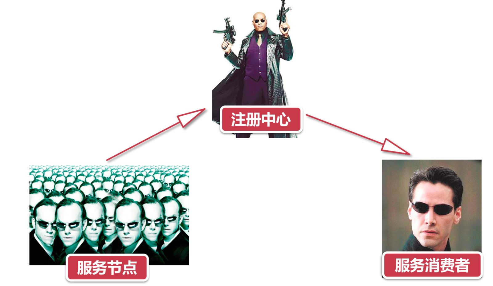
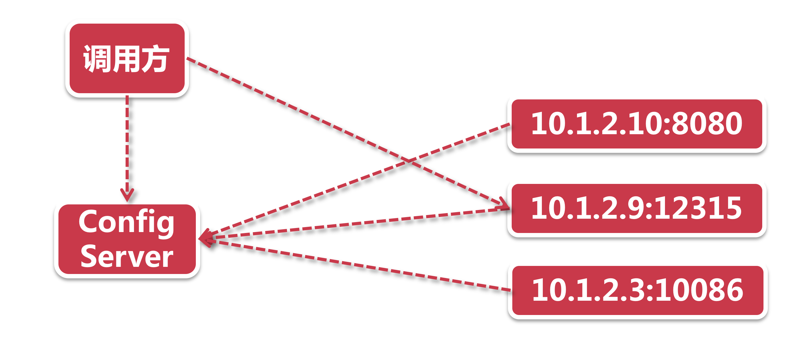
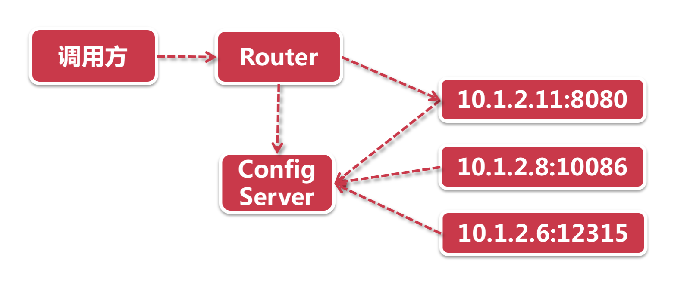
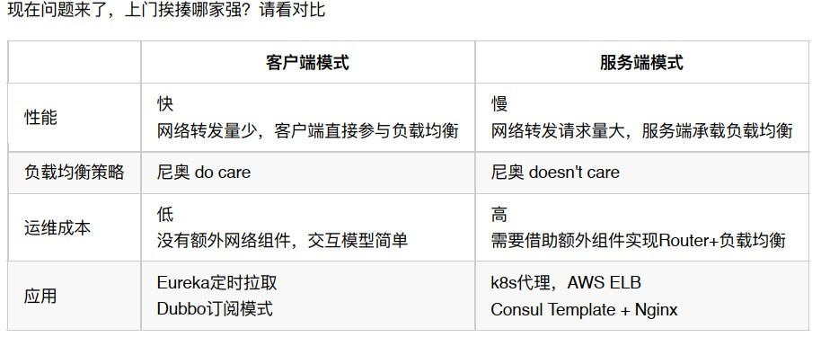

# 服务发现

大家想必都看过《黑客帝国》三部曲。影片的主角是一个年轻的黑客尼奥，他发现了整个现实世界是由一个名为 ”矩阵“ 的计算机人工智能系统控制的，在这个黑暗的世界中有一个大反派 “史密斯”，尼奥见到了黑客组织的首领墨菲斯，在墨菲斯的带领下找到史密斯，走上了抗争的一生。

在这个故事里尼奥，墨菲斯，史密斯三人都有一个共同的特征，那就是戴着墨镜。但是不同的地方是，只有尼奥是真的瞎了。。。瞎子尼奥啥也看不见，要想靠自己去找到大反派史密斯那简直就是不可能完成的任务，他必须借助墨菲斯这位黑客组织大头目的帮助，才能完成找到史密斯的任务。Eureka 里的服务发现也是这么个道理：

- **史密斯集群：**网络中的服务提供者，来无影去无踪，上线下线无所不能；
- **带头大哥墨菲斯：** 注册中心，时刻掌握史容斯的方位；
- **尼奥：** 双目失明的服务消费者，必须依靠墨菲斯的帮忙才能找到服务节点。

## 2、谁去打史密斯?

话说条条大路通罗马，虽然现在知道了怎么去找史密斯，但是谁去找史密斯却成了个问题。

Eureka的服务发现也得做这么一个抉择，是让尼奥自己去找呢？还是让大哥墨菲斯或者找一个中间人来做这件事？

### 2.1）基于客户端的服务发现

在这个服务发现模型中，只有三个角色（尼奥，墨菲斯，史密斯），这时瞎子尼奥依然是一个勤快的小伙，他打算自己去送人头。

史密斯集群（网络服务节点）通过服务注册功能，将自己的服务信息以及IP地发给了注册中心，调用方尼奥则从注册中心获取所有的可用服务列表，然后以中挑选一个史密斯实例，自己上门找打。

看到这里有的同学可能会问，尼奥手里有这么多史密所，他怎么知道该找哪个？这就要说到 "负载均衡“ 了，这里你可以把调用方看成一个内置了负载均衡策略的服务发起者，他会选择一个合适的节点进行服务调用。

### 2.2）基于服务端的服务发现

前面尼奥自己总是自己上门找揍，被打的那叫一个鼻青脸肿，所以他干脆想了一个办法，只发号施令，找打的事儿得换个人来。

这个模式下多了一个 Router 的概念，注册中心依然获取了所有的节点信息。每当尼奥想要教训一下史密斯的时候，他会发送一个指令给一个服务端的代理Router，这个Router既可以是服务端负载均衡器，也可以是网关层，而负载均衡策略则从发起调用的消费者一端，移到了服务端。总之，我尼奥不再自己送人头了。

## 3、论挨揍的效率

以上面的比较可以看出，客户端模式似乎是更加轻量且效率的做法，但是对于客户端来说，就要承载额外的负载均衡处理，但是显而易见的是，负载均衡无论是在客户端或者服务端，总归得是有的（大型互联网应用通常是客户端+网关层都会部署负载均衡），所以如果采用客户端负载均衡模式的话，对 Spring CIoud 来说则是省了一个部署组件，这又说明了  Spring CIoud  一切从简的原则。

## 4、小结

在本节课程中，我们对服务发现的模式做了探讨，了解了基于客户端以及基于服务端的服务发现，并对两种模式做了简单的对比。