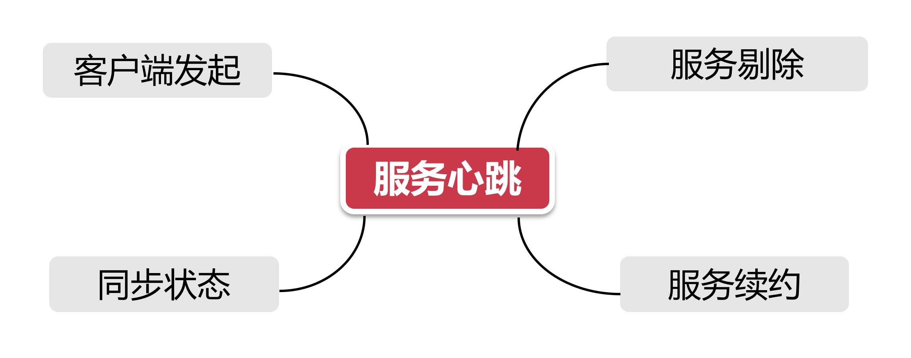
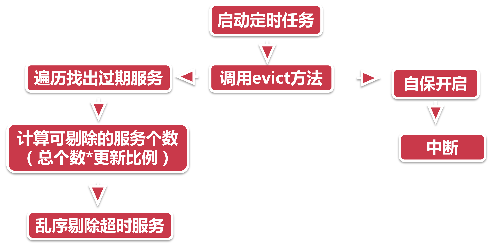

# 心跳检测与服务剔除

如果Eureka的注册中心有问题，，没了响应，很多调用请求不停报404，那Eureka有什么行之有效的手段
来解决这个问题呢?

## 1、心跳检测

心跳不息，生命不止，大道至简的 Spring Cloud 就借助这生命的本源，也就是心跳，来知晓服务的可用性。我们来看一下心跳检测有哪些特点：



1. **客户端发起：** 我们前面说过Eureka的注册中心是一个运筹帷幄的角色，足不出户办天下事，所以心跳服务是由一个个服务节点根据配置的时间主动发起的；
2. **同步状态：** 我们说的"心跳"不光要告诉注册中心“我还活着”，还要告诉他我活的好不好，是现在快不行了（ OUT OF SERVICE状态）还是生龙活虎 (UP状态)；
3. **服务剔除：** 现在轮到注册中心做点事情了，对一段时间无响应的服务，反映到心电图上就是一根直线跌停板，那便要主动从注册列表中剔除，以防服务调用方请求失败；
4. **服务续约：** 也许大家还不知道，服务续约底层也是靠着心跳来实现的，但包含了一套 ”脏数据" 处理流程，老师在服务续约章节会详细讲解。

## 2、心电图里的信息

心跳检测之于服务注册来说，就像做心电图检查之于办入院手续，入院手续需要做全方位的检查，因此要同步数十个属性到注册中心，而做一个心电图，仅仅需要以下这些信息就够了：

**访问地址：** 也就是Eureka注册中心的地址，如 http://localhost:20000/eureka/；

**访问路径：** 为了防止注册中心把我的心电图当做了别人的，给人治错了病，我还要主动告诉注册中心我是谁。不同于服务注册流程中把个人信息放到POST请求的body，心跳包把这个信息放到了访问的URL中，例如 `apps/${app_name}/${instance_id)`，这里的 `app_name`是服务注册时提供的服务名，而`instance_id`则是当前这个服务节点的唯一编号，比如9527；

**服务状态：** 心跳能反映出一个人的身体状况，对服务节点也一样，一个节点的服务状态有以下几种 `UP，DOWN，STARTING，OUT_OF_SERVICE，UNKNOWN`；

**最后一次同步注册的时间：** `lastDirtyTimeStamp`，这是心跳检测环节最复杂的一个知识点，它是当前服务节点最后一次与服务中心失去同步时的时间，`Instancelnfo`封装了该属性以及另一个搭档 `isInstancelnfoDirty`，当`isinstancelnfoDirty=true`的时候，表示当前节点自从`lastDirtyTimeStamp`以后的时间都处于未同步的状态。

### 2.1、两个核心指标

```
## 客户端指标
eureka.instance.lease-renewal-interval-in-seconds=10
eureka.instance.lease-expiration-duration-in-seconds=20
```

这两个指标都配置在服务节点上，分别表示了以下的含义：

- 第一个指标决定了每隔多久向服务器发送一次心跳包；
- 第二个参数告诉服务器，如果我在x秒内都没有心跳，那就代表我挂掉了。

通常第一个时间一定是小于第二个时间的，否则还没等到发送第二个心跳，就被注册中心推进太平间了。毕竟两次心跳之间的间隔时间，还得再多加几秒的网络延迟，才是判断服务是否挂掉的最小时间。

## 3、服务剔除

假设我们自己的应用碰到了这种情况，当一部分服务因为网络问题导致不可用，那么如何在尽可能短的时间内，剔除不可用的节点?

这就要借助Eureka的服务剔除功能，服务剔除是心跳检测的后手，正是为了让无心跳响应的服务节点自动下线，让我们来看一下Eureka的服务别除流程：



1. **启动定时任务：** 注册中心在启动的时候也会同步开启一个后台任务，默认每间隔60秒触发服务剔除任务，当然我们也可以通过在服务端 `“eureka.server.eviction-inteval-timer-in-ms=3000”`做如下参数配置修改触发间隔，这里将间隔设置成了30秒，此处建议不要设置的时间过短；
2. **调用evict：** 不像服务注册的山路十八弯，服务剔除比较直接了当，通过 `AbstractlnstanceRegisty`的eviction方法直接运行；

> **自保开启：** 服务自保是注册中心的保命招，后面课程会详细个绍，这里大家只要知道一旦自保开启，则注册中心就会中断服务剔除操作

3. **遍历过期服务：** 接下来注册中心会遍历所有服务节点，揪出所有过期服务。如何判断一个服务是过期服务呢，只要满足以下两点中任意一点就可以当做过期：

> - 已被标记为过期 (evictionTimestamp> 0)
> - 最后一次心跳时间 + 服务端配置的心跳间隔时间 < 当前时间

4. **计算可剔除的服务总个数：** 所有服务是否能被全部剔除呢? 当然不是，服务中心也要顾及自身的稳定性，因此他设置了一个系数（默认0.85），可剔除的服务数量，不能大于已注册服务的总数量乘以这个系数。比如当前有100个服务，其中99个已经断了气，那么注册中心实际上只能剔除100*0.85 = 85人服务节点，而不是99个；

5. **乱序剔除服务：** 乱序剔除，乱拳打死老师博。这里你就当做是歌单随机播放，随到哪个过期服务就把它踢下线。

## 4、小结

本节带大家学习了关于心跳检测和服务剔除的知识：

1. 心跳检测的作用，心跳包含的内容以及控制参数；
2. 注册中心服务剔除操作的核心流程。