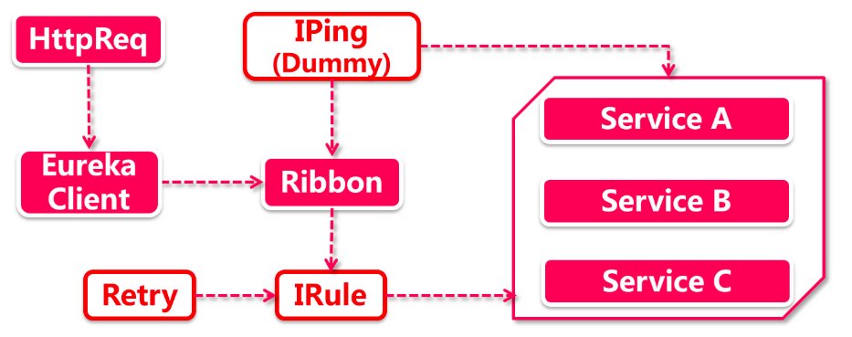

# Ribbion体系架构解析

## 1、Ribbion特点 

在SpringCloud的世界观中，Ribbon特点：

- **丰富的组件库：**整套负载均衡由7个具体策略组成，不管你是什么特殊需求，都有合适的策略供你选择；
- **适配性好：**跟谁都能搭配，SpringCloud里的五小强 (eureka， feign，gateway，zuul，hystrix)
  谁拿都能用。

## 2、走近Ribbon

刚才说到Ribbon给谁都能用，要不先让带头大哥Eureka试试?

红框白底的是Ribbon自己的组件。

一个HttpRequest发过来，先被转发到Eureka上，此时Eureka仍然通过服务发现获取了所有服务节点的物理地址，但问题是他不知道该调用哪一个，只好把请求转到了Ribbion手里。

**IPing：** iPing是Ribbon的一套healthcheck机制，顾名思义，就是要Ping一下目标机器看是否还在线，一般情况下IPing并不会主动问服务节点发起healthcheck请求，Ribbon后台通过静默处理返回true默认表示所有服务节点都处于存活状态（和Eureka集成的时候会检查服节点UP状态）。

**IRule：**这就是Ribbon的组件库了，各种负载均衡策略都继承自IRule接口，所有经过Ribbon的请求都会先请示IRule一把，找到负载均衡策略选定的目标机器，然后再把请求转发过去。

Ribbon的体系架构相对简单，职责也比较单一，只应用于负载均衡，知识点不多，因此特别适合快速通关，考虑到Ribbon和Hystrix以及Feign有千丝万缕的关系，因此关于Ribbon的retry部分知识，将放到Feign和Hystrix中来展开。