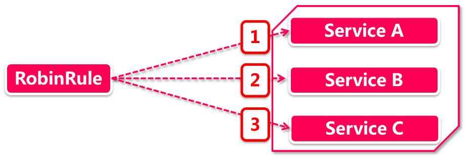
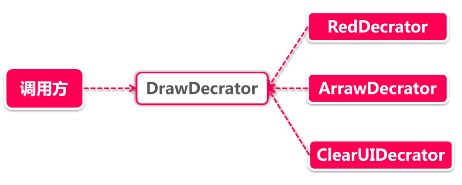
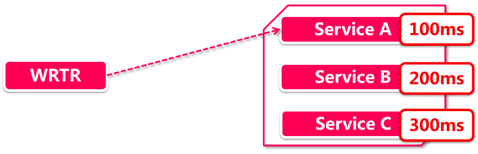
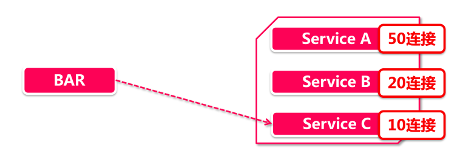
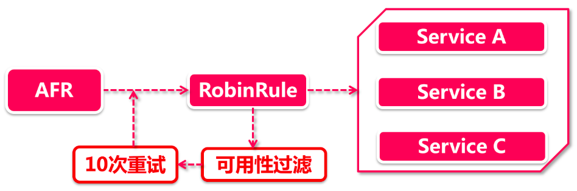
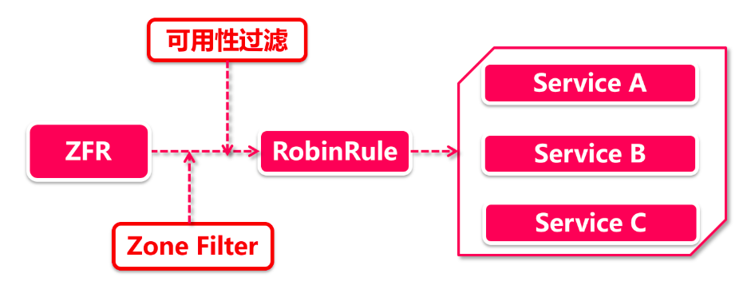

# 负载均衡策略

负载均衡包含七种策略，具体内容如下：

## 1、RandomRule- 随性而为

从名字就能看出，这是个很随性的策略，随性到什么程度呢?它会从当前可用的服务节点中，随机挑选一个节点访问。

这分明是乱拳打死老师博的路子吗，哪有负载均衡的智慧，这里为了打死老师博还真用了两个小花招，使用了yield+自旋的方式做重试，还采用了严格的防御性编程。

## 2、RoundRobinRule-按部就班

这个rule是RandomRule的亲兄弟，RandomRule是随机而为挑选节点，RoundRobinRule却按部就班从一个节点一步一步地向后选取节点，既不会跳过一个，也不会原地踏步，每一次只向后移动一步。



假如在多线程环境下，两个请求同时访问这个Rule是否会读取到相同节点呢?

不会，这靠的是RoundRobinRule底层的自旋锁+CAS的同步操作。CAS的全称是compare and Swap，是一种借助操作系统函数来实现的同步操作，前面我们讲到过Eureka为了防止服务下线被重复调用，就使用AtomiBoolean的CAS方法做同步控制，CAS+自旋锁这套组合技是高并发下最廉价的线程安全手段，因为这套作不需要锁定系统资源。

当然了，有优点必然也有缺点，自旋锁如果迟迟不能释放，将会带来CPU资源的浪费，因为自旋本身并不会执行任何业务逻辑，而是单纯的使CPU“空转”，所以通常情况下会对自旋锁的旋转次数做一个限制，比次JDK中synchronize底层的锁升级策略，就对自旋次数做了动态调整。

```java
// CAS+自旋锁获取系统资源的打开方式，真实应用中还要注意防止无休止自旋：

// 或者for (;;) 做自旋
while (true) { 
	// cas操作
	if (cas(expected, update)) {
		// 业务逻辑代码
		// break或退出return
	}
}
```

## 3、RetryRule-卷土重来

RetryRule是一个类以装饰器模式的Rule，我们前面学习服务注册的时候了解过，装饰器相当于一层套一层的俄罗斯套娃，每一层都会加上一层独特BUFF，我们这里复习一下装饰器的结构



RetryRule也是同样的道理，他的BUFF就是给其他负载均衡策略加上“重试”功能。而在RetryRule里还藏着一个subRule，这才是隐藏在下面的真正被执行的负载均衡策略，RetryRule正是要为它添加重试功能（如果初始化时没指定subRule，将默认使用RoundRobinRule）。

## 4、WeightedResponseTimeRule - 能者多劳

这个Rule继承自RoundRobinRule，他会根据服务节点的响应时间计算权重，响应时间越长权重就越低，响应越快则权重越高，权重的高低决定了机器被选中概率的高低。也就是说，响应时间越小的机器，被选中的概率越大。



由于服务器刚启动的时候，对各个服务节点采样不足，因此会采用轮询策略，当积累到一定的样本时候，会切换到WeightedResponseTimeRule 模式，关于权重的计算方式，请大家参考源码阅读。

## 5、BestAvailableRule-让最闲的人来



应该说这个Rule有点智能的味道了，在过滤掉故障服务以后，它会基于过去30分钟的统计结果选取当前并发量最小的服务节点，也就是最“闲”的节点作为目标地址。如果统计结果尚未生成，则采用轮询的方式选定节点。

关键字：

- 过滤故障服务；
- 选取并发量最小的节点

## 6、AvailabilityFilteringRule-我是有底线的

这个规则底层依赖RoundRobinRule来选取节点，但并非来者不拒，它也是有一些底线的，必须要满足它的最低要求的节点才会被选中。如果节点满足了要求，无论其响应时间或者当前并发量是什么，都会被选中。



每次AvailabilityFilteringRule (简称AFR)都会请求RobinRule挑选一个节点，然后对这个节点做以下两步检查：

是否处于熔断状态(服务不可用)

节点当前的active请求连接数超过阈值，超过了则表示节点目前太忙，不适合接客。

如果被选中的server不幸挂掉了检查，那么AFR会自动重试(次数最多10次)，让RobinRule重新选择一个服务节点。

## 7、ZoneAvoidanceRule-我的地盘我做主

这个过滤器包含了组合过滤条件，分别是Zone级别和可用性级别。



**Zone Filter：** 在Eureka注册中一个服务节点有Zone，Region和URL三个身份信息，其中Zone可以理解为机房大区(未指定则由Eureka给定默认值)，而这里会对这个Zone的健康情况过滤其下面所有服务节点。

**可用性过滤：** 这里和AvailabilityFilteringRule的验证非常像，会过滤掉当前并发量较大，或者处于熔断状态的服务节点。

