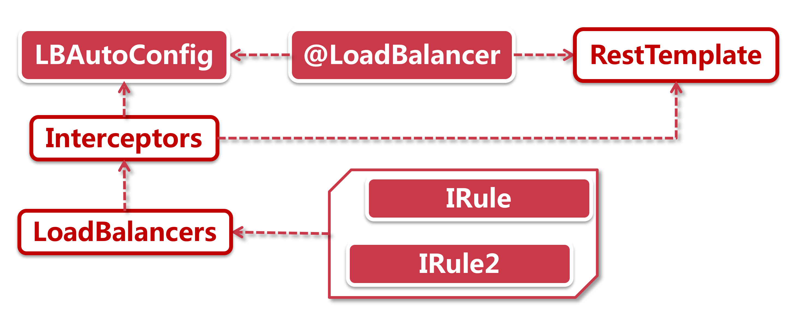
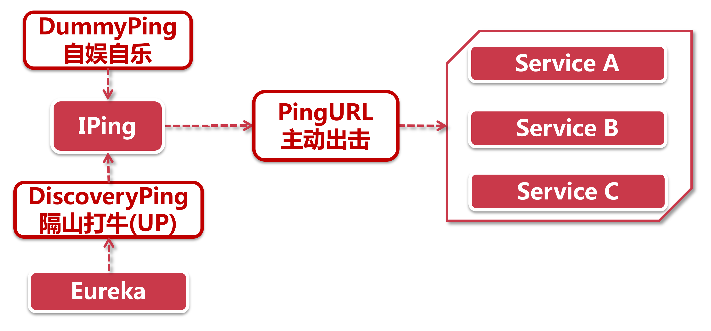

# 负载均衡器LoadBalancer原理解析

大家知道是谁把配置的负均衡策略”加塞"到一个HTTP请求的调用链路里的吗?这就要讲到Ribbon对RestTemplate的改造。

之前我们搭建了自己的ribbon-consumer，大家都知道Ribbon通过RestTemplate来发起调用清求，可是，RestTemplate分明是spring-web包下的通用类，它诞生的时候Ribbon还不知道在哪儿呢，那Ribbon是如何实现偷天换日，悄悄把自己“加塞”到RestTemplate中去的呢?

## 1、传送门-@LoadBalanced

当上帝为你关上一扇门的时候，也会为你开启另一扇门。Ribbon他有这么一个门，就是@LoadBalanced注解，它会将RestTemplate传送到Ribbon的目动装配类里进行改造。我们来看下它是怎么做的：

**@LoadBalanced：** 这个注解一头挂在RestTemplate上，另一头挂在LoadBalancerAutoConfiguration这个类上。它就像连接两个世界的传送门，将所有顶着【LoadBalanced】注解的RestTemplate类，都传入到LoadBalancerAutoConfiguration中，如果要深挖底层的作用机制，大家可以发现这个注解的定义上还有一个@Qualifier注解，可能对Spring比较熟悉的同学就恍然大悟了。@Qualifer注解搭配@Autowired注解做自动装配，可以通过name属性，将指定的Bean装载到指定位置(即使有两个同样类型的Bean，也可以通过Qualifier定义时声明的name做区分)。这里【LoadBalanced】也是借助Qualifier实现了一个给RestTemplate打标签的功能，凡是被打标的RestTemplate都会被传送到AutoConfig中做进一步改造。

**LBAutoConfig：**从前一步中传送过来的RestTemplate，会经过LBAutoConfig的装配，将一系列的`Interceptor`(拦截器)添加到RestTemplate中。拦截器是类似职责链编程模型的结构，我们常见的SevletFilter，权限控制器等，都是类似的模式，Ribbon栏截器会拦截每个网络请求做一些处理，在这个过程中拦截器会找到对应的LoadBalancer对HTTP请求进行接管，接着LoadBalancer就会找到默认或指定的负载均衡策略来对HTTP请求进行转发。

总结Ribbon的作用机制就是，由LoadBalanced在RestTemplate上打标，Ribbon将带有负载均能力的栏截器注入标记好的RestTemplate中，以此实现了负载均衡。

## 2、IPing机制

Ribbon和其它SpringCloud组件相比，Ribbon可谓称得上闲差，因为它的职责相对单一，只应用在负均衡方面，所以要给Ribon找点事儿干。IPing机制就是SpringCloud安排给Ribbon的任务。

IPing是一个主动出击的机制，他主动判断服务节点的当前状态，决定是否可作为目标节点，只有当前可用的节点才会作为负载均衡器的目标节点。

iPing有以下几个手段：

- **自娱自乐式：**DummyPing，默认返回true，即认为所有节点都可用，这也是单独使用Ribbon时的默认模式；
- **隔山打牛式：**NIWSDiscoveryPing，借助Eureka服务发现机制获取节点状态，假如节点状态是UP则认为是可用状态；
- **主动出击式：**PingUrl，它会主动向服务节点发起一次http调用，如果对方有响应则认为节点可用。

可以看出第三种主动出击的模式较生猛，IPing对每个服务节点调用个不停，节点们纷纷表示扛不住，可以想象下，假如服务节点搭载的是淘宝ump服务(负责计算商品、购物车与订单优惠，淘系top5调用量)，ump下随便一个微服务都有大几千台服务器，在服务本身就被超高访问量调用的情况下，那这种主动出击的IPing策略必然会大大增加服务节点的访问压力。

既然Eureka已经有了服务发现机制，可以获取节点的当前状态，拿来就用岂不更好?

因此除非特殊指定，在和Eureka搭配使用的时候，采用的是第二种隔山打牛式，也就是过滤非UP状态的节点(其实这个功能直接放Eureka里也能做，但真的是没事给Ribbon找点事)。

## 3、合适策略

在Ribbon这里，时间和空间经常要被换来换去，时间代表着接口响应时间(下文简称RT: Response Time)，空间表示服务器的可用连接数。

在Ribbon里有两个和时间与空间密切相关的负载均衡策略，BestAvailableRule(简称BA)和WeightedResponseTimeRule(简称WRT)。他们都有同一个梦想，那就是选择压力较小的服务节点，但这两个策略努力的方向不同。BA会根据服务节点过去一段时间的请求数，选择并发量最小的机器（选择空间）；WRT则是根据响应时间的统计结果，选择响应时间最快的服务(选择时间)。

我们知道服务的RT受很多因素制约，服务本身响应时间，网络连接时间，容器状态甚至JVM的GC等等都会影响最终的RT。我们来设想这样一个场景，现在有一个非常轻量级的微服务，他的业务代码耗时大概在2ms范围内，只占整个接口响应时间的20%，而剩下80%基本都用在了网络连接的开销上。

在上面这个例子中，如果我们以RT作为指标，其实并不能客观获取服务节点当前的性能数据，因为接口本身的处理时间在RT分布中只占有很小的比例，其至短时间的网络科动都会对RT采样造成很大影响。而由于接口响应时间较短，因此性能瓶颈更容易被连接线程数卡住，线程数量达到上限会延长新清求的等待时间，从而增加RT，但这种情况下active的线程数量有更灵敏的指示作用，因为等到RT显著增加的时候，线程池可能早已被吃满了。对待这类问题，我们的实践经验是：

**连接数敏感模型：**对响应时间较短，或RT和业务复杂度是非线性相关关系的接口，采用基于可用连接数的负载均衡策略更加合适。

同样的假设某个接口比较重量级，接口的处理时间与接收到的参数强相关。打个比方，订单导出服务，如果发起10个请求，每个请求都需要导出当前用户过去一整年的订单数据，那么这10个请求都会耗费大量的系统资源(CPU，内存)参与业务，同时RT时间也会相应拉长。在另一台机子上，同样是10个请求，但是只需要导出1个月的数据，相比较第一台机器，连接数相等的情况下，系统资源的占用率却大大不同。在这样的场景下，基于RT的指标具有更高的敏感度，我们的实践经验是：

**RT敏感模型：** 对重量级接口，尤其是根据参数不同会导致系统资源使用率浮动较大的接口(RT与业务复杂度线性相关)，建议采用基于响应时间的负载均衡策略。

