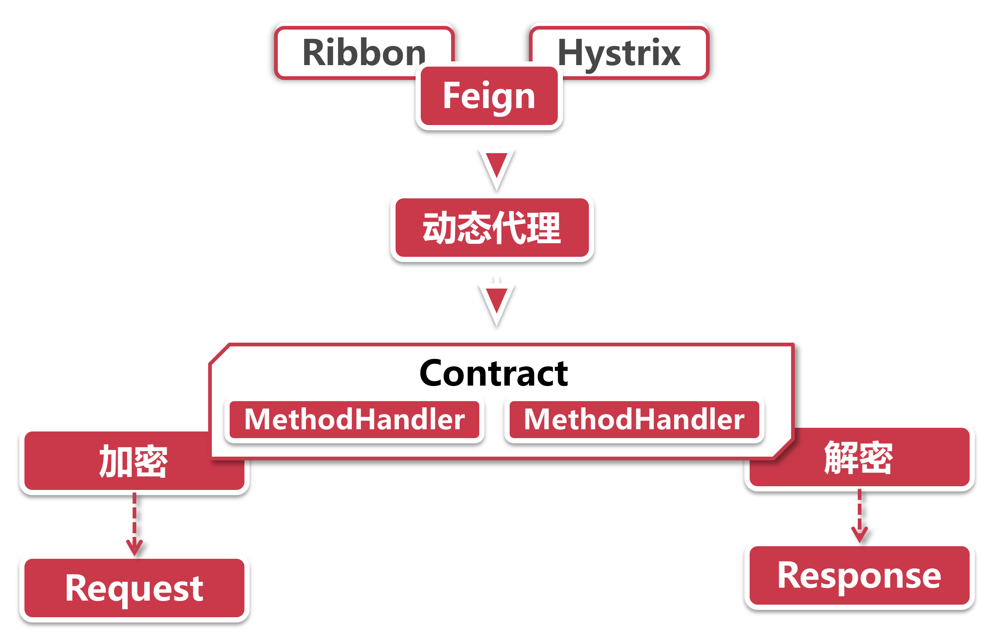
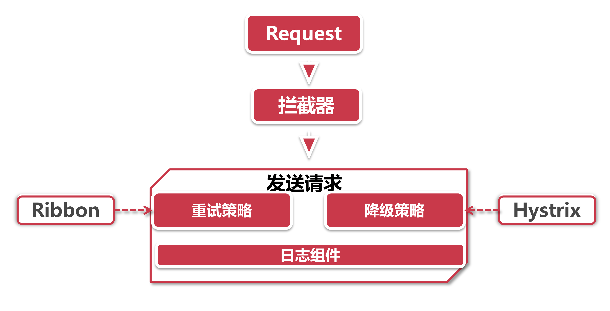

# Fegin体系结构解析

如果用一句话来介绍Fegin，那就是：声明一个代理接口，服务调用者通过调用这个代理接口的方式来调用远程服务，这样一来调用远程方法就如同调用本地接口一样方便。

## 1、上半场--构建请求



Feign手里有着Ribbon和Hystrix两把重武器，引入Feign依赖的同时这两个组件也会被一同引入。

- **Ribbon：**利用负载均衡策略选定目标机器；
- **Hystrix：**根据熔断器的开启状态，决定是否发起此次调用。

**动态代理：**Feign是通过一个代理接口进行远程调用，这一步就是为了构造接口的动态代理对象，用来代理远程服务的真实调用，这样你就可以像调用本地方法一样发起HTTP请求，不需要像Ribbon或者Eureka那样在方法调用的地方提供服务名。在Feign中动态代理是通过 `Feign.build`返回的构造器来装配相关参数，然后调用ReflectFeign的`newInstance`方法创建的，这里就应用到了Builder设计模式。

**Contract协议：**就像HTTP协议，RPC协议一样，Feign也有自己的一套协议的规范，只不过他解析的不是HTTP请求，而是上一步提到的动态代理类，通过解析动态代理接口+Builder模式，Contract协议会构造复杂的元数据对象MethodMetadata，这里面包含了动态代理接口定义的所有特征。接下来，根据这些元数据生成一系列MethodHandler对象用来处理Request和Response请求。

Contract具有高度可扩展性，可以经由对Contract的扩展，将Feign集成到其他开源组件之中。

## 2、Builder模式

Builder是设计模式中的一种，用来简化复杂组件的装配过程，假如用传统方式构建一个House类，那应该是这样写：

```java
House house = ne House();
house.setWindow("open");
house.setDoor("close");
```

而Builder模式是用链式构造的方式创建复杂对象，比如这种形式：

```java
House.builder().window("open").door("close").build()
```

这里有一个简单的实现方式，那就是lombok小工具的@Builder注解，只要在pom中添加lombok依赖，并且在IDE中添lombok的插件，就可以用注解的方法，不用写一行代码就能实现Builder模式。

## 3、下半场--发起调用



1. **拦截器：**拦截器是Spring处理网络请求的经典方案，Feign这里也沿用了这个做法，通过一系列的拦截器对Request和Response对象进行装饰，比如通过`Requestlnterceptor`给Request对象构造请求头。整装待发之后，就是正式发起调用的时候了
2. **发起请求：**Ribbon和Hystrix都参与了进来；

- ​	**重试：**Feign这里借助Ribbon的配置重试器实现了重试操作，可以指定对当前服务节点发起重试，也可以让Feign换一个服务节点重试。
- ​	**降级：**Feign接口在声明时可以指定Hystrix的降级策略实现类，如果达到了Hystrix的超时判定，或得到了异常结果，将执行指定的降级逻辑。