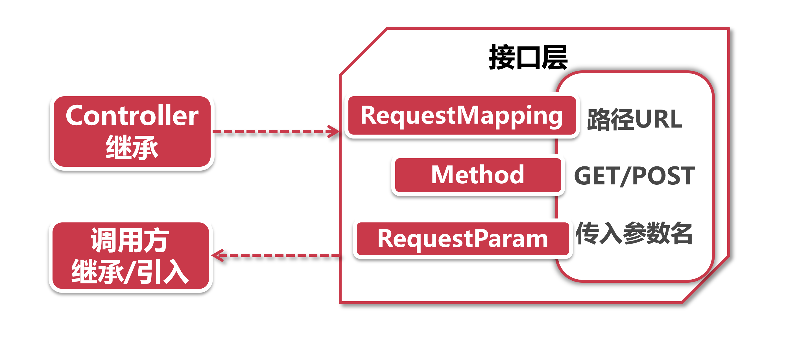

# 理想的Feign风格项目结构

前面的小节学习了Feign的使用方法，大家有没有这样的感觉，Feign虽然简化了编写代码时调用服务的过程，但是声明接口的地方却一点也不省事。作为服务调用方，不仅需要自己创建一个接口类，还需要知道调用服务的路径和参数。在服务提供方的Controller和服务调用方的接口这两个地方，我们都需要提供同一套配置，未免有些画蛇添足了。

在大型项目中都有领域(domain)划分，不同的业务领域属于不同的研发团队。比方说，商品团队需要调用订单中心的接口，如果用Feign的调用方式，商品研发团队还要和订单研发团队反复沟通服务路径，接口参数，你的接口是POST还是GET这类琐碎的问题，然后把这些属于订单业务的配置都写在商品业务的代码中。

上面这种情况，其实是基于HTTP服务治理方案的一个不大方便的地方，如果同学们有过RPC框架使用经验的话，那一定有这样的感受，RPC框架对协议层进行了深度封装，使得接口调用不再依赖人工配置的路径、POST/GET等信息，而是只根据接口和方法的签各特征（method signature，包括方法名，参数类型等)加以极少量的配置，就可以通过动态代理定位到相应的服务。这样一来，作为服务提供者，只要把自己的服务接口提供出来，调用方简简单单的将其引入自己的项目，就可以实现RPC调用。

那么我们有什么办法借鉴RPC的经验，简化Feign的配置项呢?

## 1、理想结构

本着Clean Code的原则，我们能否将服务端和客户端的两套配置声明合二为一?

答案是肯定的。

有些注解既可以放在接口上，他可以放在实现类上，假如我们声明一个公共的接口类，并目把path，HTTP method等信息配置在上面，然后让自己的业务类继承自接口，那么是不是就不用再写一大堆配置信息到业务类了呢?

我们来试一下：

**1.接口层：**通常由服务提供方的团队来定义。我们在定义接口方法的时候，就通过@RequestMapping注解，将访问路径的URL(比如"/getUser“)，连HTTP Method (GET/POST/PUT/DELETE) 配置到接口方法上，同时加上@RequestParam指定传入参数的name，当然了，你也可以将@FeignClient注解直接配置在接口上，这样的话调用方甚至不重要声明本地接口，而只要配置package scan的路径，将你的接口扫描进来就可以加载了，不过当你决定包含@FeignClient的时候要注意两件事：

- @FeignClient将引入openfeign的pom依赖，可能与调用方使用的版本不一致，如果调用方引入接口层后发生版本冲突导致项目启动失败的话，需要调用方排除导致冲突的依赖包(在pom中使用exclude排除冲突项)；
- 尽量不要在共享接口层指定fallback实现类，保持接口层的单一职责，因为降级后的业务逻辑通常应该交给服务调用方来决定，让调用方在自己声明的接口上添加@FeignClient注解并指定降级处理类。

**2.Controller：**作为服务提供方，可以将Controller指向接口，这样也就不用在Controller的方法上加一堆配置参数了。当然，如果需要加上额外的配置项，你也可以在Controller里覆盖接口注释，但是一定要确保和接口层的主要配置（路径，HTTP Method) 是相同的，假如两处注解的path设置不一样，那么业务调用方可就要404了。

**3.调用方：**根据外部接口的配置，有两个方法可以进行对接：

- 假如外部接口没有声明@FeignClient，那我们只要声明一个本地接口并加上@FeignClient注解，然后继承外部接口，不用声明任何具体方法，通过@Autowired注入后就可以进行调用了；
- 假如接口层已经添加了@FeignClient注解，这里你只需要确保在加载项目时把包路径扫到就可以了，如果接口层和调用方都使用了相同的包路径，那恭喜你，什么都不要做，直接在业务代码中使用@Autowired加载接口就可以，不过就像前面提到的，业务调用方往往需要实现特殊的降级逻辑，这就要在@FeignClient接口上指定自定义的falback实现类，那么就只好再声明一个本地接口了。

> 爬坑指南： 这里有一个小坑要留意下，如果调用方声明的本地接口继承了外部接口，并目两个地方同时声明了@FeignClient的话，在使用 @Autowired加载外部注解类时项目会启动失败。因为两处@FeignClient接口都默primary=true，Spring不知道到底该加载那个好。