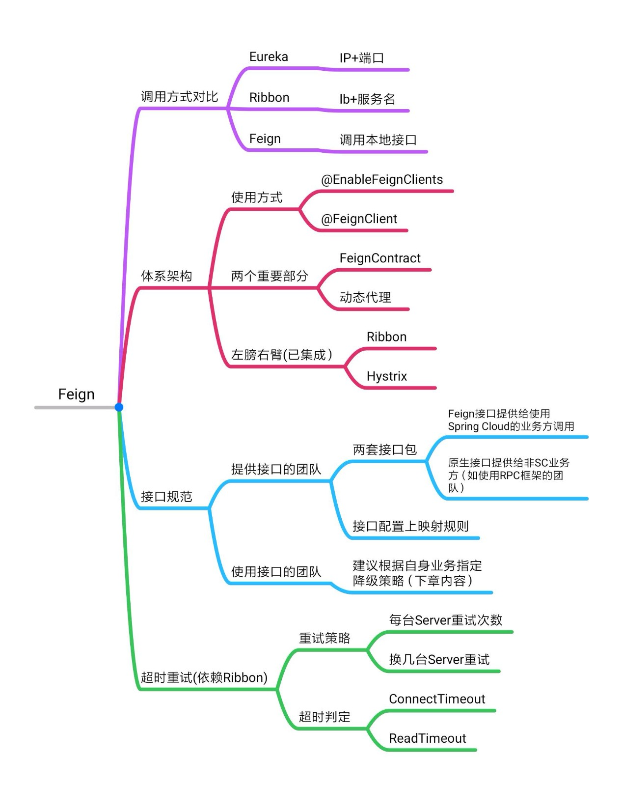

# 服务调用的超时重试

## 1、求极值的参数

```properties
feign-service-provider.ribbon.OkToRetryOnAllOperations=true
feign-service-provider.ribbon.ConnectTimeout=1000
feign-service-provider.ribbon.ReadTimeout=2000
feign-service-provider.ribbon.MaxAutoRetries=2
feign-service-provider.ribbon.MaxAutoRetriesNextServer=2
```

以上参数设置了对feign-service-provider这个微服务的超时重试策略，我们从上往下看极值函数的给定参数。

**OkToRetry0nAllOperations:** 这个参数指定了什么HTTP Method可以进行Retry，这里为了演示方便才设置为true，表示不管GET还是POST什么都能重试。真实的生产环境往往只是GET请求可以重试，或者实现了幂等性的其他类型请求。

**ConnectTimeout：**超时判定的第一个参数(单位ms)，创建会话的连接时间，注意，这个不是服务的响应时间，而是本机和服务建立一个Connection所花费的时间，如果连接超时则直接进行重试。

**ReadTimeout：**超时判定的第二个参数，服务响应时间，当连接建立好之后，如果对方服务没有在规定时间内返回，则直接进行重试。

**MaxAutoRetries：**求极限关键参数之一，当前节点重试次数。这里重试次数为2，那在首次调用超时以后，会再次向同一个服务节点发起最多2次重试(总共向当前节点1+2=3次请求)。

**MaxAutoRetriesNextServer：**求极限关键参数之二，换N节点重试，这里N=2，就是说在当前机器调用超时后，Feign将最多换N台机器发起调用(注意，这里将和第一个参数共同作用，也就是说，在新机器上超时后，会继续重试MaxAutoRetries+1次)。

## 2、极值函数

下面问题来了，按照前一个配置里的参数，最大超时时间是多少?

答案是27000毫秒，你答对了吗? 计算过程如下：

> (2000 + 1000)*(2 + 1) *(2 + 1) = 27000ms

那总结一下我们的极值函数就是：

> MAX(Response Time) = (ConnectTimeout + ReadTimeout) * (MaxAutoRetries + 1) * (MaxAutoRetriesNextServer + 1)

## 3、章节小结

