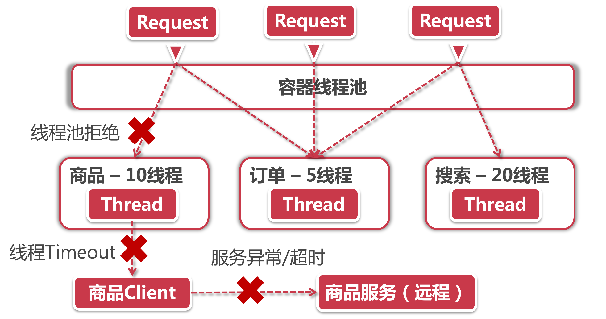

# 线程隔离(核心方案以及工作原理)

线程隔离是什么？简单地说就是将用户请求线程和服务执行线程分割开来，同时约定了每个服务最多可用线程数，举例如下：

假设我们的服务器就是六扇门总部，那每个用户请求都是来访参观的皇亲国戚。首先我们的Web容器有个线程池用来接收请求，我们把这个线程池可以看做是六扇门的大堂，所有来访的用户都要先到大堂接待。接下来，我们六扇门提供了各种各样不同的服务满足这些官老爷们，比如按摩服务，蒸桑拿服务，美容服务，按照老规矩的话这些服务都是在大堂现场开展，假如大堂只能接待20个人，结果来了这20人全是要按摩的，而技摩服务耗时又比较久，那么后面如果再来个想要蒸桑拿的可就没地方去。

现在我们六扇门有了新规矩：线程隔离，就是说每个服务单独设置一个小房间（独立线程池），把大厅区域和服务区城隔离开来，每个服务房间也有接待数量限制，比如我设置了按摩房最多接纳10人，桑拿房最多5人，美容护理室也是5人。这样，即便来了20个人喊着要按摩，我们也只能接待10人，剩下的10个人就会收到Thread Pool Rejects。如此一来，也不会耽搁六扇门为用户提供其他服务。

这下明白了吧?那我们就来看一看线程隔离方案的全景图：

## 1、线程隔离的三道坎



在线程隔离的完整链路里，需要经历三道坎(降级)才能取得真经：

**1、线程池拒绝：**这一步是线程隔离机制直接负责的，假如当前商品服务分配了10个线程，那么当线程池已经饱和的时候就可以拒绝服务，调用请求会收到Thread Pool Rejects，然后将被转到对应的fallback逻辑中，其实控制线程池中线程数量是由多个参数共同作用的，我们分别看一下：

- coreSize：核心线程数(默认为10)；
- maximumSize：设置最大允许的线程数(默认也是10)，这个属性需要打开allowMaximumSizeToDivergeFromCoreSize之后才能生效，后面这个属性允许线程池中的线程数扩展到maxinumSize个；
- queueSizeRejectionThreshold：这个属性经常会被忽略，这是控制队列最大阈值的，Hystrix默认设置了5，即便把maximumSize改大，但因为线程队列阈值的约束，你的程序依然无法承载很多并发量。所以当你想改大线程池的时候，需要这两个属性一同增大；
- KeepAIiveTimeMinutes：这个属性和线程回收有关，我们知道线程池可以最大可以扩展到maximumSize，当线程池空闲的时候，多余的线程将会被回收，这个属性就指定了线程被回收前存活的时间。默认2分钟，如果设置的过小，可能会导致系统频警回收/新建线程，造成资源浪费。

**2、线程Timeout：**我们通常情况下认为延迟只会发生在网络请求上，其实不然，在Netflix设计Hystrix的时候，就有一个设计理念：调用失败和延迟也可能发生在远程调用之前（比如说一次超长的Full GC导致的超时，或者方法只是一个本地业务计算，并不会调用外部方法），这个设计理念也可以在Hystrix的Github文档里也有提到。因此在方法调用过程中，如果同样发生了超时，则会产生Thread Timeout，调用请求被流转到fall back。

**3、服务异常/超时：**这就是我们前面学习的的服务降级，在调用远程方法后发生异常或者连接超时等情况，直接进入fallback。

## 2、线程隔离的方式

Hystrix提供了两种线程隔离的方式，分别是线程技术和信号量技术。这两种方式在业务流程上是一数的，在默认情况下，Hystrix使用线程池的方式。可以使用如下配置参数切换到信号量方式：

```
execution.isolation.strategy = ExecutionIsolationStrategy.SEMAPHORE
```

