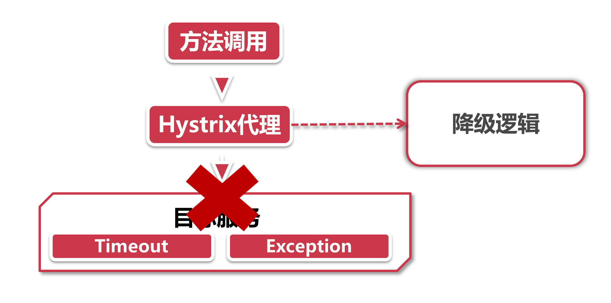
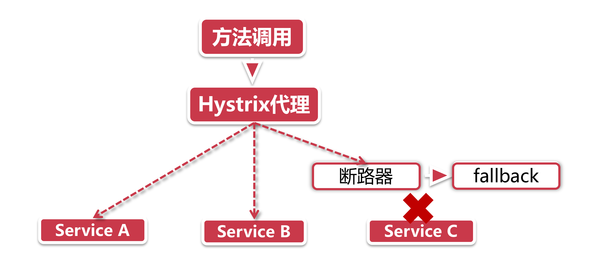
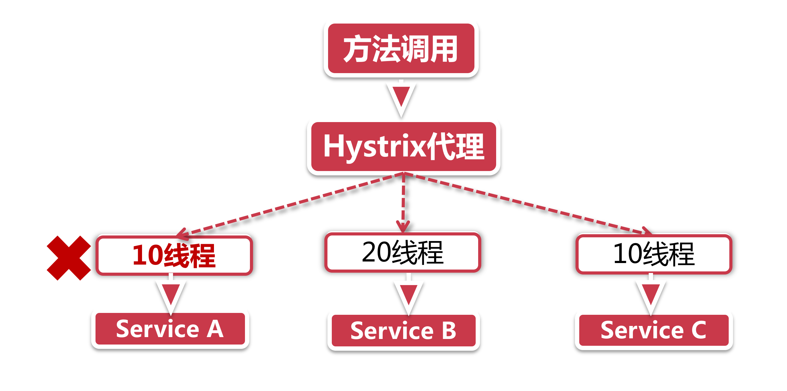

# Hystrix体系架构和核心功能解析

## 1、服务降级

微服务架构强调高可用，但并非高一致性，在一致性方面远比不上银行的大型机系统。也就是说，在日常服务调用阶段会出现一系列的调用异常，最常见的就是服务下线。

举个例子：重启服务节点的时候，服务下线指令发送到注册中心后，这时还没来得及通过服务发现机制同步到客户端，因此某些服务调用请求依然会发送到这台机器，但由于服务已经下线，最终调用方只能无功而返，报错404 Not Found。

再举一个破坏力更大的例子。前面我们讲到了服务的雪崩效应，大家可能只听说过缓存雪崩，其实雪崩效应不仅仅针对缓存，它更大的危害是在大规模分布式应用上。举一个真实的案例，电商系统很多模块都依赖营销优惠服务，比如商品详情页、搜索列表页、购物车页和下单页面都依赖营销服务来计算优惠价格，因以这个服务承载的负载压力可谓非常之高，我们设想假如这个服务出现了异常，导致响应超时，那么所有依赖它的下游系统的响应时间都会被拉长，这就引发了一个滚雪球的雪崩效应，由最上游的系统问题，引发了一系列下游系统响应超时，最终导致整个系统被拖垮。

服务降级用来应对上面的几种情况再合适不过了，假如HystrixClient调用目标请求的时候发生异常（exception），这时Hystrix会自动把这个请求转发到降级逻辑中，由服务调用方来编写异常处理逻辑，对响应超时的场景来说，我们可以通过配置Hystrix的超时等待时间（和Ribbion的timeout是两个不同配置），把超时响应的服务调用也当做是异常情况，转发到fallback逻辑中进行处理。

## 2、服务熔断

服务熔断是建立在服务降级之上的一个异常处理措施，你可以将它看做是服务降级的升级版。服务降级需要等待HTTP请求从服务节点返回导常或超时，再转向fallback逻辑，但是服务熔断引入了一种叫"断路器/熔断器”的机制，当断路器打开的时候，对服务的调用请求不会发送到目标服务节点，直接转向fallback逻辑。

假如断路器打开之后，就这么一直开着吗? 

当然不是了，一直开着多浪费电啊。服务一时失败，不代表一直失败，Hystrix也有一些配置规则，会主动去判断断路器关闭的时机。

断路器可以显著缓解由QPS（Query Per Second，每秒访问请求，用来衡量系统当前压力）激增导致的雪崩效应，由于断路器打开后，请求直接转向fallback而不会发起服务调用，因此会大幅降低承压服务的系统压力。

## 3、线程隔离

大家知道Web容器通常有一个线程池来接待来访请求，如果并发量过高，线程池被打满了就会影响后面请求的响应，在我们应用内部，假如我们提供了3个微服务，分别是A，B，C。如果请求A服务的调用量过多，我们会发现所有可用线程都会逐渐被Service A占用，接下来的现象就是服务B和服务C没有系统资源可供调用。

Hystrix通过线程隔离的方案，将执行服务调用的代码与容器本身的线程（比如tomcat thread pool）进行隔离，我们可以配置每个服务所需线程的最大数量，这样一来，即便一个服务的线程池被吃满，也不会影响其他服务。

