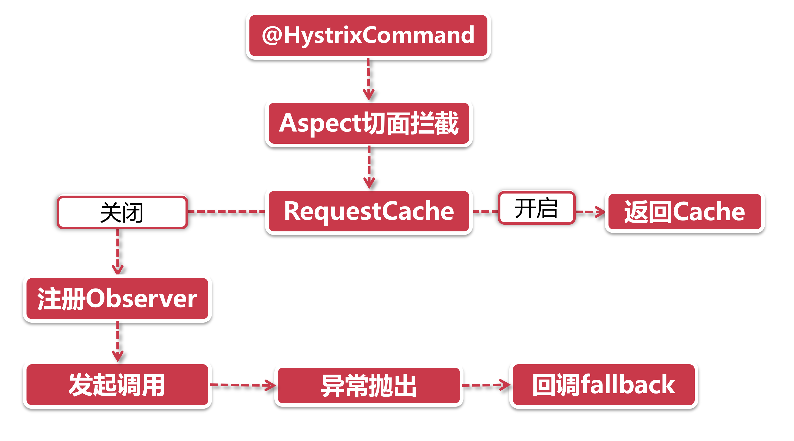

# 服务降级原理解析

作为SpringCloud中的执法部门—Hystrix监管着服务的一举一动，不管是超时还是异常抛出，但凡有违法乱纪的现象发生，就会被强制放到fallback里进行改造。可是，每个应用都有一长串的服务，那全部都交给Hystrix这能管得过来吗?

Hystrix可不是所有服务都监督，毕竟资源有限，他们只盯梢一些关键模块，给每个模块人物指派一个监听器，但凡有异常发生，立即动手。

## 1、盯梢名单-@HystrixCommand

对那些一旦发生异常，影响特别恶劣，但是还有补救措施的，我们就安排一个贴身监视：

```java
@HystrixCommand(fallbackMethod = "putInPrison")
public String bigTiger() {
	throw RuntimeException("Eat People");
}
```

上面就是我们的贴身监视@HystrixCommand注解，直接管在具体Metod方法的头上，没有指派贴身监视的方法就可以放飞自我了，Hystrix不会管你的。

@HystrixCommand注解中指定了一个fallbackMethod，这里就是进行改造的地方，也就是降级逻辑所在的方法名。注意，降级方法的方法签名（参数列表）要和原方法保持一致，也就是说，如果原方法声明了一个参数String，那么降级方法也要声明同样的参数,Hystrix会原封不动的把当前参数传递给降级方法。

当Hystrix和Feign共同使用的时候，还有一种配置方式，那就是在FeignClient注解中指定一个class，在这个class里可以外理Feign接口中声明的所有方法的降级需求。

```java
@FeignClient(name = "feign-service-provider", fallback = Fallback.class)
public interface MyHelloService extends HelloService {
}
```

## 2、异常捕捉

如果同学直接去阅读Hystix服务降级的源码，相信有很有效的直接劝退的作用，Hystix的源码大量基于RxJava，在实现上比较接近函数式语言的风格，用了大量的异步回调函数和事件驱动，层层嵌套十分前溃。

为了避免直接劝退，这里的流程图以业务流为主，不涉及具体类各和方法名：



**@HystrixCommand：**安插在方法上的监听机制，标识此方法由Hystrix监管

**AspectJ：**运用Spring的切面能力，给带有@HystrixCommand注解的方法配置了切面点，在方法调用的时候，将首先执行切面逻辑。

**Request Cache：**

如果处于开启状态，则尝试用CacheKey从本地缓存中获取数据，也就不用发起方法调用了；

如果处于关闭状态，就继续往下走到最烧脑的部分，Observer。

**注册Observer：**Obsever是观者模式（在RxJava中又叫Observable），但这里只是一个幌子，这个Observer背后运用RxJava注册了一堆异步回调函数，当方法正常执行、异常抛出、结束或其他状态的时候，将会触发对应的回调函数进行处理，而且回调函数里面还会嵌套回调函数

**发起调用：**在发起调用之前，将会检查熔断状态，如果断路器当前处于开启的状态，那么将直接走向fallback流程，如果断路器处于关闭，则发起真正的调用。

**异常，又见异常：**前面你来我往这么久，就是等方法调用抛异常，异常触发了步骤4中注册的回调函数，然后直接转给了降级方法。